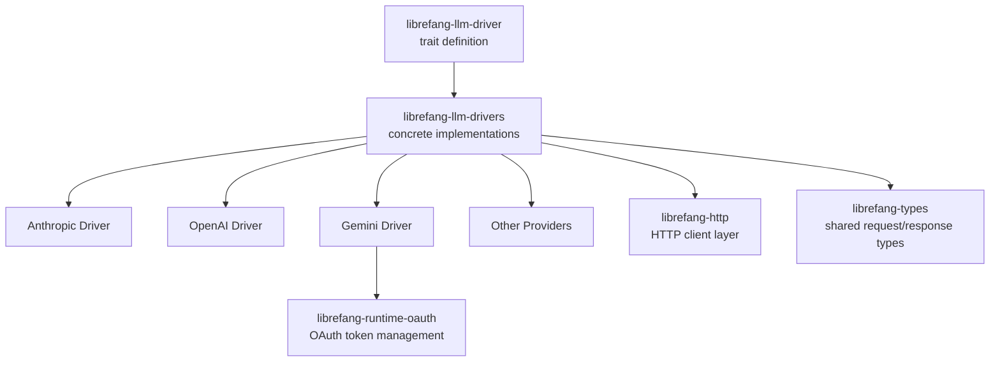

# Other — librefang-llm-drivers

# librefang-llm-drivers

Concrete LLM provider drivers implementing the `librefang-llm-driver` trait. Each driver encapsulates the wire protocol, authentication scheme, and response parsing for a specific LLM provider API.

## Purpose

This crate is the bridge between LibreFang's provider-agnostic LLM abstraction and the real-world APIs offered by Anthropic, OpenAI, Google Gemini, and others. It contains no business logic of its own — each driver is a thin translation layer that:

1. Converts `librefang-types` request models into provider-specific HTTP payloads.
2. Handles provider-specific authentication (API keys, OAuth tokens, HMAC-signed requests).
3. Sends requests via `librefang-http` and parses responses (including SSE streaming) back into `librefang-types` response models.

## Architecture



Downstream consumers depend only on `librefang-llm-driver` (the trait) and never on this crate directly — they receive a concrete driver via dependency injection or a factory function.

## Dependency Rationale

| Dependency | Role in this crate |
|---|---|
| `librefang-llm-driver` | Provides the trait each driver implements (`LlmDriver` or similar). |
| `librefang-types` | Shared request/response/message types that drivers translate to/from. |
| `librefang-http` | HTTP client abstraction; drivers don't use `reqwest` directly for outbound calls. |
| `librefang-runtime-oauth` | OAuth2 token acquisition and refresh for providers that require it (e.g., Gemini). |
| `reqwest` | Low-level HTTP client, used indirectly through `librefang-http` or for raw streaming. |
| `tokio` / `tokio-stream` | Async runtime and stream utilities for handling SSE/chunked responses. |
| `serde` / `serde_json` | Serializing provider-specific request bodies and deserializing responses. |
| `sha2` / `hmac` / `hex` | Cryptographic request signing for providers that use SigV4-style auth (e.g., AWS Bedrock). |
| `base64` | Encoding binary content or auth headers. |
| `dashmap` | Concurrent map for caching tokens, session state, or connection pools across async tasks. |
| `zeroize` | Securely clearing API keys and secrets from memory after use. |
| `regex-lite` | Pattern matching on streaming response chunks (e.g., extracting SSE data frames). |
| `url` | Constructing and validating provider endpoint URLs. |
| `tracing` | Structured logging of request/response lifecycle events. |
| `thiserror` | Deriving provider-specific error types. |

## Supported Providers

Based on the crate description and dependency profile:

- **Anthropic** — Messages API with `x-api-key` header authentication.
- **OpenAI** — Chat Completions API with Bearer token authentication.
- **Gemini** — Google's Generative AI API, likely using OAuth2 via `librefang-runtime-oauth`.
- **AWS Bedrock** (or similar HMAC-signed provider) — Inferred from the `sha2`/`hmac` dependencies, indicating SigV4-style request signing.

## Key Design Patterns

### Trait Implementation

Every driver implements the trait defined in `librefang-llm-driver`, normalizing provider differences behind a uniform async interface. Consumers call the same methods regardless of which provider is active.

### Streaming Support

The `tokio-stream` and `futures` dependencies indicate that drivers support streaming responses. Providers use SSE (Server-Sent Events) or chunked transfer encoding, and drivers parse these incremental chunks into `librefang-types` stream items using `regex-lite` for frame extraction.

### Secure Credential Handling

API keys and tokens are held in types that use `zeroize` to clear sensitive data from memory when dropped. This is a defense-in-depth measure against memory-scraping attacks.

### Error Translation

Each driver maps provider-specific error responses (rate limits, auth failures, context-length errors) into a common error type, typically defined in or re-exported from `librefang-llm-driver`. This uses `thiserror` for ergonomic error construction.

## Relationship to Other Crates

```
librefang-types          ← shared data structures
librefang-llm-driver     ← trait definition (no implementations)
librefang-llm-drivers    ← you are here (concrete trait impls)
librefang-http           ← HTTP client abstraction
librefang-runtime-oauth  ← OAuth token lifecycle
```

This crate sits in the middle of the stack: it depends on the trait, types, HTTP, and OAuth crates, and is itself depended on by higher-level orchestration code that selects and configures a driver at runtime.

## Adding a New Provider

To add support for a new LLM provider:

1. Create a new module within this crate (e.g., `src/new_provider.rs` or `src/new_provider/`).
2. Define a struct holding configuration (API key, base URL, model defaults).
3. Implement the `librefang-llm-driver` trait, translating requests to the provider's wire format and responses back to `librefang-types`.
4. If the provider uses OAuth, integrate with `librefang-runtime-oauth`.
5. If the provider requires request signing, use the `hmac`/`sha2` crates following the pattern established by existing signed-request drivers.
6. Handle streaming if the provider supports it, using `tokio-stream` and SSE parsing.
7. Register the driver in whatever factory/discovery mechanism this crate exposes.