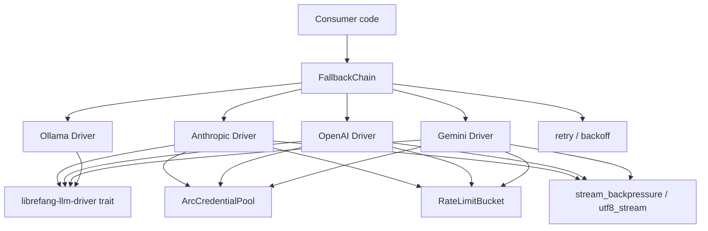

# Other — librefang-llm-drivers

# librefang-llm-drivers

Concrete LLM provider drivers for LibreFang. This crate ships ready-to-use implementations of the `LlmDriver` trait (defined in `librefang-llm-driver`) for Anthropic, OpenAI, Gemini, Groq, Ollama, and other providers, along with production-grade infrastructure for credential rotation, rate-limit tracking, failover, and stream handling.

## Architecture



Consumer code typically constructs a `FallbackChain` containing one or more provider drivers. Each driver draws credentials from a shared `ArcCredentialPool` and reports rate-limit state to a `RateLimitBucket`. When a driver fails, the chain advances to the next entry with a `FailoverReason`.

## Relationship to sibling crates

| Crate | Role |
|---|---|
| `librefang-llm-driver` | Defines the `LlmDriver` trait, shared error types (`LlmError`), and the request/response types that every driver must accept. |
| `librefang-types` | Domain-level types (messages, tool definitions, etc.) consumed by the trait and passed through drivers unchanged. |
| `librefang-http` | Shared HTTP client construction and middleware; drivers use this to build `reqwest` clients with consistent telemetry injection. |

This crate re-exports `llm_driver`, `llm_errors`, and `FailoverReason` from its dependencies so that downstream code only needs to depend on `librefang-llm-drivers` directly.

## Key components

### Per-provider drivers — `drivers::*`

Each provider lives in its own submodule under `drivers` (e.g. `drivers::anthropic`, `drivers::openai`, `drivers::gemini`). Every driver:

- Implements the `LlmDriver` trait from `librefang-llm-driver`.
- Translates the trait's generic request model into the provider's wire format (headers, JSON body, URL).
- Parses provider-specific response fields (e.g. Anthropic `thinking` blocks, OpenAI `usage` stats) back into the common response type.
- Delegates HTTP execution to `reqwest` clients built via `librefang-http`.

### Fallback chain — `drivers::fallback_chain`

```rust
use librefang_llm_drivers::drivers::fallback_chain::{FallbackChain, ChainEntry};
```

`FallbackChain` composes multiple `LlmDriver` instances into an ordered list. On each request it tries the first entry; if the call fails with a retriable error it records the `FailoverReason` and attempts the next entry. This gives multi-provider resilience without changing caller logic.

`ChainEntry` wraps an individual driver with optional metadata (weight, priority, or tags) used by the chain's selection strategy.

### Credential pool — `credential_pool`

```rust
use librefang_llm_drivers::credential_pool::{
    ArcCredentialPool, CredentialPool, PoolStrategy, PooledCredential, new_arc_pool,
};
```

Manages a set of API keys per provider and dispenses them according to a `PoolStrategy` (round-robin, random, etc.). Key features:

- **`ArcCredentialPool`** — a thread-safe, `DashMap`-backed pool behind an `Arc`, safe to share across concurrent driver instances.
- **`PooledCredential`** — a borrowed credential that is automatically returned to the pool on drop, enabling correct concurrency even when keys have per-minute rate caps.
- **`new_arc_pool`** — convenience constructor that builds an `ArcCredentialPool` from a list of keys.

Drivers accept an `ArcCredentialPool` at construction time and call into it on every request to obtain a fresh key.

### Rate-limit tracking — `rate_limit_tracker`

```rust
use librefang_llm_drivers::rate_limit_tracker::{RateLimitBucket, RateLimitSnapshot};
```

`RateLimitBucket` is a shared, atomic counter that drivers update after each response based on provider-returned headers (`x-ratelimit-remaining`, `Retry-After`, etc.). `RateLimitSnapshot` exposes a read-only view for observability dashboards and metrics.

When a bucket reports exhaustion, drivers can preemptively fail fast (returning a `FailoverReason::RateLimited`) rather than wasting a request.

### Retry and backoff utilities

- **`backoff`** — exponential backoff with jitter. Used internally by drivers and the fallback chain.
- **`retry_after`** — parses `Retry-After` headers (both delta-seconds and HTTP-date forms) and converts them to a `Duration`.
- **`shared_rate_guard`** — a RAII guard that decrements a rate-limit counter when dropped, ensuring bookkeeping stays correct even on panic paths.

### Stream handling

- **`stream_backpressure`** — wraps a byte stream with bounded-buffer backpressure so a fast producer (the network) cannot overwhelm a slow consumer (downstream parsing).
- **`utf8_stream`** — handles partial UTF-8 sequences that may arrive at chunk boundaries, reassembling them before yielding complete `String` frames. Essential for streaming completions where a multi-byte character can be split across TCP segments.
- **`think_filter`** — strips provider-specific "thinking" blocks (e.g. Anthropic's `<thinking>` tags) from the streamed output when the caller opts out of receiving internal reasoning.

## Dependency rationale

| Dependency | Why it's here |
|---|---|
| `reqwest` | HTTP transport for all provider APIs. |
| `tokio` | Async runtime; drivers are fully async. |
| `serde` / `serde_json` | Serialising requests and deserialising provider-specific JSON responses. |
| `async-trait` | The `LlmDriver` trait is async; this crate provides the concrete impls. |
| `tracing` / `opentelemetry` / `tracing-opentelemetry` | Structured logging and distributed trace propagation on every HTTP call. |
| `metrics` | Counters and histograms for request latency, token usage, and rate-limit events. |
| `dashmap` | Lock-free concurrent map backing `ArcCredentialPool`. |
| `sha2` | Hashing credential identifiers for logging without leaking raw API keys. |
| `zeroize` | Securely zeroing credential memory on drop. |
| `base64` | Encoding inline images in multi-modal requests. |
| `uuid` / `rand` | Request IDs and jitter for backoff. |
| `chrono` | Parsing `Retry-After` HTTP-date values. |

## Testing

Dev-dependencies include `wiremock` for mocking provider HTTP endpoints, `serial_test` for tests that share global state, and `tempfile` for credential-store fixtures. Each driver has integration-style tests that spin up a mock server, feed it a canned response, and assert that the driver produces the correct typed output.

## Usage sketch

```rust
use librefang_llm_drivers::{
    drivers::anthropic::AnthropicDriver,
    drivers::fallback_chain::{FallbackChain, ChainEntry},
    credential_pool::new_arc_pool,
};
use librefang_llm_driver::LlmDriver;

#[tokio::main]
async fn main() {
    let pool = new_arc_pool(vec!["sk-ant-key1".into(), "sk-ant-key2".into()]);
    let anthropic = AnthropicDriver::new(pool);

    let chain = FallbackChain::new(vec![
        ChainEntry::new(anthropic),
        // …add more providers here
    ]);

    let response = chain.complete(request).await.expect("all providers failed");
    println!("{:?}", response);
}
```

This keeps the consumer agnostic to which provider actually handled the request.