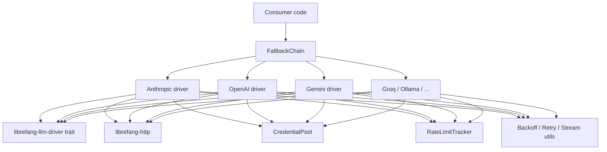

# Other — librefang-llm-drivers

# librefang-llm-drivers

Concrete LLM provider drivers for LibreFang. This crate contains the production implementations of the `LlmDriver` trait defined in `librefang-llm-driver`, wiring each provider's API (Anthropic, OpenAI, Gemini, Groq, Ollama, and others) into a uniform interface.

Beyond raw provider clients, the crate ships infrastructure that any real-world deployment needs: API-key pooling, multi-provider failover chains, rate-limit observability, retry with `Retry-After` handling, stream backpressure, and UTF-8 stream reassembly.

## Architecture



Each driver implements the trait from `librefang-llm-driver`, delegates HTTP calls through `librefang-http`, draws credentials from a shared pool, and reports rate-limit telemetry. `FallbackChain` composes multiple drivers into a single logical driver that fails over automatically.

## Crate Dependencies

| Dependency | Role |
|---|---|
| `librefang-llm-driver` | Defines the `LlmDriver` trait, error types (`LlmError`), and request/response types that every driver must satisfy. |
| `librefang-types` | Shared domain types used across the workspace (messages, tool definitions, etc.). |
| `librefang-http` | HTTP client construction and shared request/response utilities. |
| `librefang-runtime-oauth` | OAuth token acquisition for providers that require it (e.g., Gemini service-account flows). |

## Public API

### Per-Provider Drivers

The `drivers` module exposes one submodule per LLM provider. Each submodule contains a driver struct (e.g., `AnthropicDriver`, `OpenAiDriver`) that implements the `LlmDriver` trait. Construct a driver with its builder or `new` constructor, then call trait methods to send completions, streaming completions, or embeddings.

```rust
use librefang_llm_drivers::drivers::openai::OpenAiDriver;
use librefang_llm_driver::LlmDriver;

let driver = OpenAiDriver::new(config);
let response = driver.complete(request).await?;
```

### Fallback Chain

`drivers::fallback_chain::FallbackChain` composes multiple drivers into a single `LlmDriver`. Each entry is a `ChainEntry` (a driver plus metadata). When a request fails, the chain advances to the next entry and retries, attaching a `FailoverReason` to the response so callers can observe which provider ultimately served the request and why previous ones were skipped.

### Credential Pool

```rust
use librefang_llm_drivers::credential_pool::{new_arc_pool, PoolStrategy};

let pool = new_arc_pool(keys, PoolStrategy::RoundRobin);
```

- **`CredentialPool`** / **`ArcCredentialPool`** — thread-safe, shared pools of `PooledCredential` values.
- **`PoolStrategy`** — selection strategy (round-robin, random, etc.).
- Drivers accept an `ArcCredentialPool` and draw a fresh key per request, spreading load across multiple API keys.

### Rate-Limit Tracking

`rate_limit_tracker::{RateLimitBucket, RateLimitSnapshot}` provides observability into per-provider rate-limit counters. Drivers update the bucket after each response (using headers like `x-ratelimit-remaining`), and any part of the system can take a snapshot for dashboarding or adaptive throttling.

### Supporting Utilities

These are public because downstream crates may reuse them when building custom drivers:

| Module | Purpose |
|---|---|
| `backoff` | Exponential-backoff delay calculation for retries. |
| `retry_after` | Parses `Retry-After` headers (seconds or HTTP-date) into a `Duration`. |
| `shared_rate_guard` | RAII guard that temporarily reserves a rate-limit slot and releases it on drop. |
| `stream_backpressure` | Applies backpressure when consuming SSE/chunked streams so a fast producer cannot OOM the receiver. |
| `utf8_stream` | Reassembles byte-level chunks into valid UTF-8 strings, handling split multi-byte sequences across chunk boundaries. |
| `think_filter` | Strips `<think …>…</think"` blocks from model output before returning to the caller (useful for reasoning models). |

### Re-exports

The crate re-exports the following for convenience:

- **`llm_driver`** — the trait and core types from `librefang-llm-driver`.
- **`llm_errors`** — error enums from the same crate.
- **`FailoverReason`** — the enum describing why a fallback occurred.

## Implementing a New Provider

1. Add a new submodule under `drivers/` (e.g., `drivers::mistral`).
2. Define a driver struct holding configuration, an HTTP client reference, and an optional credential pool handle.
3. Implement the `LlmDriver` trait, translating the generic request into the provider's wire format and the provider's response back into the shared response type.
4. Use `librefang_http` for outbound requests, `backoff` and `retry_after` for retry logic, and `stream_backpressure`/`utf8_stream` for streaming.
5. Register the driver in any `FallbackChain` or use it standalone.

## Testing

The `dev-dependencies` include `wiremock` for mocking provider HTTP endpoints, `serial_test` for test serialization (useful when tests share global state like credential pools), and `tempfile` for temporary file-based fixtures.

To test a driver against a mock server:

```rust
use wiremock::{MockServer, Mock, ResponseTemplate};
use wiremock::matchers::{method, path};

let server = MockServer::start().await;
Mock::given(method("POST"))
    .and_path("/v1/chat/completions")
    .respond_with(ResponseTemplate::new(200).set_body_json(serde_json::json!({...})))
    .mount(&server)
    .await;

let driver = OpenAiDriver::new_with_base_url(config, &server.uri());
let result = driver.complete(request).await?;
```

## Key Invariants

- **Zeroize**: API keys stored in `PooledCredential` are zeroized on drop via the `zeroize` crate, preventing credential leakage from memory.
- **Thread safety**: `ArcCredentialPool` uses `DashMap` internally, supporting concurrent access from multiple async tasks without a global lock.
- **Idempotent credential rotation**: If a key is rate-limited or revoked, the pool marks it and the next `next_credential()` call returns a different key rather than panicking.