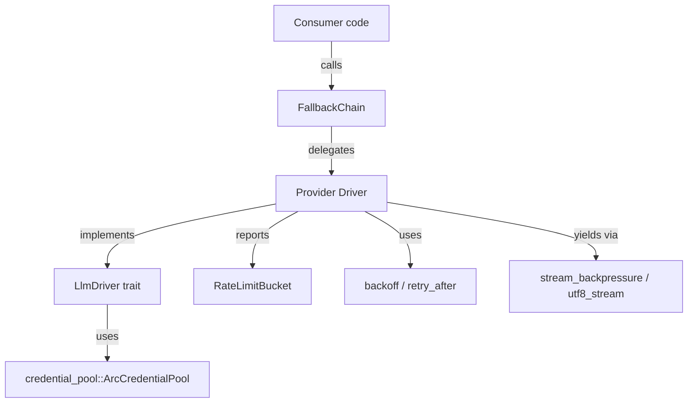

# Other — librefang-llm-drivers

# librefang-llm-drivers

Concrete LLM provider drivers for LibreFang. This crate implements the `LlmDriver` trait defined in `librefang-llm-driver` for Anthropic, OpenAI, Gemini, Groq, Ollama, and other providers, along with production-grade infrastructure for credential management, failover, rate limiting, and stream handling.

## Architecture


```mermaid
graph TD
    A[Consumer code] -->|calls| B[FallbackChain]
    B -->|delegates| C[Provider Driver]
    C -->|implements| D[LlmDriver trait]
    D -->|uses| E[credential_pool::ArcCredentialPool]
    C -->|reports| F[RateLimitBucket]
    C -->|uses| G[backoff / retry_after]
    C -->|yields via| H[stream_backpressure / utf8_stream]
```

Each provider driver is an isolated module under `drivers::` that translates the generic `LlmDriver` interface into provider-specific HTTP requests. The `FallbackChain` composes multiple drivers behind a single `LlmDriver` implementation, providing automatic failover.

## Provider Drivers

All drivers live under the `drivers` module and implement the `LlmDriver` trait from `librefang-llm-driver`. The supported providers are:

- **Anthropic** (`drivers::anthropic`) — Claude family models
- **OpenAI** (`drivers::openai`) — GPT family models
- **Gemini** (`drivers::gemini`) — Google Gemini models
- **Groq** (`drivers::groq`) — Groq-hosted inference
- **Ollama** (`drivers::ollama`) — Local Ollama inference

Each driver module handles:

1. Building the provider-specific HTTP request body from the generic input types in `librefang-types`.
2. Parsing provider-specific response formats back into the shared output types.
3. Extracting rate-limit headers and reporting them to the shared `RateLimitBucket`.
4. Applying retry/backoff logic using the shared `backoff` and `retry_after` utilities.

### Adding a New Provider

To add a new LLM provider:

1. Create a new module under `src/drivers/`.
2. Define a struct that holds provider-specific configuration (endpoint URL, model defaults, etc.).
3. Implement `LlmDriver` for that struct, handling request translation and response parsing.
4. Register the module in `src/drivers/mod.rs`.

## Fallback Chain

The `FallbackChain` composes multiple `LlmDriver` implementations into a single driver that tries each in order. This is the primary entry point for production use.

```rust
use librefang_llm_drivers::drivers::fallback_chain::{FallbackChain, ChainEntry};
```

- **`ChainEntry`** — Wraps a boxed `LlmDriver` with metadata (name, priority, optional weight).
- **`FallbackChain`** — Implements `LlmDriver` itself. On a call, it tries the first entry; if that fails with a retriable error, it advances to the next entry.

Failover emits `FailoverReason` values so callers can observe why a provider was skipped. The chain respects per-provider rate limits and `Retry-After` headers before attempting the next entry.

## Credential Pool

API key rotation and distribution across concurrent requests.

```rust
use librefang_llm_drivers::credential_pool::{new_arc_pool, PoolStrategy, PooledCredential};
```

| Type | Purpose |
|---|---|
| `CredentialPool` | Core pool that stores credentials and dispenses them |
| `ArcCredentialPool` | `Arc<CredentialPool>` — the common shared handle |
| `PoolStrategy` | Selection strategy enum (round-robin, random, least-recently-used) |
| `PooledCredential` | A credential borrowed from the pool with metadata (last used, usage count) |
| `new_arc_pool` | Convenience constructor that returns an `ArcCredentialPool` |

Drivers receive an `ArcCredentialPool` at construction and draw a credential for each request, then return it. Credentials are zeroized on drop via the `zeroize` dependency.

## Rate Limit Tracking

```rust
use librefang_llm_drivers::rate_limit_tracker::{RateLimitBucket, RateLimitSnapshot};
```

Each driver instance holds a reference to a `RateLimitBucket` keyed by provider. After every response, the driver parses rate-limit headers (e.g., `x-ratelimit-remaining`, `Retry-After`) and updates the bucket.

- **`RateLimitSnapshot`** — A point-in-time view of remaining requests/tokens and the reset window.
- **`RateLimitBucket`** — Thread-safe storage (`DashMap`-backed) that multiple drivers can update concurrently.

The `shared_rate_guard` utility provides a scoped guard that checks the bucket before allowing a request to proceed, blocking or rejecting early if the quota is exhausted.

## Retry and Backoff

- **`backoff`** — Exponential backoff calculation with jitter. Drivers call this to compute wait durations between retries.
- **`retry_after`** — Parses `Retry-After` headers (both delta-seconds and HTTP-date formats). When present, this value overrides the computed backoff.
- **`shared_rate_guard`** — Acquires permission before sending a request. Combines rate-limit bucket state with retry-after tracking to gate outgoing calls.

## Stream Handling

LLM responses are often server-sent events (SSE). Two utilities manage the resulting byte streams:

- **`stream_backpressure`** — Applies backpressure so a fast-producing SSE stream doesn't overwhelm the consumer. Uses tokio channel buffering.
- **`utf8_stream`** — Handles partial UTF-8 sequences that can occur when HTTP chunks split multi-byte characters. Reassembles complete UTF-8 strings before yielding them downstream.

## Think Filter

- **`think_filter`** — Strips "thinking" tokens (e.g., `<think ...>...</think >` blocks) that some models emit before the actual response. Applied as a stream transformation so callers only see the final output.

## Dependency Map

| Dependency | Role in this crate |
|---|---|
| `librefang-llm-driver` | Provides the `LlmDriver` trait and error types that every driver implements |
| `librefang-types` | Shared request/response types that drivers translate to/from provider formats |
| `librefang-http` | Shared HTTP client configuration and middleware |
| `reqwest` | Underlying HTTP client for all provider API calls |
| `dashmap` | Concurrent map for rate-limit tracking and credential pool |
| `zeroize` | Secure clearing of API key material on drop |
| `sha2`, `hex` | Credential fingerprinting for pool deduplication |
| `opentelemetry`, `tracing` | Structured logging and distributed tracing per request |
| `metrics` | Counter/histogram emission for request latency, retry counts, and rate-limit events |
| `base64` | Encoding inline images or file attachments in provider payloads |
| `chrono` | Parsing HTTP-date `Retry-After` headers |

## Testing

Dev-dependencies include `wiremock` for mocking provider HTTP endpoints, `serial_test` for test serialization, and `tempfile` for filesystem-based fixtures. Each driver module should include tests that:

1. Mock the provider's HTTP responses using `wiremock::MockServer`.
2. Verify correct request body construction.
3. Verify correct response parsing, including error cases.
4. Test retry behavior by simulating 429/503 responses with `Retry-After` headers.
5. Test fallback chain behavior by failing the first mock and succeeding on the second.