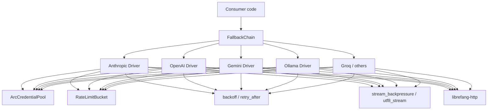

# Other — librefang-llm-drivers

# librefang-llm-drivers

Concrete LLM provider drivers for the LibreFang platform. This crate implements the `LlmDriver` trait (from `librefang-llm-driver`) for Anthropic, OpenAI, Gemini, Groq, Ollama, and other providers, and wraps those implementations with production-grade infrastructure: credential pooling, fallback chains, rate-limit tracking, retry with backoff, and stream backpressure handling.

## Architecture


```mermaid
graph TD
    A[Consumer code] --> B[FallbackChain]
    B --> C1[Anthropic Driver]
    B --> C2[OpenAI Driver]
    B --> C3[Gemini Driver]
    B --> C4[Ollama Driver]
    B --> C5[Groq / others]
    C1 & C2 & C3 & C4 & C5 --> D[ArcCredentialPool]
    C1 & C2 & C3 & C4 & C5 --> E[RateLimitBucket]
    C1 & C2 & C3 & C4 & C5 --> F[backoff / retry_after]
    C1 & C2 & C3 & C4 & C5 --> G[stream_backpressure / utf8_stream]
    C1 & C2 & C3 & C4 & C5 --> H[librefang-http]
```

All drivers implement the trait defined in `librefang-llm-driver`, which defines the contract for sending prompts, receiving completions, and handling streaming responses. This crate turns that contract into working HTTP calls against each provider's API.

## Key Components

### Per-Provider Drivers (`drivers::*`)

Each provider lives in its own submodule under `drivers`. Every driver:

- Builds provider-specific HTTP requests (URL, headers, body schema).
- Maps provider-specific error responses into the shared `llm_errors` types re-exported from `librefang-llm-driver`.
- Handles streaming via SSE/chunked responses, piped through `stream_backpressure` and `utf8_stream` for safe downstream consumption.

### Fallback Chain (`drivers::fallback_chain`)

`FallbackChain` composes multiple drivers into an ordered failover list. Each entry is a `ChainEntry` that pairs a driver with optional routing metadata. When a request fails, the chain advances to the next entry, exposing the `FailoverReason` so callers can log or react.

Use this when you want transparent resilience—e.g., prefer Anthropic, fall back to OpenAI, then Ollama.

### Credential Pool (`credential_pool`)

A thread-safe, shared pool of API keys built on `dashmap`. The main types:

| Type | Role |
|---|---|
| `CredentialPool` | The pool itself; selects credentials per request. |
| `ArcCredentialPool` | `Arc<CredentialPool>` — the shared handle. |
| `PoolStrategy` | Selection algorithm (e.g., round-robin, random). |
| `PooledCredential` | A borrowed credential from the pool, automatically tracked. |
| `new_arc_pool` | Convenience constructor returning `ArcCredentialPool`. |

Keys are stored with zeroize-on-drop semantics via the `zeroize` crate. The pool hashes credentials with `sha2` for deduplication and tracking.

### Rate Limit Tracking (`rate_limit_tracker`)

- **`RateLimitBucket`** — tracks per-provider remaining capacity and reset times, typically populated from response headers (`x-ratelimit-remaining`, `Retry-After`, etc.).
- **`RateLimitSnapshot`** — a read-only view of current rate-limit state for observability and metrics.

These integrate with the `metrics` crate so upstream dashboards can display provider throttle status.

### Retry and Backoff Utilities

| Module | Purpose |
|---|---|
| `backoff` | Exponential backoff with jitter for transient failures. |
| `retry_after` | Parses `Retry-After` headers (seconds or HTTP-date) and gates retries accordingly. |
| `shared_rate_guard` | A RAII-style guard that holds a rate-limit slot for the duration of a request and releases it on drop, preventing over-commitment. |

### Stream Handling

| Module | Purpose |
|---|---|
| `stream_backpressure` | Applies backpressure when the consumer reads slower than the provider sends, preventing unbounded buffering. |
| `utf8_stream` | Ensures chunk boundaries don't split UTF-8 sequences — reassembles partial characters across chunk boundaries. |
| `think_filter` | Strips `<think …>…</think ` reasoning blocks from provider output before returning to callers. Useful for providers that emit internal chain-of-thought. |

## Relationship to Other Crates

| Crate | Relationship |
|---|---|
| `librefang-llm-driver` | Defines the `LlmDriver` trait and error types. This crate implements them. Re-exported here as `llm_driver` and `llm_errors`. |
| `librefang-types` | Shared domain types (prompts, completions, messages, model identifiers). |
| `librefang-http` | Shared HTTP client construction, middleware, and telemetry injection (OpenTelemetry propagation via `opentelemetry-http`). |

All outbound HTTP traffic goes through `reqwest` clients built with `librefang-http`, ensuring consistent tracing spans, metric emission, and header propagation.

## Usage Patterns

### Single Provider

```rust
use librefang_llm_drivers::drivers::anthropic::AnthropicDriver;
use librefang_llm_drivers::credential_pool::new_arc_pool;

let pool = new_arc_pool(vec!["sk-ant-...".to_string()], PoolStrategy::RoundRobin);
let driver = AnthropicDriver::new(pool);

let response = driver.complete(request).await?;
```

### Fallback Chain

```rust
use librefang_llm_drivers::drivers::fallback_chain::{FallbackChain, ChainEntry};
// Compose entries from individual drivers, then:
let chain = FallbackChain::new(entries);
let response = chain.complete(request).await?;
```

The chain tries each entry in order. On success it returns immediately; on failure it records the `FailoverReason` and tries the next.

## Testing

The crate uses `wiremock` for HTTP mocking in integration tests and `serial_test` to isolate tests that share global state (credential files, rate-limit counters). `tempfile` is used for tests involving credential persistence to disk.

## Adding a New Provider

1. Create a new submodule under `drivers/` (e.g., `drivers/mistral.rs`).
2. Define a driver struct that holds an `ArcCredentialPool` and any provider-specific config.
3. Implement the `LlmDriver` trait — build the request, send via `librefang-http`, parse the response.
4. Handle streaming if the provider supports it, piping chunks through `utf8_stream` and `stream_backpressure`.
5. Integrate `RateLimitBucket` updates from response headers.
6. Register the driver in `FallbackChain` construction if multi-provider failover is desired.
7. Add `wiremock`-based integration tests under `tests/`.