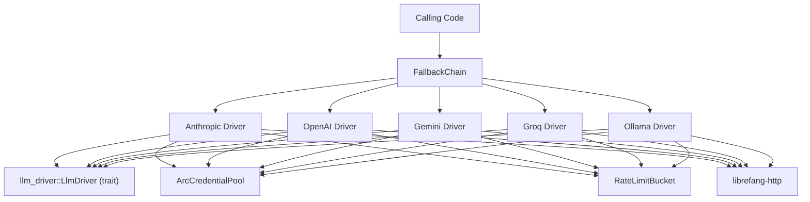

# Other — librefang-llm-drivers

# librefang-llm-drivers

Concrete LLM provider drivers that implement the driver trait defined in `librefang-llm-driver`. This is the integration layer where provider-specific HTTP endpoints, authentication, error handling, and retry logic live.

## Architecture

```mermaid
graph TD
    Consumer[Calling Code] --> FC[FallbackChain]
    FC --> D1[Anthropic Driver]
    FC --> D2[OpenAI Driver]
    FC --> D3[Gemini Driver]
    FC --> D4[Groq Driver]
    FC --> D5[Ollama Driver]
    D1 & D2 & D3 & D4 & D5 --> Trait["llm_driver::LlmDriver (trait)"]
    D1 & D2 & D3 & D4 & D5 --> CP[ArcCredentialPool]
    D1 & D2 & D3 & D4 & D5 --> RL[RateLimitBucket]
    D1 & D2 & D3 & D4 & D5 --> HTTP[librefang-http]
```

Each provider is encapsulated in its own module under `drivers::*`. All of them implement the same `LlmDriver` trait, making them interchangeable. Higher-level code typically interacts with a `FallbackChain` rather than individual drivers directly.

## Key Components

### Per-Provider Drivers (`drivers::*`)

Modules for Anthropic, OpenAI, Gemini, Groq, Ollama, and others. Each driver:

- Translates the generic `LlmDriver` request into the provider's native HTTP API format.
- Parses provider-specific response payloads and error codes back into the shared `llm_errors` types.
- Attaches credentials from the pool and updates rate-limit snapshots after each response.

### Fallback Chain (`drivers::fallback_chain`)

Composes multiple drivers into a failover chain. When a request fails, the chain advances to the next `ChainEntry` based on the `FailoverReason` (rate limit hit, server error, credential exhaustion, etc.). This is the recommended entry point for callers that need resilience.

**Key types:**
- `FallbackChain` — the chain executor.
- `ChainEntry` — pairs a driver with its configuration in the chain.

### Credential Pool (`credential_pool`)

Manages a shared pool of API keys so that multiple concurrent requests can draw from a rotating set of credentials instead of hammering a single key.

**Key types:**
- `CredentialPool` / `ArcCredentialPool` — the pool itself, wrapped in `Arc` for shared ownership.
- `PooledCredential` — a credential borrowed from the pool, returned automatically on drop.
- `PoolStrategy` — controls how credentials are selected (round-robin, random, etc.).
- `new_arc_pool` — convenience constructor.

Credentials are hashed with `sha2` for deduplication and zeroed with `zeroize` on drop to avoid lingering secrets in memory. Persistent caching uses the platform data directory via `dirs`.

### Rate-Limit Tracker (`rate_limit_tracker`)

Tracks per-provider rate-limit counters (requests remaining, reset timestamps) gleaned from response headers. Exposes a `RateLimitSnapshot` for observability and a `RateLimitBucket` for internal bookkeeping.

### Retry, Backoff, and `Retry-After` (`backoff`, `retry_after`, `shared_rate_guard`)

- **`backoff`** — exponential backoff with jitter for transient failures.
- **`retry_after`** — parses the `Retry-After` header (seconds or HTTP-date) and sleeps accordingly, overriding the default backoff when the provider explicitly asks for a wait period.
- **`shared_rate_guard`** — a coordination primitive ensuring that when one request encounters a rate-limit error, concurrent requests to the same provider also back off rather than all hitting the wall simultaneously.

### Stream Handling (`stream_backpressure`, `utf8_stream`)

- **`stream_backpressure`** — applies backpressure when consuming server-sent event (SSE) streams so a fast producer doesn't exhaust memory.
- **`utf8_stream`** — handles partial UTF-8 sequences that can arrive at chunk boundaries in streamed responses, buffering until a complete character is available.

### Think Filter (`think_filter`)

Strips "thinking" tokens (internal reasoning blocks) from responses when the provider includes them but the consumer doesn't need them. Keeps the output clean for callers that only want the final answer.

## Re-exports

The crate re-exports the following for convenience:

| Re-export | Source |
|---|---|
| `llm_driver` | `librefang-llm-driver` — the trait and associated types |
| `llm_errors` | Error types from the driver crate |
| `FailoverReason` | Enum describing why a fallback occurred |

## Dependencies on Other Workspace Crates

| Crate | Role |
|---|---|
| `librefang-types` | Shared domain types (messages, tool definitions, etc.) |
| `librefang-llm-driver` | The `LlmDriver` trait this crate implements |
| `librefang-http` | Shared HTTP client construction, middleware, and telemetry injection |

## Testing

The `dev-dependencies` include `wiremock` for mocking provider HTTP endpoints, `serial_test` for ordering sensitive tests, and `tempfile` for credential-pool persistence tests. When adding a new provider driver, use `wiremock::MockServer` to simulate the provider's API and validate request formatting, error mapping, and retry behavior.