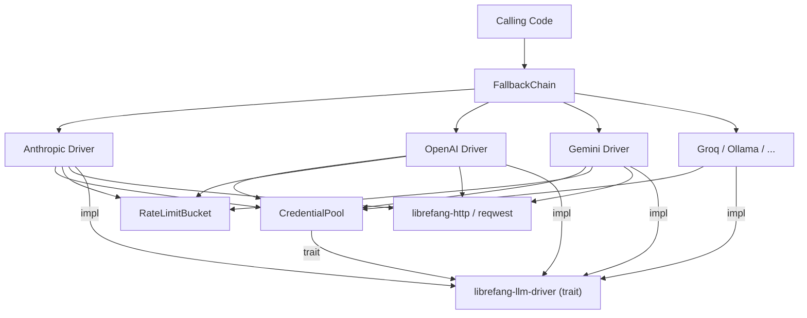

# Other — librefang-llm-drivers

# librefang-llm-drivers

Concrete LLM provider drivers for the LibreFang platform. This crate implements the `LlmDriver` trait defined in `librefang-llm-driver` for Anthropic, OpenAI, Gemini, Groq, Ollama, and other LLM providers, along with the infrastructure needed to manage credentials, rate limits, retries, and failover across them.

## Architecture


```mermaid
graph TD
    Consumer["Calling Code"] --> FC["FallbackChain"]
    FC --> D1["Anthropic Driver"]
    FC --> D2["OpenAI Driver"]
    FC --> D3["Gemini Driver"]
    FC --> D4["Groq / Ollama / ..."]
    D1 --> CP["CredentialPool"]
    D2 --> CP
    D3 --> CP
    D4 --> CP
    D1 --> RL["RateLimitBucket"]
    D2 --> RL
    D3 --> RL
    D1 --> HTTP["librefang-http / reqwest"]
    D2 --> HTTP
    D3 --> HTTP
    CP -->|"trait"| TRAIT["librefang-llm-driver (trait)"]
    D1 -->|"impl"| TRAIT
    D2 -->|"impl"| TRAIT
    D3 -->|"impl"| TRAIT
    D4 -->|"impl"| TRAIT
```

## Module Layout

| Path | Responsibility |
|------|----------------|
| `drivers::*` | Per-provider driver implementations (anthropic, openai, gemini, groq, ollama, etc.) |
| `drivers::fallback_chain` | `FallbackChain` and `ChainEntry` — compose multiple drivers into a failover chain |
| `credential_pool` | Shared, thread-safe API-key pool with pluggable selection strategies |
| `rate_limit_tracker` | `RateLimitBucket` and `RateLimitSnapshot` — provider rate-limit observability |
| `backoff` | Exponential backoff computation |
| `retry_after` | `Retry-After` header parsing and enforcement |
| `shared_rate_guard` | Shared concurrency/rate-limit guard across driver instances |
| `stream_backpressure` | Backpressure management for streaming responses |
| `think_filter` | Filters extended-thinking output from responses |
| `utf8_stream` | UTF-8 boundary-safe byte stream handling |

### Re-exports

The crate re-exports `llm_driver` (the trait and error types from `librefang-llm-driver`), `llm_errors`, and `FailoverReason` so consumers don't need to depend on the trait crate directly for common types.

## Key Components

### Per-Provider Drivers (`drivers::*`)

Each provider module implements the `LlmDriver` trait for a specific LLM API. A driver handles:

- Translating the generic request shape from `librefang-types` into the provider's wire format
- Signing requests with credentials drawn from the credential pool
- Sending requests via `librefang-http` / `reqwest`
- Parsing provider-specific response formats back into generic types
- Streaming response handling with proper UTF-8 boundary management
- Respect for provider-specific rate-limit headers and error codes

### Fallback Chain (`drivers::fallback_chain`)

`FallbackChain` wraps an ordered list of `ChainEntry` items, each pairing a driver with optional configuration overrides. When a request fails, the chain advances to the next entry, emitting a `FailoverReason` describing why the previous provider was skipped (rate limit, auth failure, timeout, server error, etc.).

This is the primary composition mechanism for production deployments — callers typically construct a single `FallbackChain` rather than using individual drivers directly.

### Credential Pool (`credential_pool`)

```rust
pub use credential_pool::{ArcCredentialPool, CredentialPool, PoolStrategy, PooledCredential, new_arc_pool};
```

Manages a shared set of API keys for a given provider. The pool is concurrency-safe (`DashMap`-backed) and supports multiple selection strategies via `PoolStrategy` (e.g., round-robin, random, least-recently-used).

Key types:

- **`CredentialPool`** — the pool itself, tracking usage counts, cooldowns, and validity
- **`ArcCredentialPool`** — `Arc<CredentialPool>`, the typical shared-reference type
- **`PooledCredential`** — a credential borrowed from the pool with automatic return semantics
- **`new_arc_pool`** — convenience constructor

Credentials are zeroized on drop (`zeroize` dependency) to minimize in-memory key exposure.

### Rate Limit Tracking (`rate_limit_tracker`)

```rust
pub use rate_limit_tracker::{RateLimitBucket, RateLimitSnapshot};
```

`RateLimitBucket` tracks remaining request capacity per provider. Drivers update the bucket from response headers (`x-ratelimit-remaining`, etc.) and use `RateLimitSnapshot` to expose observability data to callers and metrics.

### Streaming Utilities

LLM streaming responses arrive as incremental byte chunks over HTTP. Two utilities handle the edge cases:

- **`utf8_stream`** — ensures chunks are split only at valid UTF-8 boundaries, preventing decode errors on partial multi-byte characters
- **`stream_backpressure`** — applies backpressure so fast producers don't overwhelm slow consumers

### Retry and Backoff

- **`backoff`** — computes exponential backoff durations with jitter
- **`retry_after`** — parses `Retry-After` headers (both delta-seconds and HTTP-date formats) and enforces the wait period
- **`shared_rate_guard`** — a concurrency primitive that limits in-flight requests per provider, coordinating across multiple driver instances sharing the same provider endpoint

### Think Filter (`think_filter`)

Some providers (notably Anthropic's extended thinking) include internal reasoning tokens in their responses. `think_filter` strips these from the output so downstream consumers see only the final response text.

## Dependencies

| Crate | Role |
|-------|------|
| `librefang-types` | Shared request/response types |
| `librefang-llm-driver` | The `LlmDriver` trait this crate implements |
| `librefang-http` | Shared HTTP client configuration |
| `reqwest` | Underlying HTTP client |
| `tokio` | Async runtime |
| `serde` / `serde_json` | Serialization |
| `dashmap` | Concurrent credential pool storage |
| `sha2` / `hex` | Credential fingerprinting |
| `zeroize` | Secure credential memory clearing |
| `tracing` / `opentelemetry` / `metrics` | Observability |
| `base64` | Encoding for provider-specific payloads |
| `rand` | Jitter in backoff, random credential selection |

## Testing

Dev-dependencies include `wiremock` for mocking provider HTTP endpoints, `serial_test` for test serialization, and `tempfile` for filesystem-related tests (credential storage). Tests exercise each driver against mocked provider APIs, validate fallback chain behavior under simulated failures, and confirm credential pool rotation strategies.