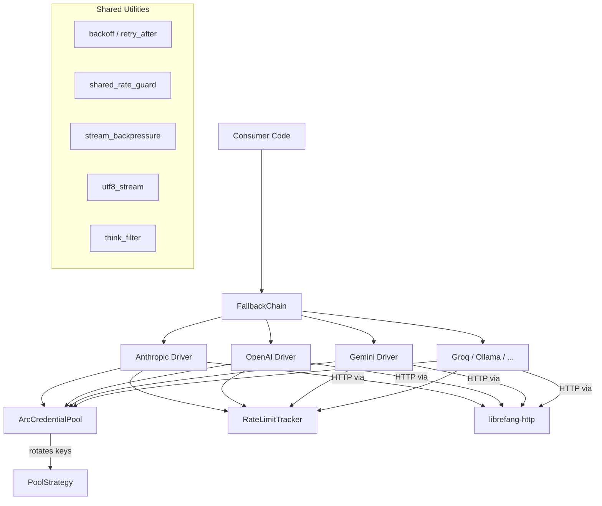

# Other — librefang-llm-drivers

# librefang-llm-drivers

Concrete LLM provider drivers for the LibreFang platform. This crate implements the `LlmDriver` trait defined in `librefang-llm-driver` for Anthropic, OpenAI, Gemini, Groq, Ollama, and other providers, and layers production-grade infrastructure on top: credential pooling, fallback chains, rate-limit tracking, retry/backoff, and stream backpressure handling.

## Architecture


```mermaid
graph TD
    A[Consumer Code] --> B[FallbackChain]
    B --> C1[Anthropic Driver]
    B --> C2[OpenAI Driver]
    B --> C3[Gemini Driver]
    B --> C4[Groq / Ollama / ...]
    C1 --> D[ArcCredentialPool]
    C2 --> D
    C3 --> D
    C4 --> D
    C1 --> E[RateLimitTracker]
    C2 --> E
    C3 --> E
    C4 --> E
    D -->|rotates keys| F[PoolStrategy]
    C1 & C2 & C3 & C4 -->|HTTP via| G[librefang-http]
    subgraph "Shared Utilities"
        H[backoff / retry_after]
        I[shared_rate_guard]
        J[stream_backpressure]
        K[utf8_stream]
        L[think_filter]
    end
```

## Relationship to Other Crates

| Crate | Role |
|---|---|
| `librefang-llm-driver` | Defines the `LlmDriver` trait and error types that this crate implements. Re-exported here as `llm_driver`. |
| `librefang-types` | Shared domain types (messages, model IDs, tool definitions, etc.) |
| `librefang-http` | HTTP client construction, possibly with observability/telemetry middleware. All outbound requests flow through this layer. |

## Key Components

### Per-Provider Drivers — `drivers::*`

Each provider lives in its own submodule under `drivers`. Every driver implements the `LlmDriver` trait and is responsible for:

1. Translating the generic request format into the provider's wire format (JSON body, headers, query params).
2. Making the HTTP request via `librefang-http` / `reqwest`.
3. Parsing the provider-specific response back into the shared response type.
4. Extracting rate-limit headers and feeding them into the shared `RateLimitTracker`.

Available drivers include Anthropic, OpenAI, Gemini, Groq, and Ollama.

### Fallback Chain — `drivers::fallback_chain`

**Types:** `FallbackChain`, `ChainEntry`

Composes multiple drivers into an ordered failover chain. When a request fails (network error, rate limit, server error, etc.), the chain automatically retries against the next provider. The `FailoverReason` enum (re-exported at the crate root) categorizes why a particular driver was skipped, enabling observability and alerting.

Use this when you want resilience across providers — for example, primary traffic to Anthropic with automatic fallback to OpenAI if Anthropic is rate-limiting.

### Credential Pool — `credential_pool`

**Types:** `ArcCredentialPool`, `CredentialPool`, `PoolStrategy`, `PooledCredential`, `new_arc_pool`

Manages a shared pool of API keys for a given provider. Rather than hard-coding a single key, you register multiple keys and the pool distributes them according to a `PoolStrategy` (e.g., round-robin, random, least-recently-used).

- `new_arc_pool` — constructor that returns an `ArcCredentialPool` (thread-safe, shareable across tasks).
- `PooledCredential` — a borrowed credential from the pool that is automatically returned when dropped.
- `zeroize` is used to securely clear credential material from memory.

The pool uses `dashmap` internally for lock-free concurrent access.

### Rate Limit Tracking — `rate_limit_tracker`

**Types:** `RateLimitBucket`, `RateLimitSnapshot`

Tracks per-provider rate-limit state as reported by response headers (e.g., `x-ratelimit-remaining`, `Retry-After`). Drivers update the tracker after each response. Downstream code can query a `RateLimitSnapshot` to make informed scheduling decisions — for example, choosing the least-constrained provider in a fallback chain.

### Shared Utilities

These are standalone modules used internally by drivers but also publicly available for custom driver implementations:

| Module | Purpose |
|---|---|
| `backoff` | Exponential backoff calculation for retries. |
| `retry_after` | Parses `Retry-After` headers (both delta-seconds and HTTP-date formats). |
| `shared_rate_guard` | A concurrency guard that blocks or defers requests when a provider's rate-limit bucket is exhausted. |
| `stream_backpressure` | Applies backpressure when consuming server-sent event (SSE) streams so a fast producer doesn't overwhelm the consumer. |
| `utf8_stream` | Handles partial UTF-8 codepoints at chunk boundaries in streaming responses — reassembles them before yielding. |
| `think_filter` | Strips or transforms `<think …>` blocks that some models emit, so they don't leak into user-facing output. |

## Re-exports

The crate re-exports the following for convenience:

- `llm_driver` — the trait and associated types from `librefang-llm-driver`.
- `llm_errors` — error types for LLM operations.
- `FailoverReason` — categorization of why a fallback occurred.

## Usage Patterns

### Basic Driver Construction

```rust
use librefang_llm_drivers::drivers::anthropic::AnthropicDriver;
use librefang_llm_drivers::credential_pool::new_arc_pool;

let pool = new_arc_pool(vec!["sk-ant-...".to_string()]);
let driver = AnthropicDriver::new(pool);
```

### Fallback Chain

```rust
use librefang_llm_drivers::drivers::fallback_chain::{FallbackChain, ChainEntry};
// Configure with primary and fallback providers, then use the chain
// as a single LlmDriver implementation.
```

### Rate-Limit-Aware Scheduling

```rust
use librefang_llm_drivers::rate_limit_tracker::RateLimitSnapshot;
// Query the snapshot before dispatching to pick the healthiest provider.
```

## Observability

The crate depends on `tracing`, `opentelemetry`, `tracing-opentelemetry`, and `metrics`. Drivers emit spans and metrics for request latency, token counts, rate-limit consumption, and failover events. Integrate with your OpenTelemetry collector to get end-to-end visibility.

## Testing

Tests use `wiremock` to mock provider HTTP endpoints and `serial_test` to prevent race conditions in tests that touch the global rate-limit state. `tempfile` is used for any tests involving credential file I/O.