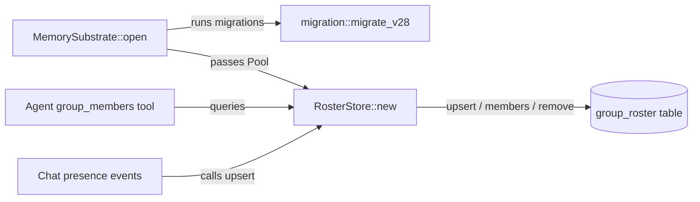

# Other — librefang-memory-src

# Roster Store (`librefang-memory/src/roster_store.rs`)

## Purpose

`RosterStore` persists the membership of group chats in SQLite so that agents can look up who is present in a room without the full roster being injected into the system prompt. This saves tokens on every request while still letting the agent answer questions like "who is in this chat?" through the `group_members` tool.

## Architecture



The store is intentionally a thin wrapper around an `r2d2` connection pool. It does **not** own its schema — `group_roster` is created by the shared migration ladder (`migration::migrate_v28`), which runs inside `MemorySubstrate::open` before the store is constructed. This design means:

- All schema changes flow through a single migration path.
- Constructing a `RosterStore` can never panic on a locked or read-only database; failures surface earlier, at boot.

## Data Model

The underlying `group_roster` table is keyed on a composite of `(channel_type, chat_id, user_id)`:

| Column | Type | Notes |
|---|---|---|
| `channel_type` | text | Protocol/network identifier (e.g. `"telegram"`) |
| `chat_id` | text | Platform-specific group identifier |
| `user_id` | text | Platform-specific user identifier |
| `display_name` | text | Current display name — overwritten on every upsert |
| `username` | text | Optional handle — preserved if a later upsert supplies `None` |
| `first_seen` | integer | Unix timestamp set on `INSERT` |
| `last_seen` | integer | Unix timestamp updated on every upsert |

## API

### `RosterStore::new(pool)`

Wraps an existing `r2d2::Pool<SqliteConnectionManager>`. No DDL is executed here.

### `upsert(channel, chat_id, user_id, display_name, username)`

Inserts a new member or updates an existing one. On conflict:

- `display_name` is **always** overwritten with the latest value.
- `username` uses `COALESCE(excluded.username, group_roster.username)` — a `None` will not erase a previously known username.
- `last_seen` is refreshed to the current Unix timestamp.
- `first_seen` is set once on insert and never changed.

**Guard:** If `chat_id` or `user_id` is empty, the call returns immediately without touching the database. This prevents garbage rows from malformed events.

### `members(channel, chat_id) → Vec<(user_id, display_name, username)>`

Returns all known members of a group, ordered alphabetically by `display_name`. Returns an empty `Vec` if the chat is unknown or the pool is exhausted.

### `remove_member(channel, chat_id, user_id)`

Deletes a single member row. Used when a leave/part/kick event is received.

### `member_count(channel, chat_id) → usize`

Returns `COUNT(*)` for the given group. Returns `0` on unknown chats or pool exhaustion.

## Error Handling Strategy

None of the public methods return `Result`. Instead, they follow a **degrade gracefully** pattern:

1. **Empty inputs** — `upsert` silently ignores rows with empty `chat_id` or `user_id`.
2. **Pool exhaustion** — Every method catches a failed `pool.get()`, emits a `tracing::warn!`, increments the `librefang_memory_pool_get_failed_total` counter (labelled with `store => "roster"` and the `op` name), and returns a safe default (`None`, `0`, or `Vec::new()`).
3. **SQL errors** — `let _ = c.execute(...)` discards insertion failures. Query methods use `.unwrap()` on the prepared statement under the assumption that the schema has been validated by migrations at boot.

This makes the store safe to call from hot paths (presence floods) without propagating transient DB pressure upward.

## Metrics

All pool-get failures emit a counter:

```
librefang_memory_pool_get_failed_total{store="roster",op="<operation>"}
```

Where `<operation>` is one of `upsert`, `members`, `remove_member`, or `member_count`. Monitoring this metric is the primary way to detect connection-pool saturation.

## Testing

Tests use `SqliteConnectionManager::memory()` with a single-connection pool. The helper `in_memory_store()` runs `migration::run_migrations` against the in-memory database before constructing the store, ensuring the test schema matches production.

Key test cases:

| Test | Validates |
|---|---|
| `upsert_and_list` | Basic insert and retrieval; username `Option` handling |
| `idempotent_upsert_updates_display_name` | Repeated upserts update display name without duplicating rows |
| `remove_member` | Deletion removes the correct row; count decreases |
| `empty_chat_returns_nothing` | Unknown chats yield empty results, not errors |
| `different_chats_are_isolated` | Members in one chat don't leak into another |
| `empty_ids_are_ignored` | Empty `chat_id` or `user_id` produces no rows |

## Integration Notes

- **Instantiation:** Call `RosterStore::new(pool)` with the same pool used by `MemorySubstrate`. The migrations must have already been applied.
- **Write path:** Chat adapters should call `upsert` on every presence, join, or profile-update event.
- **Read path:** The `group_members` agent tool calls `members` to satisfy queries about who is in the current chat.
- **Thread safety:** `r2d2::Pool` is `Send + Sync`; `RosterStore` can be freely shared across threads (e.g. cloned into async tasks).