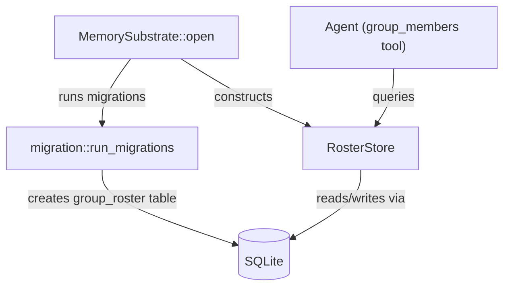

# Other — librefang-memory-src

# RosterStore — SQLite-Backed Group Roster

## Purpose

`RosterStore` tracks which users have been seen in each group chat, persisting membership data across daemon restarts. Agents query this store through the `group_members` tool rather than having the full roster injected into the system prompt, which saves tokens on large groups.

The store lives in `librefang-memory/src/roster_store.rs` and operates on the same SQLite database managed by `MemorySubstrate`.

## Architecture

## Key Design Decisions

**No schema DDL in the constructor.** `RosterStore::new` only wraps an existing connection pool. The `group_roster` table is created by `migration::migrate_v28`, which `MemorySubstrate::open` runs before constructing the store. This ensures:

1. Every memory table goes through the single migration ladder — no divergent schema paths.
2. Constructing a `RosterStore` can never panic on a locked or read-only database. Schema failures surface from `MemorySubstrate::open` at boot instead.

**Graceful degradation on pool exhaustion.** Every method that acquires a connection handles pool exhaustion by logging a warning, incrementing a failure metric, and returning a safe default (empty vec, zero count, or no-op). The store never panics due to contention.

## Schema

The underlying `group_roster` table (created by migration v28):

| Column | Type | Notes |
|---|---|---|
| `channel_type` | text | e.g. `"telegram"` |
| `chat_id` | text | Group/chat identifier |
| `user_id` | text | User identifier within the channel |
| `display_name` | text | Current display name |
| `username` | text | Nullable handle/username |
| `first_seen` | integer | Unix timestamp of first insertion |
| `last_seen` | integer | Unix timestamp, updated on every upsert |

The unique constraint is **(channel_type, chat_id, user_id)**.

## API

### `RosterStore::new(pool: Pool<SqliteConnectionManager>) -> Self`

Wraps an existing r2d2 connection pool. Call this only after migrations have been applied.

### `upsert(channel, chat_id, user_id, display_name, username)`

Inserts a new member or updates an existing one. On conflict (same channel + chat + user), it:

- Overwrites `display_name` with the new value.
- Updates `username` only if a non-null value is provided (`COALESCE` preserves the existing username).
- Refreshes `last_seen` to the current Unix timestamp.
- Leaves `first_seen` unchanged.

Silently returns if `chat_id` or `user_id` is empty — these are treated as invalid identifiers.

### `members(channel, chat_id) -> Vec<(String, String, Option<String>)>`

Returns all members for the given chat as `(user_id, display_name, username)` tuples, ordered alphabetically by `display_name`. Returns an empty `Vec` on pool exhaustion or if no members exist.

### `remove_member(channel, chat_id, user_id)`

Deletes a single member from the roster. No-op on pool exhaustion.

### `member_count(channel, chat_id) -> usize`

Returns the number of members in a chat. Returns `0` on pool exhaustion or if no members exist.

## Error Handling & Observability

All pool acquisition failures emit:

- A `tracing::warn` log identifying the store (`roster`), the operation, and the channel/chat identifiers.
- A counter increment on `librefang_memory_pool_get_failed_total` with labels `store => "roster"` and `op => <operation>`.

SQL execution errors from `execute` and `query_row` are silently consumed (`let _ = ...` / `.unwrap_or(...)`). This is intentional — the roster is best-effort metadata, and transient SQLite errors should not crash the agent loop.

## Isolation Model

Each `(channel_type, chat_id)` pair is fully isolated. There is no cross-chat leakage: members in `("telegram", "-100")` are invisible to queries for `("telegram", "-200")` or `("discord", "100")`. This is enforced by the `WHERE` clause in every query.

## Testing

Tests create an in-memory SQLite database via `in_memory_store()`, which:

1. Builds a single-connection pool (`max_size(1)`).
2. Runs `migration::run_migrations` to create the full schema.
3. Constructs and returns a `RosterStore`.

Covered scenarios:

- **`upsert_and_list`** — basic insertion and alphabetical ordering.
- **`idempotent_upsert_updates_display_name`** — repeated upserts update display_name but don't duplicate rows.
- **`remove_member`** — deletion reduces count and the removed member is absent from listings.
- **`empty_chat_returns_nothing`** — querying a nonexistent chat returns empty/zero.
- **`different_chats_are_isolated`** — members in one chat don't appear in another.
- **`empty_ids_are_ignored`** — upserts with empty `chat_id` or `user_id` are silently dropped.