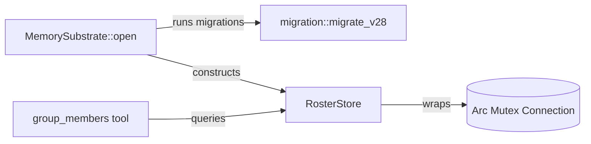

# Other — librefang-memory-src

# RosterStore — SQLite-Backed Group Roster

## Overview

`RosterStore` persists group chat membership across daemon restarts. Instead of embedding the full roster into the agent's system prompt (wasting tokens), agents query this store on demand through the `group_members` tool.

The store lives in `librefang-memory/src/roster_store.rs` and wraps a shared SQLite connection behind a `Mutex`.

## Schema

The table `group_roster` is created by `migration::migrate_v28` during `MemorySubstrate::open`. `RosterStore::new` intentionally does **not** run DDL — all schema changes go through the single migration ladder so that failures surface at boot rather than at construction time.

| Column | Type | Role |
|---|---|---|
| `channel_type` | TEXT | Platform identifier (e.g. `"telegram"`) |
| `chat_id` | TEXT | Group/chat identifier |
| `user_id` | TEXT | User identifier within that chat |
| `display_name` | TEXT | Current display name |
| `username` | TEXT | Optional platform username |
| `first_seen` | INTEGER | Unix timestamp of first insert |
| `last_seen` | INTEGER | Unix timestamp, updated on every upsert |

The unique constraint is `(channel_type, chat_id, user_id)`.

## Architecture

`MemorySubstrate::open` runs all migrations (including `migrate_v28` which creates the `group_roster` table) and then passes the `Arc<Mutex<Connection>>` into `RosterStore::new`.

## API

### `new(conn: Arc<Mutex<Connection>>) -> Self`

Wraps an existing connection. No schema creation, no panics on locked/read-only databases.

### `upsert(channel, chat_id, user_id, display_name, username)`

Inserts a new member or updates an existing one. On conflict:
- `display_name` is **always** overwritten with the new value.
- `username` is overwritten **only if** a non-`None` value is provided (`COALESCE` preserves the old username).
- `last_seen` is refreshed to the current unix timestamp.
- `first_seen` is set only on insert and never modified.

**Silently returns** if `chat_id` or `user_id` is empty — this guards against malformed events without logging or panicking.

### `members(channel, chat_id) -> Vec<(user_id, display_name, Option<username>)>`

Returns all members of a specific group chat, sorted alphabetically by `display_name`. Returns an empty `Vec` for unknown chats.

### `remove_member(channel, chat_id, user_id)`

Deletes a single member record. Used when the platform reports a user leaving a group.

### `member_count(channel, chat_id) -> usize`

Returns the number of tracked members. Returns `0` on query failure or for unknown chats.

## Key Design Decisions

1. **No DDL in the constructor.** Schema ownership lives entirely in `migration.rs`. This keeps `RosterStore::new` infallible and prevents lock/read-only errors from appearing mid-run.

2. **Mutex, not async.** SQLite doesn't support concurrent writes. The `Mutex<Connection>` serializes access simply and correctly. Callers holding the lock do minimal work (single SQL statements).

3. **Silent failure on empty IDs.** `upsert` returns early when `chat_id` or `user_id` is empty rather than inserting garbage rows or panicking. This makes the store resilient to incomplete platform events.

4. **Username preservation.** The `ON CONFLICT` clause uses `COALESCE(excluded.username, group_roster.username)` so that an upsert without a username (e.g., the platform didn't provide one) doesn't erase a previously known username.

## Testing

Tests in the `#[cfg(test)]` module use `Connection::open_in_memory()` and call `migration::run_migrations` to set up the full schema, then construct a `RosterStore` via `new`. Key scenarios covered:

- **`upsert_and_list`** — basic insert and alphabetical retrieval.
- **`idempotent_upsert_updates_display_name`** — repeated upserts update the display name without duplicating rows.
- **`remove_member`** — deletion works and remaining members are unaffected.
- **`empty_chat_returns_nothing`** — unknown chat IDs yield empty results.
- **`different_chats_are_isolated`** — members in one chat don't leak into another.
- **`empty_ids_are_ignored`** — empty `chat_id` or `user_id` values are silently dropped.

To add a new test, use the `in_memory_store()` helper which handles connection creation, migration, and store construction.