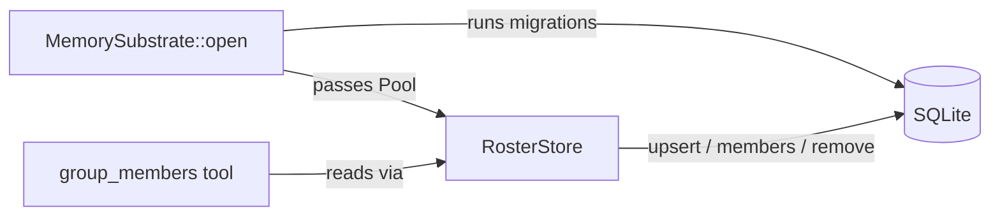

# Other — librefang-memory-src

# RosterStore — SQLite-Backed Group Roster

## Purpose

`RosterStore` persists the membership of every group chat the daemon has seen. Instead of injecting the full roster into the agent's system prompt (expensive in tokens), agents query the store on demand through the `group_members` tool.

This means:
- Roster data survives daemon restarts.
- Token cost is zero until the agent actually needs to look up a member.
- Membership state is scoped per `(channel_type, chat_id)` pair, so Telegram, Discord, and other channels coexist without collision.

## Architecture

`MemorySubstrate::open` is responsible for running the migration ladder (including `migration::migrate_v28`, which creates the `group_roster` table) **before** constructing the `RosterStore`. This design ensures that `RosterStore::new` can never panic on a locked or read-only database — schema failures surface at boot, not at first use.

## Schema

The table is created externally by `migration::migrate_v28`. The expected shape is:

| Column | Type | Role |
|---|---|---|
| `channel_type` | TEXT | Protocol identifier (e.g. `"telegram"`, `"discord"`) |
| `chat_id` | TEXT | Platform-specific group identifier |
| `user_id` | TEXT | Platform-specific user identifier |
| `display_name` | TEXT | Human-readable name at time of last sighting |
| `username` | TEXT | Nullable platform handle |
| `first_seen` | INTEGER | Unix epoch seconds, set on INSERT |
| `last_seen` | INTEGER | Unix epoch seconds, updated on every upsert |

The unique constraint is `(channel_type, chat_id, user_id)`.

## API

### `RosterStore::new(pool)`

Wraps an existing `r2d2::Pool<SqliteConnectionManager>`. Does **not** run DDL — see the design rationale above.

### `upsert(channel, chat_id, user_id, display_name, username)`

Inserts a new member or updates an existing one. On conflict:
- `display_name` is always overwritten with the latest value.
- `username` is updated only if the new value is non-`NULL` (`COALESCE` preserves the old value).
- `last_seen` is refreshed to the current timestamp.
- `first_seen` remains unchanged.

**Guard:** silently returns if `chat_id` or `user_id` is empty.

### `members(channel, chat_id) -> Vec<(user_id, display_name, Option<username>)>`

Returns all members of a group, ordered alphabetically by `display_name`. Returns an empty vec on pool exhaustion or if no members exist.

### `remove_member(channel, chat_id, user_id)`

Deletes a single member row. Silent no-op if the pool is exhausted.

### `member_count(channel, chat_id) -> usize`

Returns the number of rows for the given group. Returns `0` on pool exhaustion.

## Error & Pool Exhaustion Handling

Every public method follows the same pattern when the connection pool is exhausted:

1. Increments the `librefang_memory_pool_get_failed_total` counter (labels: `store = "roster"`, `op = "<method_name>"`).
2. Emits a `tracing::warn!` with the channel and chat ID.
3. Returns a safe default — empty vec, zero count, or silent return.

This ensures that transient pool pressure never crashes the daemon or propagates to the agent.

## Integration Points

| Caller | Direction | What happens |
|---|---|---|
| `MemorySubstrate::open` | inbound | Constructs `RosterStore` after running migrations |
| `migration::run_migrations` | inbound (tests) | Sets up the `group_roster` table in test helpers |
| `group_members` tool | outbound | Calls `members()` to serve agent queries |
| Bridge / protocol layer | inbound | Calls `upsert()` when presence events arrive |

## Testing

Tests use `in_memory_store()`, which builds a single-connection in-memory SQLite pool, runs the full migration ladder via `crate::migration::run_migrations`, and returns a ready-to-use `RosterStore`.

Covered scenarios:
- Basic insert and list ordering.
- Idempotent upsert updating `display_name` while preserving the row.
- Member removal and count consistency.
- Empty chat IDs returning nothing.
- Cross-chat isolation (members in one chat don't leak into another).
- Empty `chat_id` / `user_id` inputs being silently rejected.