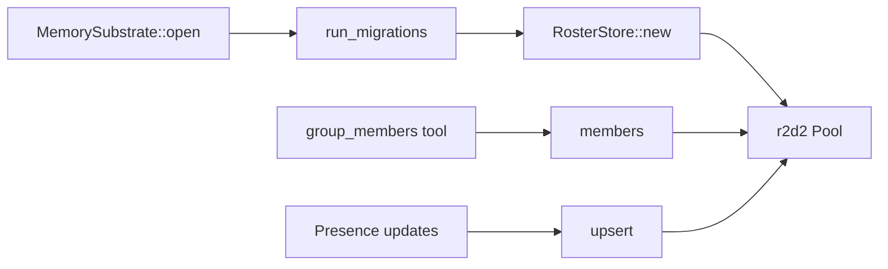

# Other — librefang-memory-src

# RosterStore — Group Chat Member Persistence

## Overview

`RosterStore` persists which users have been seen in each group chat across daemon restarts. Instead of injecting the entire roster into the agent's system prompt (wasting tokens), agents query member lists on demand via the `group_members` tool.

The store is a thin wrapper around an `r2d2`-pooled SQLite connection. All operations are synchronous and degrade gracefully if the connection pool is exhausted — they log a warning, increment a failure metric, and return an empty result rather than panicking.

## Schema

The backing table `group_roster` is **not** created by this module. It is managed by the shared migration ladder (`migration::migrate_v28`), which runs during `MemorySubstrate::open` before the store is constructed. This ensures:

- Every memory table goes through a single, ordered migration path.
- Constructing a `RosterStore` can never fail due to a locked or read-only database — that failure surfaces earlier, at boot.

The table schema (from the migration) uses a composite key of `(channel_type, chat_id, user_id)` with columns for `display_name`, `username`, `first_seen`, and `last_seen`.

## Architecture

```mermaid
graph LR
    A[MemorySubstrate::open] --> B[run_migrations]
    B --> C[RosterStore::new]
    C --> D[r2d2 Pool]
    E[group_members tool] --> F[members]
    F --> D
    G[Presence updates] --> H[upsert]
    H --> D
```

`MemorySubstrate::open` runs migrations first, then passes the pool into `RosterStore::new`. At runtime, presence events call `upsert`, and the agent tool calls `members`.

## API

### `RosterStore::new(pool)`

Wraps an existing `Pool<SqliteConnectionManager>`. No DDL is executed here — the pool must already have the `group_roster` table via migrations.

### `upsert(channel, chat_id, user_id, display_name, username)`

Inserts a new member or updates an existing one. On conflict (same `channel` + `chat_id` + `user_id`), it:

- Overwrites `display_name` with the new value.
- Preserves the existing `username` if the new value is `None` (via `COALESCE`).
- Refreshes `last_seen` to the current Unix timestamp.
- Leaves `first_seen` unchanged.

**Guards:** If `chat_id` or `user_id` is empty, the call is silently ignored — no database interaction occurs.

### `members(channel, chat_id) -> Vec<(String, String, Option<String>)>`

Returns all members for the given chat as `(user_id, display_name, username)` tuples, ordered alphabetically by `display_name`. Returns an empty `Vec` if the pool is exhausted or no members exist.

### `remove_member(channel, chat_id, user_id)`

Deletes a single member from the roster. No-op if the pool is unavailable.

### `member_count(channel, chat_id) -> usize`

Returns the count of members in a group. Returns `0` if the pool is exhausted.

## Error Handling Strategy

All methods handle pool exhaustion identically:

1. Increment the `librefang_memory_pool_get_failed_total` counter with labels `store=roster` and `op=<operation>`.
2. Log a `tracing::warn` with the channel and chat_id.
3. Return a safe default (`None`, empty vec, or zero).

SQL execution errors from `execute` and `query_row` are silently consumed (the `let _ = ...` pattern). This is intentional — a transient SQLite error should not crash the agent loop.

## Integration Points

- **Migration dependency:** `crate::migration::run_migrations` must run before constructing the store. Tests use `in_memory_store()` which calls `run_migrations` explicitly.
- **Metric emission:** Uses the `metrics` crate's `counter!` macro. The consuming application must install a metrics exporter to observe pool exhaustion.
- **Channel identification:** The `channel` parameter is a string like `"telegram"` that distinguishes different chat platforms. Rosters for different channels are fully isolated even if `chat_id` values overlap.