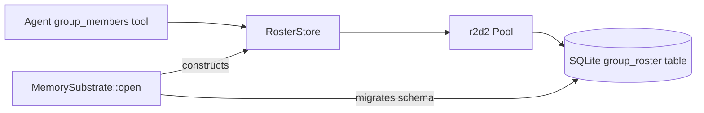

# Other — librefang-memory-src

# RosterStore — Group Chat Member Persistence

## Purpose

`RosterStore` persists group chat member lists to SQLite so they survive daemon restarts. Instead of injecting an entire roster into the agent's system prompt (consuming tokens on every request), agents query membership on-demand through the `group_members` tool.

## Architecture


```mermaid
graph LR
    A[Agent group_members tool] --> B[RosterStore]
    B --> C[r2d2 Pool]
    C --> D[(SQLite group_roster table)]
    E[MemorySubstrate::open] -->|migrates schema| D
    E -->|constructs| B
```

The store is a thin wrapper over an `r2d2::Pool<SqliteConnectionManager>`. It does **not** own the database or its migrations — those responsibilities live in `MemorySubstrate::open`, which runs the full migration ladder (including `migration::migrate_v28` that creates the `group_roster` table) before constructing the store.

## Construction & Lifecycle

```rust
let store = RosterStore::new(pool);
```

`new` accepts a pre-configured connection pool. It intentionally performs **zero DDL** — no `CREATE TABLE IF NOT EXISTS`, no schema checks. This design choice has two benefits:

1. **Single migration path.** Every memory table is created through one migration ladder, avoiding drift between ad-hoc DDL and migration scripts.
2. **No panics on locked/read-only databases.** If the schema is missing, the failure surfaces from `MemorySubstrate::open` at boot time rather than from a surprise panic inside the store.

## API Reference

### `upsert`

```rust
store.upsert("telegram", "-100", "user_42", "Alice", Some("alice_tg"));
```

Inserts a new member or updates an existing one. The SQL uses `ON CONFLICT(channel_type, chat_id, user_id)` so repeated calls are idempotent:

- `display_name` is always overwritten with the latest value.
- `username` uses `COALESCE(excluded.username, group_roster.username)` — a `None` username will **not** erase a previously stored one.
- `last_seen` is refreshed to the current Unix timestamp on every upsert.
- `first_seen` is set only on insert and never modified.

**Guard:** calls with an empty `chat_id` or `user_id` are silently ignored (early return, no DB hit).

### `members`

```rust
let members: Vec<(String, String, Option<String>)> = store.members("telegram", "-100");
// Returns (user_id, display_name, username) tuples, sorted by display_name
```

Returns all known members of a group chat, ordered alphabetically by `display_name`. Returns an empty `Vec` if the pool is exhausted or the chat has no members.

### `remove_member`

```rust
store.remove_member("telegram", "-100", "user_42");
```

Deletes a single member from a specific chat. No-op if the pool is exhausted.

### `member_count`

```rust
let count: usize = store.member_count("telegram", "-100");
```

Returns the number of stored members for a chat. Returns `0` on pool exhaustion.

## Error Handling Philosophy

Every method follows the same pattern for pool exhaustion:

1. Attempt `self.pool.get()`.
2. On failure, increment the `librefang_memory_pool_get_failed_total` counter with `store => "roster"` and the operation name.
3. Log a `tracing::warn` with the channel and chat ID.
4. Return a safe default — empty vec, zero count, or silent skip — rather than propagating an error.

This makes the store **degrade gracefully** under connection pressure: queries return empty results and writes are dropped, but the process stays alive. Callers never need to handle `Result` types.

## Database Schema

The `group_roster` table is created by `migration::migrate_v28` with this approximate shape:

| Column | Type | Notes |
|---|---|---|
| `channel_type` | TEXT | e.g. `"telegram"`, `"discord"` |
| `chat_id` | TEXT | Platform-specific group identifier |
| `user_id` | TEXT | Platform-specific user identifier |
| `display_name` | TEXT | Human-readable name |
| `username` | TEXT | Nullable platform handle |
| `first_seen` | INTEGER | Unix timestamp, set on insert |
| `last_seen` | INTEGER | Unix timestamp, updated on every upsert |

Primary key / unique constraint: `(channel_type, chat_id, user_id)`.

Data is fully isolated per `(channel_type, chat_id)` pair — members from one group are never visible in another.

## Testing

Tests use an in-memory SQLite database via `in_memory_store()`, which builds a single-connection pool and runs the full migration suite before constructing the store. Key test cases:

- **`upsert_and_list`** — basic insert and retrieval, including nullable username handling.
- **`idempotent_upsert_updates_display_name`** — repeated upserts for the same user update the display name without creating duplicates; existing usernames are preserved when a `None` is passed.
- **`remove_member`** — verifies deletion and that remaining members are intact.
- **`empty_chat_returns_nothing`** — querying a nonexistent chat returns empty results, not errors.
- **`different_chats_are_isolated`** — members in one chat don't leak into another.
- **`empty_ids_are_ignored`** — empty `chat_id` or `user_id` values are silently dropped.