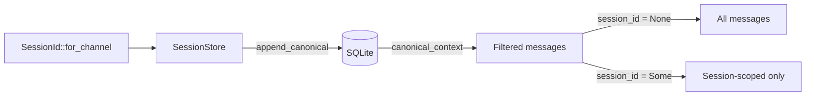

# Other — librefang-memory-tests

# librefang-memory-tests — Chat-Scoped Canonical Context Integration Tests

## Purpose

This module contains integration regression tests that guard a critical privacy fix in `librefang-memory`. The bug allowed **cross-session context leakage**: when a single agent served multiple WhatsApp conversations (e.g., a DM and a group chat), canonical memory entries from one session could appear in the LLM prompt built for another. The fix tags every `CanonicalEntry` with its originating `SessionId` and enforces filtering at read time in `canonical_context`.

These tests exercise the full append → load → context roundtrip through the same public API the kernel calls, ensuring the isolation contract holds end-to-end against a real SQLite database.

## The Bug Being Guarded

```
Before fix:
  Agent serves DM (Jessica) + Group (contains Jessica)
  canonical_context(agent, session_dm)  →  [dm-1, group-1, dm-2]  ← LEAK
  canonical_context(agent, session_group) →  [dm-1, group-1, dm-2]  ← LEAK

After fix:
  canonical_context(agent, session_dm)   →  [dm-1, dm-2]
  canonical_context(agent, session_group) →  [group-1]
```

## Architecture & Data Flow



## Test Infrastructure

### `setup()`

Creates a fresh, isolated `SessionStore` backed by an in-memory SQLite database with all migrations applied. Every test gets a clean slate — no shared state between tests.

**Dependencies called:**
- `Connection::open_in_memory()` — ephemeral SQLite
- `run_migrations(&conn)` — schema setup from `librefang_memory::migration`
- `SessionStore::new(Arc<Mutex<conn>>)` — production store constructor

### `user_msg(text)`

Helper that constructs a `Message` with `Role::User` and `MessageContent::Text`. Pinned is set to `false`. Keeps test assertions focused on content rather than message assembly.

## Test Cases

### `canonical_context_isolates_two_whatsapp_chats_for_same_agent`

**What it proves:** Two WhatsApp channels served by the same agent maintain completely isolated canonical contexts.

**Scenario:**
1. One agent handles both a WhatsApp DM (`…@s.whatsapp.net`) and a WhatsApp group (`…@g.us`).
2. Messages arrive interleaved: `dm-1`, then `group-1`, then `dm-2`.
3. Querying context for the DM session returns only `["dm-1", "dm-2"]`.
4. Querying context for the group session returns only `["group-1"]`.

**Key assertion:** `session_dm ≠ session_group` — the `SessionId::for_channel` derivation must produce distinct IDs for distinct channel identifiers, even when sharing the same `AgentId`.

**APIs exercised:**
- `SessionId::for_channel(agent, channel_id)` — session derivation
- `store.append_canonical(agent, messages, None, Some(session_id))` — tagged writes
- `store.canonical_context(agent, Some(session_id), None)` — filtered reads

### `canonical_context_unfiltered_returns_all_for_backward_compat`

**What it proves:** Callers that haven't adopted per-session filtering still get all messages across every session, preserving the original `canonical_context` semantics.

**Scenario:**
1. Two sessions (WhatsApp and Telegram) each write one message under the same agent.
2. Calling `canonical_context(agent, None, None)` returns both messages regardless of session tag.

**Why this matters:** The `session_id` parameter on `canonical_context` is optional. Passing `None` must continue to behave as it did before session-scoping was introduced, so existing consumers don't break.

## Relationship to Production Code

| Test helper / assertion | Production counterpart |
|---|---|
| `setup()` | Kernel's database initialization path |
| `SessionId::for_channel(agent, channel)` | Kernel's session derivation on every inbound message |
| `append_canonical(…, Some(session))` | Kernel tagging entries during message processing |
| `canonical_context(agent, Some(session), None)` | Kernel building scoped LLM prompt context |
| `canonical_context(agent, None, None)` | Legacy callers / cross-session summarization |

## Running

```sh
# From the workspace root
cargo test -p librefang-memory --test canonical_chat_scoped_integration

# With output
cargo test -p librefang-memory --test canonical_chat_scoped_integration -- --nocapture
```

No external services are required — all tests use in-memory SQLite and are deterministic.