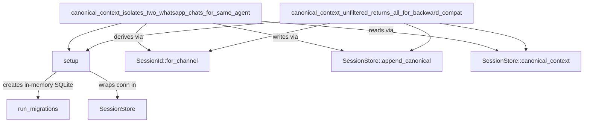

# Other — librefang-memory-tests

# librefang-memory-tests: Canonical Chat-Scoped Integration Tests

## Purpose

This module contains integration regression tests that guard a critical privacy fix in `session.rs`. Before the fix, every WhatsApp DM and group conversation sharing the same agent would see each other's history injected into the LLM prompt — meaning a private chat could leak group messages and vice versa.

The fix tags each `CanonicalEntry` with the originating `SessionId` at write time and filters by session at read time. These tests exercise the full append → load → context roundtrip via the crate's public API, which is what the kernel actually calls.

## Architecture

## Test Harness

### `setup() → SessionStore`

Creates a fresh in-memory SQLite database, runs the full migration suite via `run_migrations`, and returns a new `SessionStore` backed by an `Arc<Mutex<Connection>>`. Each test calls `setup()` independently so there is no state leakage between tests.

### `user_msg(text: &str) → Message`

Helper that constructs a `Message` with `Role::User`, `MessageContent::Text`, no pin, and no timestamp. Used to build the canonical entries that get appended to the store.

## Test Cases

### `canonical_context_isolates_two_whatsapp_chats_for_same_agent`

**What it verifies:** Two distinct WhatsApp conversations — a DM (`whatsapp:393331111111@s.whatsapp.net`) and a group (`whatsapp:120363111111111111@g.us`) — that share the same `AgentId` must not see each other's canonical context.

**Flow:**

1. Creates a single agent and derives two different `SessionId` values via `SessionId::for_channel`.
2. Asserts the two sessions are not equal (different chats must produce different sessions).
3. Appends three messages in interleaved order: `dm-1`, `group-1`, `dm-2` — each tagged with its own session.
4. Calls `canonical_context(agent, Some(session_dm), None)` and asserts only `["dm-1", "dm-2"]` are returned.
5. Calls `canonical_context(agent, Some(session_group), None)` and asserts only `["group-1"]` is returned.

**Regression being guarded:** Without the `SessionId` tag on `CanonicalEntry`, all three messages would appear in both contexts, causing cross-chat leakage into the LLM prompt.

### `canonical_context_unfiltered_returns_all_for_backward_compat`

**What it verifies:** When `canonical_context` is called with `session_id = None`, it returns all messages across all sessions for that agent. This preserves the original cross-channel canonical-memory semantics for callers that haven't adopted per-session filtering yet.

**Flow:**

1. Creates an agent and two sessions (WhatsApp and Telegram).
2. Appends one message to each session.
3. Calls `canonical_context(agent, None, None)` and asserts both `["a-1", "b-1"]` are returned.

## Relationship to Production Code

| Production API | Used in tests |
|---|---|
| `run_migrations` (`librefang_memory::migration`) | Database initialization in `setup()` |
| `SessionStore::new` (`librefang_memory::session`) | Wrapping the migrated connection |
| `SessionStore::append_canonical` | Writing tagged canonical entries |
| `SessionStore::canonical_context` | Reading filtered (or unfiltered) context |
| `SessionId::for_channel` (`librefang_types::agent`) | Deriving session identity from channel address |

These tests are the canonical consumer of the session-scoped filtering contract. If you change the `SessionId`-tagging logic in `session.rs` or the filtering behavior in `canonical_context`, these tests must continue to pass.