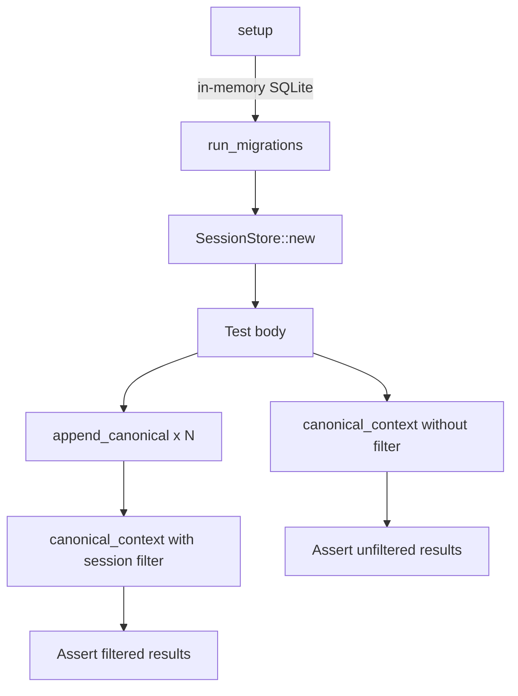

# Other — librefang-memory-tests

# librefang-memory-tests: Canonical Chat-Scoped Integration Tests

## Purpose

This module contains **integration regression tests** for the `librefang-memory` crate. Specifically, it guards against a cross-session data leak bug where canonical memory entries from one chat session could bleed into another when both sessions belonged to the same agent.

The underlying fix lives in `librefang-memory::session`, where each `CanonicalEntry` is tagged with its originating `SessionId` and filtered at read time. These tests exercise the full append → load → context roundtrip through the crate's public API — the same path the kernel calls on every inbound message.

## The Bug Being Guarded Against

Before the fix, WhatsApp DMs and group chats sharing the same `AgentId` would have their canonical memory merged into a single pool. When the kernel assembled the LLM prompt, a private DM could receive group messages in its context window, and vice versa. This was a **privacy leak**: unrelated participants' messages could be exposed across conversation boundaries.

The fix introduced per-`SessionId` tagging on `CanonicalEntry` records and session-scoped filtering in `canonical_context`.

## Test Infrastructure

### `setup()`

Creates a fresh, isolated `SessionStore` backed by an in-memory SQLite database:

1. Opens an in-memory `Connection` via `rusqlite`.
2. Runs database migrations via `run_migrations`.
3. Wraps the connection in `Arc<Mutex<Connection>>` and constructs a `SessionStore`.

Each test gets its own isolated database, so tests are independent and order-insensitive.

### `user_msg(text)`

Helper that constructs a `Message` with `Role::User` and `MessageContent::Text`. The `pinned` flag is `false` and `timestamp` is `None`. Used throughout both tests to build canonical entries.

## Test Cases

### `canonical_context_isolates_two_whatsapp_chats_for_same_agent`

The primary regression test. It simulates a realistic scenario where a single agent serves both a WhatsApp DM and a WhatsApp group chat containing the same contact.

**Setup:**

- One `AgentId` shared across both chats.
- Two sessions derived via `SessionId::for_channel`:
  - `session_dm` — `whatsapp:393331111111@s.whatsapp.net` (DM)
  - `session_group` — `whatsapp:120363111111111111@g.us` (group)

The test first asserts that these two channel identifiers produce **distinct** `SessionId` values, confirming the channel-derivation function works correctly.

**Sequence of operations:**

1. Append `user_msg("dm-1")` under `session_dm`.
2. Append `user_msg("group-1")` under `session_group`.
3. Append `user_msg("dm-2")` under `session_dm`.

**Assertions:**

- Querying `canonical_context` with `session_dm` returns only `["dm-1", "dm-2"]` — the interleaved `"group-1"` must not appear.
- Querying `canonical_context` with `session_group` returns only `["group-1"]` — neither `"dm-1"` nor `"dm-2"` must appear.

This confirms that writes are correctly tagged and reads are correctly filtered by session scope.

### `canonical_context_unfiltered_returns_all_for_backward_compat`

Ensures backward compatibility for callers that have not adopted per-session filtering.

**Setup:**

- One `AgentId` with two sessions across different platforms (`whatsapp` and `telegram`).

**Operations:**

1. Append `"a-1"` under session A (WhatsApp).
2. Append `"b-1"` under session B (Telegram).
3. Call `canonical_context` with `session_id = None`.

**Assertion:**

- Both `"a-1"` and `"b-1"` are returned, preserving the original cross-channel canonical-memory semantics. This ensures that existing consumers of the API that don't pass a session filter continue to work unchanged.

## API Surface Exercised

| Method | Called On | Purpose in Tests |
|---|---|---|
| `SessionId::for_channel(agent, channel)` | `SessionId` | Derives a session-specific ID from an agent and a channel string |
| `append_canonical(agent, messages, None, Some(session))` | `SessionStore` | Writes canonical entries tagged with the given session |
| `canonical_context(agent, Some(session), None)` | `SessionStore` | Reads canonical entries filtered by session |
| `canonical_context(agent, None, None)` | `SessionStore` | Reads all canonical entries unfiltered (backward compat) |
| `run_migrations(&conn)` | `migration` module | Initializes the SQLite schema |

## Execution Flow

## Relationship to the Wider Codebase

- **`librefang-memory::session`** — Contains the production `SessionStore` implementation, the `append_canonical` and `canonical_context` methods, and the `CanonicalEntry` tagging/filtering logic that these tests guard.
- **`librefang-memory::migration`** — Provides `run_migrations`, called during setup to ensure the test schema matches production.
- **`librefang-types::agent`** — Defines `AgentId` and `SessionId`, including the `for_channel` derivation function.
- **`librefang-types::message`** — Defines `Message`, `Role`, and `MessageContent` used to construct test payloads.

The kernel invokes these same APIs on every inbound message to store and retrieve conversation context. These tests ensure that the privacy boundary between chat sessions is maintained end-to-end through the public API, without relying on internal implementation details.