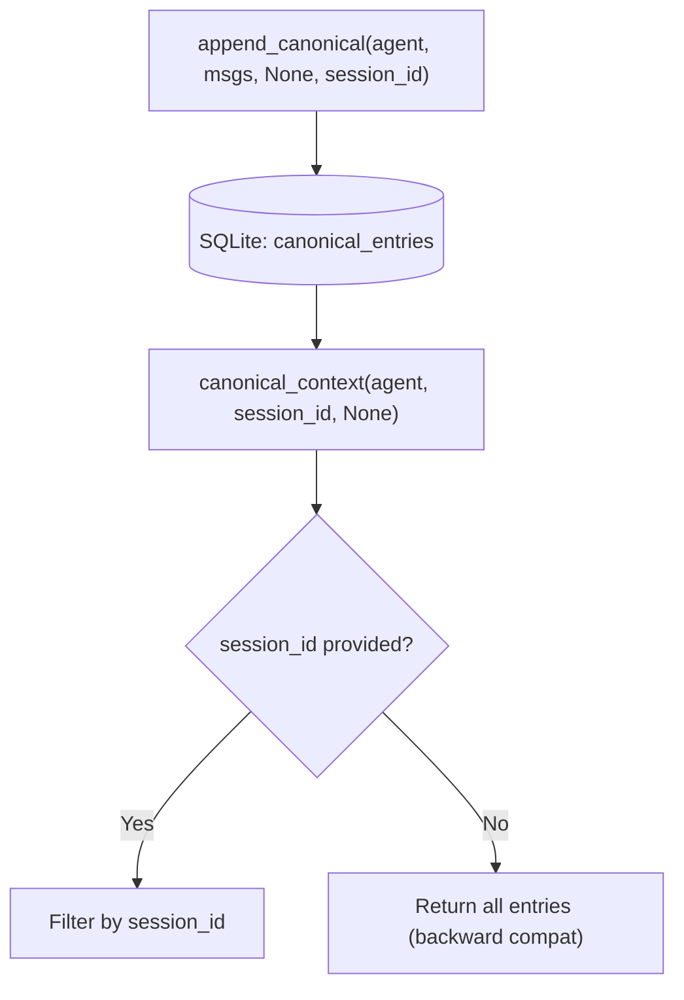

# Other — librefang-memory-tests

# librefang-memory/tests — Canonical Chat-Scoped Integration Tests

## Purpose

This module contains integration regression tests that guard a critical privacy fix in the `librefang-memory` crate's canonical context system. The tests verify that conversation history stored for an agent is properly isolated by chat session, preventing cross-channel message leakage between WhatsApp DMs, groups, Telegram chats, or any other channels sharing the same agent.

## Background: The Bug

Before the fix in `session.rs`, every `CanonicalEntry` was stored against an `AgentId` alone. When the kernel requested canonical context to build an LLM prompt, **all** entries for that agent were returned — regardless of which chat session originally produced them. In practice, this meant:

- A WhatsApp DM user's messages could appear in a group chat prompt
- Group messages could be injected into private DM prompts
- Any two channels sharing an agent would see each other's history

## Architecture



Each `CanonicalEntry` row now carries a `session_id` column. The `canonical_context` read path applies a `WHERE` filter when a `SessionId` is supplied, or returns unfiltered results when `None` is passed.

## Test Infrastructure

### `setup() → SessionStore`

Creates a fully initialized `SessionStore` backed by an in-memory SQLite database:

1. Builds an `r2d2::Pool<SqliteConnectionManager>` with `max_size(1)`
2. Runs database schema migrations via `run_migrations`
3. Constructs and returns a `SessionStore` from the pool

This mirrors the real initialization path the kernel follows at startup, but without touching the filesystem.

### `user_msg(text) → Message`

Helper that constructs a `Message` with:
- `role`: `Role::User`
- `content`: `MessageContent::Text(text)`
- `pinned`: `false`
- `timestamp`: `None`

## Test Cases

### `canonical_context_isolates_two_whatsapp_chats_for_same_agent`

**The primary regression test.** Simulates two WhatsApp conversations — a DM and a group chat — both routed to the same `AgentId`.

**Flow:**

1. Derive two distinct `SessionId`s via `SessionId::for_channel`:
   - `session_dm` from `"whatsapp:393331111111@s.whatsapp.net"` (DM JID)
   - `session_group` from `"whatsapp:120363111111111111@g.us"` (group JID)
2. Assert the derived session IDs differ — the channel-derivation function must produce unique keys per chat.
3. Append three messages in interleaved order:
   - `"dm-1"` → `session_dm`
   - `"group-1"` → `session_group`
   - `"dm-2"` → `session_dm`
4. Query `canonical_context(agent, Some(session_dm), None)` and assert only `["dm-1", "dm-2"]` are returned — `"group-1"` must not leak.
5. Query `canonical_context(agent, Some(session_group), None)` and assert only `["group-1"]` is returned — `"dm-1"` and `"dm-2"` must not leak.

This exercises the full append → persist → load → filter roundtrip through the public API, which is exactly the path the kernel invokes on every inbound message and every prompt construction.

### `canonical_context_unfiltered_returns_all_for_backward_compat`

**Backward compatibility guard.** Verifies that passing `session_id = None` to `canonical_context` returns entries from all sessions, preserving the original cross-channel semantics for callers that haven't adopted per-session filtering.

**Flow:**

1. Derive `session_a` (WhatsApp) and `session_b` (Telegram).
2. Append one message to each session.
3. Call `canonical_context(agent, None, None)`.
4. Assert both messages appear in the result set.

## APIs Under Test

These tests exercise the following public surface from `librefang-memory` and `librefang-types`:

| Function / Method | Crate | Role |
|---|---|---|
| `SessionStore::new(pool)` | `librefang-memory` | Construct the store |
| `run_migrations(&conn)` | `librefang-memory` | Initialize schema |
| `SessionStore::append_canonical(agent, msgs, summary, session_id)` | `librefang-memory` | Write tagged entries |
| `SessionStore::canonical_context(agent, session_id, limit)` | `librefang-memory` | Read filtered (or unfiltered) entries |
| `SessionId::for_channel(agent, channel_str)` | `librefang-types` | Derive a deterministic session ID from a channel address |
| `AgentId::new()` | `librefang-types` | Create a fresh agent identifier |

## Running

```bash
# From the workspace root
cargo test -p librefang-memory --test canonical_chat_scoped_integration

# With output
cargo test -p librefang-memory --test canonical_chat_scoped_integration -- --nocapture
```

No external services or filesystem paths are required. The tests use `:memory:` SQLite databases via `r2d2_sqlite`.

## Contributing

When adding new session-scoping behavior to `session.rs` or the canonical memory layer, add a corresponding test here. Tests should:

- Use the public API exclusively (no direct SQL assertions)
- Exercise both the filtered (`Some(session_id)`) and unfiltered (`None`) code paths
- Append messages across multiple sessions before querying, to catch ordering and interleaving bugs
- Assert on the full content of returned messages, not just counts