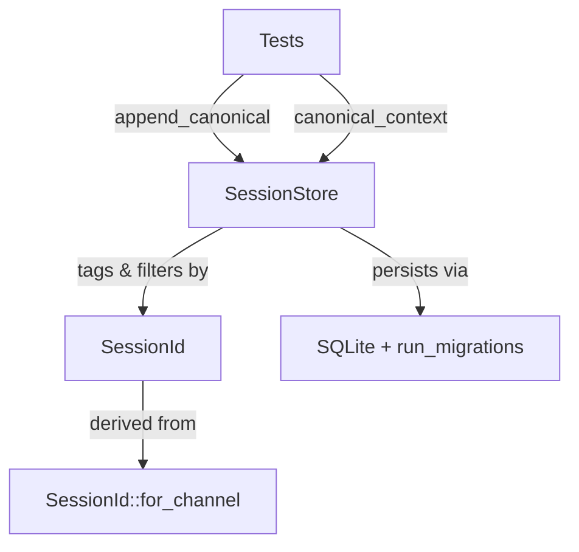

# Other — librefang-memory-tests

# librefang-memory/tests — Chat-Scoped Canonical Context Integration Tests

## Purpose

This module contains integration regression tests that guard a **cross-session privacy leak** in the canonical memory subsystem. Before the fix, every WhatsApp DM and group sharing the same agent would see each other's conversation history injected into the LLM prompt. A private chat could surface group messages and vice versa.

The tests exercise the full **append → load → context roundtrip** through the crate's public API — the same path the kernel calls on every inbound message — ensuring the session-scoping fix in `session.rs` continues to work correctly.

## Bug Context and Fix

`CanonicalEntry` records were stored globally per agent with no session association. When `canonical_context` was called to assemble LLM prompt context, it returned entries from all channels indiscriminately. The fix introduced two changes in `session.rs`:

1. **Write path**: `append_canonical` now tags each `CanonicalEntry` with the originating `SessionId`.
2. **Read path**: `canonical_context` filters entries by the provided `SessionId`, returning only messages from that session.

## Test Infrastructure

### `setup()`

Creates an isolated in-memory SQLite database, runs schema migrations via `run_migrations`, and returns a fresh `SessionStore` backed by a shared `Arc<Mutex<Connection>>`. Each test gets a fully independent database.

### `user_msg(text)`

Helper that constructs a `Message` with `Role::User` and the given text content. Used to simulate inbound user messages appended to canonical memory.

## Test Cases

### `canonical_context_isolates_two_whatsapp_chats_for_same_agent`

**What it verifies**: The core isolation guarantee. Two chat sessions derived from the same agent — a WhatsApp DM (`whatsapp:393331111111@s.whatsapp.net`) and a WhatsApp group (`whatsapp:120363111111111111@g.us`) — must not see each other's canonical entries.

**Flow**:

1. Derive two `SessionId` values via `SessionId::for_channel` and assert they differ.
2. Append three messages in interleaved order: `dm-1`, `group-1`, `dm-2`.
3. Call `canonical_context` filtered by the DM session — verify only `["dm-1", "dm-2"]` is returned.
4. Call `canonical_context` filtered by the group session — verify only `["group-1"]` is returned.

If this test fails, the session-scoping filter is broken and private messages are leaking across chat boundaries.

### `canonical_context_unfiltered_returns_all_for_backward_compat`

**What it verifies**: Backward compatibility for callers that have not adopted per-session filtering. Passing `session_id = None` to `canonical_context` must return all canonical entries across all sessions for the agent, preserving the original cross-channel semantics.

**Flow**:

1. Create two sessions (WhatsApp and Telegram) under the same agent.
2. Append one message to each session.
3. Call `canonical_context(agent, None, None)` and verify both messages appear in order.

If this test fails, the unfiltered path was broken during the session-scoping refactor.

## Relationship to Production Code



| Test function | Calls into | Source module |
|---|---|---|
| `setup` | `run_migrations` | `librefang-memory/src/migration.rs` |
| `setup` | `SessionStore::new` | `librefang-memory/src/session.rs` |
| Both tests | `append_canonical` | `librefang-memory/src/session.rs` |
| Both tests | `canonical_context` | `librefang-memory/src/session.rs` |
| Both tests | `SessionId::for_channel` | `librefang-types/src/agent.rs` |
| `user_msg` | `Message` constructor | `librefang-types/src/message.rs` |

## Running

```sh
# From the workspace root
cargo test -p librefang-memory --test canonical_chat_scoped_integration

# Or all tests in the crate
cargo test -p librefang-memory
```

No external services or environment variables are required — all tests use in-memory SQLite.