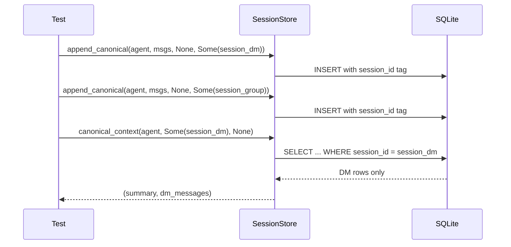

# Other — librefang-memory-tests

# librefang-memory-tests: Canonical Chat-Scoped Integration Tests

## Purpose

This module contains **regression integration tests** that guard against cross-session data leakage in canonical memory. Specifically, it verifies that when a single agent serves multiple WhatsApp conversations (e.g., a private DM and a group chat), messages from one session never appear in another session's LLM context.

The tests exercise the full public API roundtrip — `append_canonical` → `canonical_context` — using an in-memory SQLite database, matching the real call path the kernel uses on every inbound message.

## Background: The Bug Being Guarded

Before the fix in `session.rs`, every `CanonicalEntry` was stored without an originating `SessionId` tag. When `canonical_context` loaded recent messages to build the LLM prompt, it returned all entries for a given `AgentId` regardless of which chat they came from. This meant:

- A WhatsApp DM could inject group messages into its prompt.
- A group chat could surface private DM content to all participants.

The fix introduces per-entry `SessionId` tagging on write and session-scoped filtering on read. These tests ensure that fix stays in place.

## Test Infrastructure

### `setup() → SessionStore`

Creates a fully initialized `SessionStore` backed by an in-memory SQLite database:

1. Builds an `r2d2::Pool<SqliteConnectionManager>` with `max_size(1)`.
2. Runs database migrations via `run_migrations`.
3. Returns a `SessionStore` ready for use.

This mirrors production initialization without touching the filesystem.

### `user_msg(text: &str) → Message`

Convenience helper that constructs a `Message` with `Role::User` and `MessageContent::Text`. Sets `pinned: false` and `timestamp: None`, since these fields are irrelevant to the session-isolation logic under test.

## Test Cases

### `canonical_context_isolates_two_whatsapp_chats_for_same_agent`

**What it verifies:** Per-session filtering prevents cross-talk between chats sharing the same agent.

**Scenario:**
- One agent serves both a DM with Jessica and a group Jessica belongs to.
- Three messages are appended in interleaved order: `dm-1`, `group-1`, `dm-2`.
- Each append includes its derived `SessionId` via `SessionId::for_channel`.

**Key assertion:** `SessionId::for_channel` produces different session IDs for different channel identifiers:

```
session_dm   = for_channel(agent, "whatsapp:393331111111@s.whatsapp.net")
session_group = for_channel(agent, "whatsapp:120363111111111111@g.us")
assert_ne!(session_dm, session_group)
```

**Assertions on reads:**
- `canonical_context(agent, Some(session_dm), None)` returns only `["dm-1", "dm-2"]` — never `"group-1"`.
- `canonical_context(agent, Some(session_group), None)` returns only `["group-1"]` — never `"dm-1"` or `"dm-2"`.

### `canonical_context_unfiltered_returns_all_for_backward_compat`

**What it verifies:** Passing `session_id = None` to `canonical_context` returns all messages across all sessions, preserving the original pre-fix semantics for callers that haven't adopted per-session filtering.

**Scenario:**
- Two messages are appended under two different sessions (`session_a` from WhatsApp, `session_b` from Telegram).
- `canonical_context(agent, None, None)` is called.

**Assertion:** Both `"a-1"` and `"b-1"` are returned in order, confirming the unfiltered path still works.

## Architecture and Data Flow



## Relationships to Other Crates

| Crate | Dependency | Usage |
|---|---|---|
| `librefang-memory` | Under test | Provides `SessionStore`, `run_migrations` |
| `librefang-types` | Types | Provides `AgentId`, `SessionId`, `Message`, `Role`, `MessageContent` |
| `r2d2` / `r2d2-sqlite` | Infrastructure | Connection pooling for in-memory SQLite |

## Running

```bash
# Run just these integration tests
cargo test -p librefang-memory --test canonical_chat_scoped_integration

# Run with output visible
cargo test -p librefang-memory --test canonical_chat_scoped_integration -- --nocapture
```

No external services or environment variables are required. The tests are self-contained and use only in-memory SQLite.