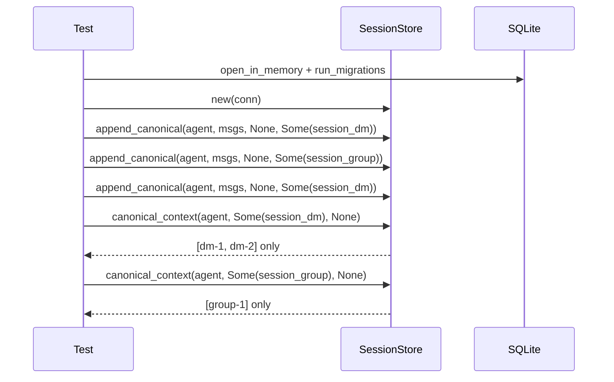

# Other — librefang-memory-tests

# librefang-memory-tests: Canonical Chat-Scoped Integration Tests

## Purpose

This test module is an **integration regression suite** that guards a critical privacy fix in `librefang-memory`. The fix ensures that canonical context entries are tagged with the originating `SessionId` and filtered at read time. Without it, every WhatsApp DM and group sharing the same agent would see each other's history injected into the LLM prompt — meaning a private chat could leak group messages and vice versa.

The tests exercise the full append → load → context roundtrip via the crate's public API, mirroring the actual call path the kernel uses on every inbound message.

## What Bug It Prevents

Before the session-scoping fix, `SessionStore::canonical_context` returned all canonical entries for an agent regardless of which chat session they came from. In a multi-tenant WhatsApp scenario where one agent handles both DMs and groups:

1. User sends "dm-1" in a private WhatsApp chat.
2. Someone sends "group-1" in a WhatsApp group the agent also serves.
3. User sends "dm-2" in the private chat.
4. The DM's LLM prompt would receive all three messages, leaking "group-1" from the group context.

The fix adds a `SessionId` column to canonical entries and a filter clause in `canonical_context`.

## Test Infrastructure

### `setup() -> SessionStore`

Creates a fresh, isolated test environment:

1. Opens an in-memory SQLite database via `Connection::open_in_memory`.
2. Runs database migrations via `run_migrations`.
3. Wraps the connection in `Arc<Mutex<Connection>>` and constructs a `SessionStore`.

Each test gets its own blank database, so tests are fully independent.

### `user_msg(text: &str) -> Message`

Convenience helper that constructs a `Message` with `Role::User`, the given text as `MessageContent::Text`, `pinned: false`, and `timestamp: None`. Used to build canonical entries quickly without boilerplate.

## Test Cases

### `canonical_context_isolates_two_whatsapp_chats_for_same_agent`

The primary isolation regression test. It simulates two WhatsApp conversations for the same agent:

- **DM session**: derived from `SessionId::for_channel(agent, "whatsapp:393331111111@s.whatsapp.net")`
- **Group session**: derived from `SessionId::for_channel(agent, "whatsapp:120363111111111111@g.us")`

**Sequence**:

1. Append `"dm-1"` to the DM session.
2. Append `"group-1"` to the group session.
3. Append `"dm-2"` to the DM session (interleaved timing).

**Assertions**:

- `session_dm` and `session_group` are not equal — different channels must derive different session IDs.
- `canonical_context(agent, Some(session_dm), None)` returns exactly `["dm-1", "dm-2"]` — no group messages.
- `canonical_context(agent, Some(session_group), None)` returns exactly `["group-1"]` — no DM messages.

### `canonical_context_unfiltered_returns_all_for_backward_compat`

Ensures backward compatibility for callers that have not adopted per-session filtering. When `canonical_context` is called with `session_id = None`, it must return all canonical entries for the agent across every session.

**Sequence**:

1. Append `"a-1"` under one session (`whatsapp` channel).
2. Append `"b-1"` under a different session (`telegram` channel).

**Assertion**:

- `canonical_context(agent, None, None)` returns `["a-1", "b-1"]` — all entries, unfiltered.

This guarantees that existing kernel code paths that don't pass a `SessionId` continue to work unchanged after the migration.

## Execution Flow



## Dependencies and Integration Points

| Dependency | Usage |
|---|---|
| `librefang_memory::session::SessionStore` | Core unit-under-test. Provides `append_canonical` and `canonical_context`. |
| `librefang_memory::migration::run_migrations` | Prepares the in-memory SQLite schema before each test. |
| `librefang_types::agent::{AgentId, SessionId}` | Identity types. `SessionId::for_channel` derives a deterministic session ID from an agent + channel address. |
| `librefang_types::message::{Message, Role, MessageContent}` | Message types used to construct canonical entries. |
| `rusqlite::Connection` | In-memory SQLite backend for test isolation. |

## Running

```sh
# Run just this integration test file
cargo test -p librefang-memory --test canonical_chat_scoped_integration

# Run with output visible
cargo test -p librefang-memory --test canonical_chat_scoped_integration -- --nocapture
```

No external services or databases are required — everything runs in-memory.