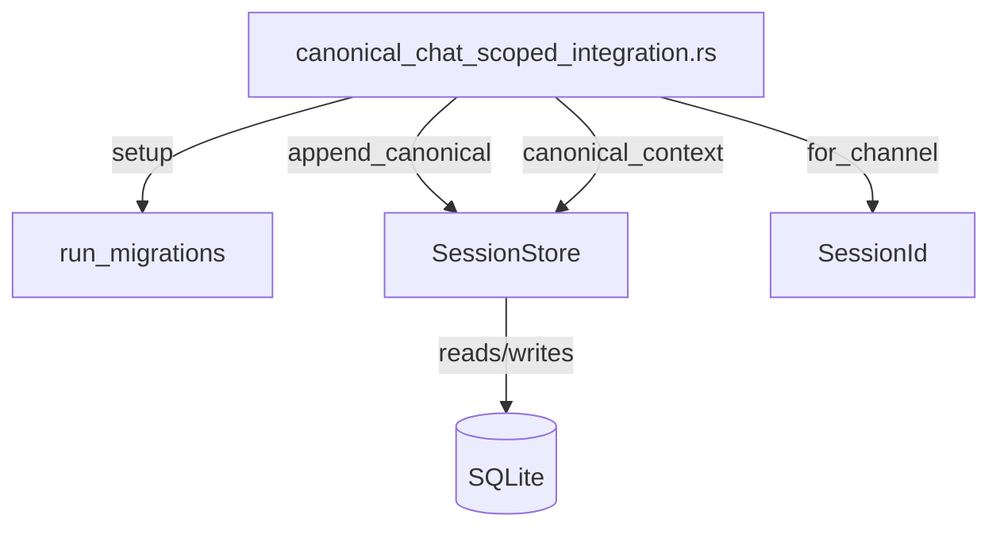

# Other — librefang-memory-tests

# librefang-memory/tests — Canonical Chat-Scoped Integration Tests

## Purpose

This directory contains an integration regression test that guards against a cross-session data-leak bug in canonical context storage. Before the fix in `session.rs`, every WhatsApp DM and group chat sharing the same `AgentId` could see each other's message history injected into the LLM prompt — a private DM could surface group messages and vice versa.

The test exercises the full **append → load → context** roundtrip through the crate's public API (`SessionStore`), mirroring the actual call path the kernel uses on every inbound message.

## The Bug It Prevents

`CanonicalEntry` rows were keyed only by `AgentId`. When the kernel loaded context for an LLM prompt, it pulled every canonical entry for that agent regardless of which chat session produced it. The fix added a `SessionId` tag to each entry and introduced filtering at read time in `canonical_context`.

## Test Infrastructure

### `setup()`

Creates a fresh, isolated test environment:

```
in-memory SQLite → run_migrations → SessionStore(Arc<Mutex<Connection>>)
```

Each test gets its own database, so tests are independent and parallelizable.

### `user_msg(text)`

Helper that constructs a `Message` with `Role::User`, text content, and `pinned: false`. Keeps test assertions readable.

## Test Cases

### `canonical_context_isolates_two_whatsapp_chats_for_same_agent`

The primary regression test. It verifies that two distinct chat sessions derived for the same agent produce isolated context windows.

**Setup:**

- One `AgentId`.
- Two `SessionId`s derived via `SessionId::for_channel`:
  - `session_dm` — from a WhatsApp DM address (`…@s.whatsapp.net`)
  - `session_group` — from a WhatsApp group address (`…@g.us`)

**Flow:**

1. Assert the two sessions are not equal (different channels must produce different sessions).
2. Append three messages in interleaved order: `dm-1`, `group-1`, `dm-2`.
3. Load context filtered by `session_dm` → verify only `["dm-1", "dm-2"]`.
4. Load context filtered by `session_group` → verify only `["group-1"]`.

If this test fails, the session-scoping filter in `canonical_context` is broken and cross-chat leakage is happening.

### `canonical_context_unfiltered_returns_all_for_backward_compat`

Ensures that callers passing `session_id = None` to `canonical_context` still receive all entries across every session. This preserves the original pre-fix semantics for code paths that haven't adopted per-session filtering.

**Flow:**

1. Append one message each to two different sessions (WhatsApp and Telegram channels).
2. Call `canonical_context(agent, None, None)`.
3. Assert both messages are returned.

## Relationships to Production Code



The test calls into three production modules:

| Production module | Functions used | Role in test |
|---|---|---|
| `librefang_memory::migration` | `run_migrations` | Schema setup |
| `librefang_memory::session` | `SessionStore::new`, `append_canonical`, `canonical_context` | Core API under test |
| `librefang_types::agent` | `AgentId::new`, `SessionId::for_channel` | Identity derivation |

## Running

```sh
# Run just these integration tests
cargo test -p librefang-memory --test canonical_chat_scoped_integration

# Run with trace output to see SQL statements
RUST_LOG=librefang_memory=trace cargo test -p librefang-memory --test canonical_chat_scoped_integration -- --nocapture
```

## When to Extend

Add a new test here when:

- Changing how `SessionId` is derived from channel addresses (add a derivation-correctness test).
- Modifying the `canonical_context` filtering logic or its `session_id` parameter semantics.
- Introducing new backward-compatibility or migration paths for untagged canonical entries.
- Adding support for a new channel type whose address format could collide with existing ones.