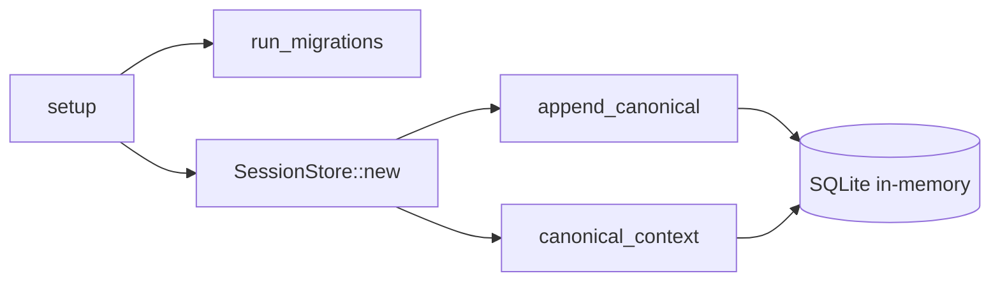

# Other — librefang-memory-tests

# librefang-memory-tests

Integration regression tests for chat-scoped canonical context filtering in `librefang-memory`.

## Purpose

This module guards against a cross-channel message leak in the canonical memory store. Before the fix in `session.rs`, every WhatsApp DM and group that shared the same `AgentId` had each other's history injected into the LLM prompt. A private DM could surface group messages, and vice versa. The fix tags each `CanonicalEntry` with the originating `SessionId` and filters by that tag at read time.

The tests exercise the full append → load → context roundtrip through the crate's public API (`SessionStore`), which is the same path the kernel calls on every inbound message.

## Architecture



Every test opens a fresh in-memory SQLite database, runs schema migrations, and constructs a `SessionStore` backed by an `Arc<Mutex<Connection>>`. This mirrors the production setup without requiring a persistent database.

## Test Infrastructure

### `setup()`

Creates an isolated `SessionStore` for each test:

1. Opens an in-memory SQLite connection via `Connection::open_in_memory`.
2. Runs database migrations via `run_migrations(&conn)`.
3. Wraps the connection in `Arc<Mutex<Connection>>` and returns a new `SessionStore`.

### `user_msg(text)`

Helper that builds a `Message` with `Role::User`, `MessageContent::Text`, no pin, and no timestamp. Keeps test assertions focused on content rather than message construction.

## Test Cases

### `canonical_context_isolates_two_whatsapp_chats_for_same_agent`

**What it validates:** Session-scoped filtering prevents cross-channel leakage.

**Scenario:** A single agent serves both a WhatsApp DM (with Jessica) and a WhatsApp group (containing Jessica). Messages arrive interleaved across both sessions.

**Steps:**

1. Derive two `SessionId` values from channel identifiers using `SessionId::for_channel`:
   - `session_dm` ← `"whatsapp:393331111111@s.whatsapp.net"`
   - `session_group` ← `"whatsapp:120363111111111111@g.us"`
2. Assert the two session IDs differ (different chats must not collapse to the same session).
3. Append `"dm-1"` → `"group-1"` → `"dm-2"` in that order, each tagged with its own `SessionId`.
4. Call `canonical_context(agent, Some(session_dm), None)` and assert the returned messages are exactly `["dm-1", "dm-2"]` — no `"group-1"`.
5. Call `canonical_context(agent, Some(session_group), None)` and assert the returned messages are exactly `["group-1"]` — no `"dm-1"` or `"dm-2"`.

**Failure mode:** If `append_canonical` stops tagging entries with `SessionId`, or if `canonical_context` stops filtering by that tag, the DM context will contain `"group-1"` and the test fails.

### `canonical_context_unfiltered_returns_all_for_backward_compat`

**What it validates:** Passing `session_id = None` to `canonical_context` returns messages from all sessions, preserving the original cross-channel semantics.

**Scenario:** Two sessions on different platforms (WhatsApp and Telegram) each contribute one message.

**Steps:**

1. Append `"a-1"` tagged with `session_a` and `"b-1"` tagged with `session_b`.
2. Call `canonical_context(agent, None, None)` (no session filter).
3. Assert the returned messages are `["a-1", "b-1"]`.

**Failure mode:** If the unfiltered path is accidentally broken by the session-scoping change, this test catches the regression.

## Relationships to Other Modules

| Module | Relationship |
|---|---|
| `librefang-memory::session` | Primary target. Tests call `SessionStore::append_canonical` and `SessionStore::canonical_context`. |
| `librefang-memory::migration` | `setup` calls `run_migrations` to prepare the schema. |
| `librefang-types::agent` | Uses `AgentId::new()` and `SessionId::for_channel` to derive session identities from channel addresses. |
| `librefang-types::message` | Constructs `Message` with `Role`, `MessageContent`, and related fields. |

## Running

```bash
# From the workspace root
cargo test -p librefang-memory --test canonical_chat_scoped_integration
```