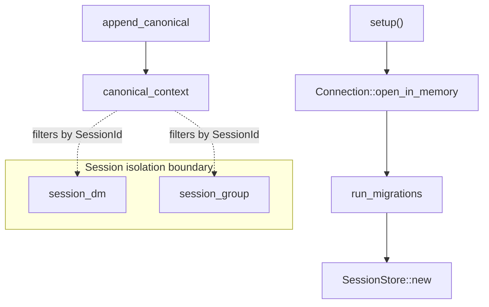

# Other — librefang-memory-tests

# librefang-memory-tests

Integration regression tests for the `librefang-memory` crate, specifically guarding **chat-scoped canonical context isolation** — a privacy-critical fix in `SessionStore` that prevents cross-session message leakage between conversations handled by the same agent.

## Background: The Privacy Bug

Before the fix under test, `CanonicalEntry` records in the session store were **not** tagged with the originating `SessionId`. When the kernel loaded canonical context to build an LLM prompt, every conversation sharing the same `AgentId` received the full union of all messages across all sessions. Concretely, a WhatsApp DM and a WhatsApp group chat — both routed to the same agent — would inject each other's history into the LLM context, leaking private messages into group prompts and vice versa.

The fix adds a `SessionId` tag at write time (`append_canonical`) and filters by that tag at read time (`canonical_context`).

## Test Architecture



## Test Harness

### `setup()`

Creates an ephemeral `SessionStore` backed by an in-memory SQLite database:

1. Opens `Connection::open_in_memory`.
2. Runs `run_migrations` to create the schema.
3. Returns `SessionStore::new(Arc<Mutex<Connection>>)`.

Every test starts from a blank slate. The `Arc<Mutex<Connection>>` mirrors the production wiring where the store is shared across async tasks.

### `user_msg(text)`

Helper that constructs a `Message` with `Role::User` and `MessageContent::Text`. Used to build payloads for `append_canonical`.

## Test Cases

### `canonical_context_isolates_two_whatsapp_chats_for_same_agent`

**Purpose:** Verifies that two distinct chat channels derived for the same agent produce isolated canonical contexts — the core privacy guarantee.

**Steps:**

1. Create a single `AgentId`.
2. Derive two `SessionId` values via `SessionId::for_channel`:
   - `session_dm` — from `"whatsapp:393331111111@s.whatsapp.net"` (DM)
   - `session_group` — from `"whatsapp:120363111111111111@g.us"` (group)
3. Assert the two session IDs differ (different chats must produce different sessions).
4. Append messages interleaved across sessions:
   - `"dm-1"` → `session_dm`
   - `"group-1"` → `session_group`
   - `"dm-2"` → `session_dm`
5. Call `canonical_context(agent, Some(session_dm), None)` and assert returned messages are exactly `["dm-1", "dm-2"]` — no group content.
6. Call `canonical_context(agent, Some(session_group), None)` and assert returned messages are exactly `["group-1"]` — no DM content.

**What it catches:** A regression where `canonical_context` stops filtering by `SessionId`, or `append_canonical` stops tagging entries with the session. Both would cause cross-contamination of private and group message history.

### `canonical_context_unfiltered_returns_all_for_backward_compat`

**Purpose:** Ensures that passing `session_id = None` to `canonical_context` returns **all** canonical entries across sessions, preserving backward compatibility for callers that haven't adopted per-session filtering.

**Steps:**

1. Append `"a-1"` under `session_a` (WhatsApp channel).
2. Append `"b-1"` under `session_b` (Telegram channel).
3. Call `canonical_context(agent, None, None)`.
4. Assert both `"a-1"` and `"b-1"` appear in results.

**What it catches:** A regression where `None` no longer acts as a "no filter" sentinel — for example, if the implementation mistakenly requires a `SessionId` and returns empty results or errors when none is provided.

## API Surface Exercised

| Function | Crate | Role in test |
|---|---|---|
| `SessionStore::new` | `librefang-memory` | Construct the store |
| `run_migrations` | `librefang-memory::migration` | Initialize the schema |
| `SessionStore::append_canonical` | `librefang-memory::session` | Write tagged messages |
| `SessionStore::canonical_context` | `librefang-memory::session` | Read filtered messages |
| `SessionId::for_channel` | `librefang-types::agent` | Derive session from channel identifier |
| `AgentId::new` | `librefang-types::agent` | Create a unique agent |

## Running

```bash
cargo test -p librefang-memory --test canonical_chat_scoped_integration
```

Both tests are pure-unit (in-memory SQLite, no network) and complete in milliseconds. They should be run in CI on every push to guard against regressions in session-scoped memory isolation.