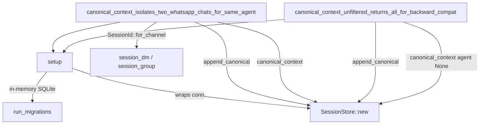

# Other — librefang-memory-tests

# librefang-memory-tests: Chat-Scoped Canonical Context Integration Tests

## Purpose

This module contains **integration regression tests** that guard against a cross-session data leak in the canonical memory subsystem. The bug it prevents: when a single agent served both a WhatsApp DM and a WhatsApp group, messages from one chat could appear in the LLM prompt context of the other. The fix lives in `session.rs`, where every `CanonicalEntry` is tagged with the originating `SessionId` and filtered at read time.

These tests exercise the full **append → load → context roundtrip** through the crate's public API — the same path the kernel calls on every inbound message — so any regression in session tagging or filtering is caught immediately.

## Architecture



## Test Fixtures

### `setup() → SessionStore`

Creates a fully-initialized `SessionStore` backed by an in-memory SQLite database. This mirrors the production initialization path without touching the filesystem:

1. Opens an in-memory `rusqlite::Connection`.
2. Calls `run_migrations(&conn)` to establish the schema.
3. Wraps the connection in `Arc<Mutex<Connection>>` and returns `SessionStore::new(...)`.

Every test calls `setup()` independently, so tests share no state and can run in parallel.

### `user_msg(text: &str) → Message`

Convenience helper that constructs a `Message` with `Role::User`, the given text as `MessageContent::Text`, and `pinned: false`. Used to quickly create test payloads without boilerplate.

## Test Cases

### `canonical_context_isolates_two_whatsapp_chats_for_same_agent`

**What it verifies:** Messages appended under one session never appear when loading context for a different session, even when both sessions belong to the same agent.

**How it works:**

1. Derives two distinct `SessionId` values via `SessionId::for_channel`:
   - `session_dm` — from `"whatsapp:393331111111@s.whatsapp.net"` (a private DM)
   - `session_group` — from `"whatsapp:120363111111111111@g.us"` (a group chat)
2. Asserts the two IDs differ (`assert_ne!`).
3. Appends three messages in interleaved order:
   - `"dm-1"` → `session_dm`
   - `"group-1"` → `session_group`
   - `"dm-2"` → `session_dm`
4. Calls `canonical_context(agent, Some(session_dm), None)` and asserts only `["dm-1", "dm-2"]` are returned.
5. Calls `canonical_context(agent, Some(session_group), None)` and asserts only `["group-1"]` is returned.

This ordering is intentional: the group message arrives chronologically *between* the two DM messages, so a broken filter that ignored session scope would surface `group-1` in the DM context.

### `canonical_context_unfiltered_returns_all_for_backward_compat`

**What it verifies:** Passing `session_id = None` to `canonical_context` returns messages across all sessions, preserving the original cross-channel semantics for callers that haven't adopted per-session filtering.

**How it works:**

1. Creates two sessions on different platforms (WhatsApp and Telegram) under the same agent.
2. Appends one message per session.
3. Calls `canonical_context(agent, None, None)` and asserts both messages appear in order.

## Dependencies on Other Crates

| Crate | Usage |
|---|---|
| `librefang-memory` | `SessionStore`, `run_migrations` — the system under test |
| `librefang-types` | `AgentId`, `SessionId`, `Message`, `Role`, `MessageContent` — shared domain types |
| `rusqlite` | `Connection::open_in_memory` — lightweight database for test isolation |

## Running the Tests

```sh
# From the workspace root
cargo test -p librefang-memory --test canonical_chat_scoped_integration

# With output visible
cargo test -p librefang-memory --test canonical_chat_scoped_integration -- --nocapture
```

Both tests run against an in-memory database and require no external services.