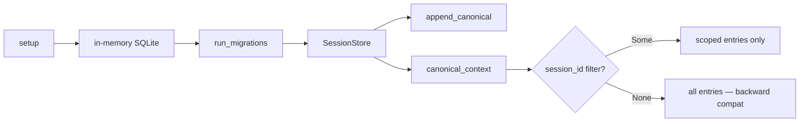

# Other — librefang-memory-tests

# librefang-memory-tests — Chat-Scoped Canonical Context Integration Tests

## Purpose

This integration test module is a regression guard for a cross-chat message leakage bug in `SessionStore`. Before the fix, every WhatsApp DM and group sharing the same agent saw each other's canonical history injected into the LLM prompt. The tests verify that each `CanonicalEntry` is tagged with its originating `SessionId` and filtered correctly at read time.

## Architecture



## Test Infrastructure

### `setup() → SessionStore`

Creates a fully initialized `SessionStore` backed by an in-memory SQLite database with a single-connection pool. Runs schema migrations via `run_migrations` so the test environment mirrors production without touching the filesystem.

### `user_msg(text: &str) → Message`

Convenience constructor that builds a `Message` with `Role::User`, plain `MessageContent::Text`, no pin, and no timestamp. Keeps test assertions focused on content rather than message assembly.

## Test Cases

### `canonical_context_isolates_two_whatsapp_chats_for_same_agent`

**What it verifies:** Canonical entries written under different `SessionId`s for the same `AgentId` are strictly isolated when queried.

**Scenario:**
1. Derive two distinct session IDs from WhatsApp channel identifiers:
   - `session_dm` — from `whatsapp:393331111111@s.whatsapp.net` (DM)
   - `session_group` — from `whatsapp:120363111111111111@g.us` (group)
2. Assert the two session IDs differ (validates the channel-derivation function).
3. Append three messages interleaved across sessions: `dm-1`, then `group-1`, then `dm-2`.
4. Call `canonical_context(agent, Some(session_dm), None)` and assert only `["dm-1", "dm-2"]` are returned.
5. Call `canonical_context(agent, Some(session_group), None)` and assert only `["group-1"]` is returned.

**Failure mode caught:** If `SessionStore::append_canonical` fails to persist the session tag, or `canonical_context` ignores the filter, DM messages appear in the group context and vice versa.

### `canonical_context_unfiltered_returns_all_for_backward_compat`

**What it verifies:** Passing `None` as the `session_id` argument to `canonical_context` returns canonical entries across all sessions for the agent.

**Why this matters:** Callers that haven't adopted per-session filtering still rely on the original cross-channel behavior. This test ensures that the session-scoping feature is additive and doesn't break existing consumers.

**Scenario:**
1. Create two sessions on different channels (WhatsApp and Telegram) for the same agent.
2. Append one message to each.
3. Call `canonical_context(agent, None, None)`.
4. Assert both messages are returned.

## Dependencies and Cross-Module Interactions

| Dependency | Usage |
|---|---|
| `librefang_memory::migration::run_migrations` | Brings the in-memory SQLite schema to the current version |
| `librefang_memory::session::SessionStore` | The system under test — `new`, `append_canonical`, `canonical_context` |
| `librefang_types::agent::{AgentId, SessionId}` | `AgentId::new()` generates test agents; `SessionId::for_channel()` derives session IDs from channel strings |
| `librefang_types::message::{Message, Role, MessageContent}` | Constructs test messages |

## Running

```bash
cargo test -p librefang-memory --test canonical_chat_scoped_integration
```

Both tests are pure unit-level integration tests with no I/O, no network, and no persistent state. They run in milliseconds.