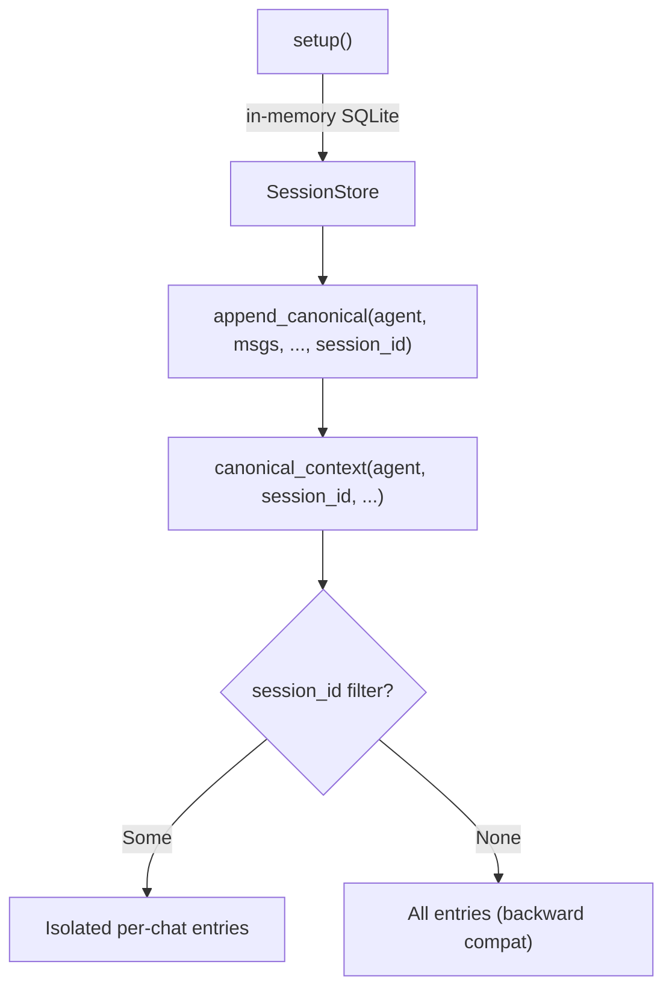

# Other — librefang-memory-tests

# librefang-memory-tests — Canonical Chat-Scoped Integration Tests

## Purpose

This module contains integration regression tests that guard a critical privacy fix in `SessionStore`. Before the fix, every WhatsApp DM and group chat sharing the same agent would see each other's canonical history injected into the LLM prompt. A private conversation could leak group messages and vice versa.

The tests exercise the full **append → load → context roundtrip** through the crate's public API — the same path the kernel calls on every inbound message — ensuring that `CanonicalEntry` records are correctly tagged with their originating `SessionId` and filtered at read time.

## Architecture



## Test Fixtures

### `setup() → SessionStore`

Creates a fresh `SessionStore` backed by an in-memory SQLite database with all migrations applied. Each test gets a fully isolated database, so tests can run in parallel without interference.

Internally calls:
- `Connection::open_in_memory()` — creates the ephemeral database
- `run_migrations(&conn)` — applies the schema from `librefang_memory::migration`

### `user_msg(text: &str) → Message`

Helper that constructs a `Message` with `Role::User` and `MessageContent::Text`. Sets `pinned: false` and `timestamp: None` since these fields are irrelevant to the isolation logic under test.

## Test Cases

### `canonical_context_isolates_two_whatsapp_chats_for_same_agent`

The primary regression test. Simulates the scenario where a single agent handles both a WhatsApp DM and a WhatsApp group containing the same contact.

**Steps:**

1. Creates one `AgentId` and two `SessionId`s derived via `SessionId::for_channel`:
   - `session_dm` — from `"whatsapp:393331111111@s.whatsapp.net"` (individual DM)
   - `session_group` — from `"whatsapp:120363111111111111@g.us"` (group chat)

2. Asserts the two channel strings produce **different** session IDs — the foundation of the isolation guarantee.

3. Interleaves `append_canonical` calls across both sessions:
   - `append_canonical(agent, ["dm-1"], …, session_dm)`
   - `append_canonical(agent, ["group-1"], …, session_group)`
   - `append_canonical(agent, ["dm-2"], …, session_dm)`

4. Calls `canonical_context(agent, Some(session_dm), None)` and asserts the returned messages contain **only** `["dm-1", "dm-2"]` — no trace of `"group-1"`.

5. Calls `canonical_context(agent, Some(session_group), None)` and asserts the returned messages contain **only** `["group-1"]` — no trace of either DM message.

If either assertion fails, it means the session-scoped filtering in `session.rs` is broken and messages are leaking across chat boundaries.

### `canonical_context_unfiltered_returns_all_for_backward_compat`

Ensures backward compatibility for callers that haven't adopted per-session filtering yet.

1. Appends messages under two different sessions (`session_a` via WhatsApp, `session_b` via Telegram).
2. Calls `canonical_context(agent, None, None)` — passing `None` for the session filter.
3. Asserts **all** messages from both sessions are returned (`["a-1", "b-1"]`).

This guarantees that legacy code paths which don't supply a `SessionId` continue to see the original cross-channel canonical memory behavior.

## Relationship to Production Code

| Test function | Production API exercised | Source |
|---|---|---|
| `canonical_context_isolates_two_whatsapp_chats_for_same_agent` | `SessionStore::append_canonical` | `librefang-memory/src/session.rs` |
| `canonical_context_isolates_two_whatsapp_chats_for_same_agent` | `SessionStore::canonical_context` | `librefang-memory/src/session.rs` |
| `canonical_context_isolates_two_whatsapp_chats_for_same_agent` | `SessionId::for_channel` | `librefang-types/src/agent.rs` |
| `canonical_context_unfiltered_returns_all_for_backward_compat` | Same APIs as above | Same sources |
| `setup` | `run_migrations` | `librefang-memory/src/migration.rs` |

## Running

```bash
# Run just this test file
cargo test -p librefang-memory --test canonical_chat_scoped_integration

# Run with output visible
cargo test -p librefang-memory --test canonical_chat_scoped_integration -- --nocapture
```

No external services or environment variables are required — all tests use in-memory SQLite.