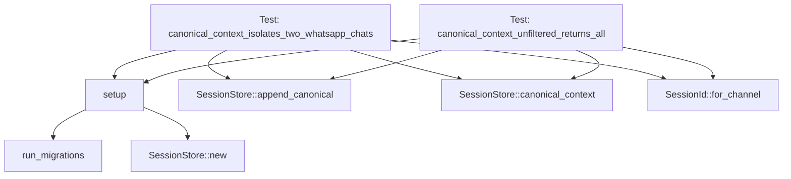

# Other — librefang-memory-tests

# librefang-memory-tests: Canonical Chat-Scoped Integration Tests

## Purpose

This module contains integration regression tests that guard a privacy-critical fix in `librefang-memory`'s `SessionStore`. The fix ensures that **canonical memory entries are scoped by `SessionId`**, preventing cross-contamination of conversation history between different chat sessions that share the same agent.

### The Bug It Prevents

Before the fix, every `CanonicalEntry` was stored without an originating `SessionId` tag. When the kernel requested canonical context for an LLM prompt, it received entries from **all** chats tied to that agent — meaning a WhatsApp DM could inject group messages into its prompt, and vice versa. This was both a privacy leak and a source of confused LLM responses.

## Architecture


```mermaid
graph TD
    A[Test: canonical_context_isolates_two_whatsapp_chats] --> B[setup]
    A --> C[SessionStore::append_canonical]
    A --> D[SessionStore::canonical_context]
    A --> E[SessionId::for_channel]
    F[Test: canonical_context_unfiltered_returns_all] --> B
    F --> C
    F --> D
    F --> E
    B --> G[run_migrations]
    B --> H[SessionStore::new]
```

## Test Helpers

### `setup() → SessionStore`

Creates a fully initialized `SessionStore` backed by an **in-memory SQLite** database (`SqliteConnectionManager::memory()`). This avoids filesystem side effects and gives each test an isolated, blank slate.

The function:
1. Builds an `r2d2::Pool` with `max_size(1)` (sufficient for single-threaded tests)
2. Runs database migrations via `run_migrations`
3. Returns a new `SessionStore` wrapping the pool

### `user_msg(text: &str) → Message`

Convenience constructor for `Message` with `Role::User` and text content. Sets `pinned: false` and `timestamp: None` since neither field is relevant to the isolation logic under test.

## Test Cases

### `canonical_context_isolates_two_whatsapp_chats_for_same_agent`

The primary regression test. It simulates the real-world scenario that triggered the original bug: a single agent serving both a WhatsApp DM and a WhatsApp group containing the same person.

**Steps:**

1. Derive two distinct `SessionId` values using `SessionId::for_channel` with different channel addresses:
   - `whatsapp:393331111111@s.whatsapp.net` (DM)
   - `whatsapp:120363111111111111@g.us` (group)
2. Append messages in interleaved order: `dm-1`, then `group-1`, then `dm-2`.
3. Call `canonical_context(agent, Some(session_dm), None)` and assert only `["dm-1", "dm-2"]` appear.
4. Call `canonical_context(agent, Some(session_group), None)` and assert only `["group-1"]` appears.

**What this proves:** The `session_id` parameter passed to `append_canonical` is correctly stored and used as a filter at read time. Interleaved writes from different sessions do not bleed into each other's context windows.

### `canonical_context_unfiltered_returns_all_for_backward_compat`

Ensures backward compatibility for callers that haven't adopted per-session filtering.

**Steps:**

1. Append messages across two different sessions (`session_a` via WhatsApp, `session_b` via Telegram).
2. Call `canonical_context(agent, None, None)` — passing `None` for `session_id`.
3. Assert **all** messages are returned, regardless of session.

**What this proves:** The `session_id = None` path preserves the original cross-channel canonical memory semantics. Existing callers that don't pass a session tag continue to work unchanged.

## Dependencies on Other Crates

| Crate | Usage |
|---|---|
| `librefang-memory` | `SessionStore`, `run_migrations` — the code under test |
| `librefang-types` | `AgentId`, `SessionId`, `Message`, `Role`, `MessageContent` — domain types |
| `r2d2` / `r2d2-sqlite` | Connection pool and in-memory SQLite for test isolation |

## How to Run

```bash
# Run just these integration tests
cargo test -p librefang-memory --test canonical_chat_scoped_integration

# Run with output visible
cargo test -p librefang-memory --test canonical_chat_scoped_integration -- --nocapture
```

No external services or environment variables are required. The tests are fully self-contained using in-memory SQLite.

## When to Extend This Module

Add a new test here when:

- You modify the `session_id` tagging or filtering logic in `session.rs`
- You change the `canonical_context` or `append_canonical` signatures
- You introduce new channel types that affect `SessionId::for_channel` derivation
- You alter the backward-compatible "return all when unfiltered" behavior