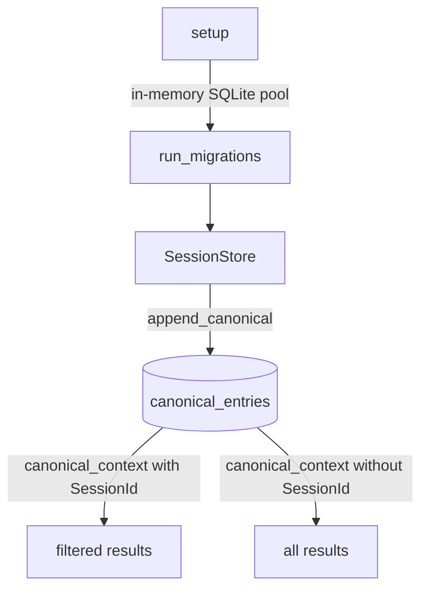

# Other — librefang-memory-tests

# librefang-memory/tests — Chat-Scoped Canonical Context Integration Tests

## Purpose

This module contains integration regression tests that guard a critical privacy fix in `librefang-memory`. Before the fix, every WhatsApp DM and group sharing the same agent would see each other's conversation history injected into the LLM prompt. A private chat could leak group messages and vice versa.

The fix lives in `session.rs`: each `CanonicalEntry` is tagged with its originating `SessionId`, and entries are filtered by session at read time. These tests exercise the full `append → load → context` roundtrip via the crate's public API — the same path the kernel calls on every inbound message.

## Architecture

```mermaid
flowchart TD
    A[setup] -->|in-memory SQLite pool| B[run_migrations]
    B --> C[SessionStore]
    C -->|append_canonical| D[(canonical_entries)]
    D -->|canonical_context with SessionId| E[filtered results]
    D -->|canonical_context without SessionId| F[all results]
```

## Test Infrastructure

### `setup() -> SessionStore`

Creates an ephemeral in-memory SQLite database, runs schema migrations via `run_migrations`, and returns a fresh `SessionStore`. Each test gets a fully isolated database. The pool is capped at `max_size(1)` since there is no concurrent access in these tests.

### `user_msg(text: &str) -> Message`

Helper that builds a `Message` with `Role::User`, `MessageContent::Text`, `pinned: false`, and no timestamp. Used to construct the message payloads fed into `append_canonical`.

## Test Cases

### `canonical_context_isolates_two_whatsapp_chats_for_same_agent`

**What it verifies:** Two distinct chats (a DM and a group) targeting the same agent must never see each other's canonical context.

**How it works:**

1. Creates a single `AgentId` representing the shared agent.
2. Derives two session IDs via `SessionId::for_channel` — one for the DM address (`…@s.whatsapp.net`) and one for the group address (`…@g.us`).
3. Asserts the derived session IDs differ — the channel-derivation function must produce distinct sessions for distinct chats.
4. Appends three messages in interleaved order: `dm-1`, `group-1`, `dm-2`.
5. Calls `canonical_context(agent, Some(session_dm), None)` and asserts only `["dm-1", "dm-2"]` are returned.
6. Calls `canonical_context(agent, Some(session_group), None)` and asserts only `["group-1"]` is returned.

If this test fails, it means the session-scoped filtering in `canonical_context` is broken and cross-chat message leakage is occurring.

### `canonical_context_unfiltered_returns_all_for_backward_compat`

**What it verifies:** Callers that pass `session_id = None` to `canonical_context` still receive all entries across every session for that agent. This preserves the original pre-fix semantics for code paths that haven't adopted per-session filtering yet.

**How it works:**

1. Creates an agent and two sessions (WhatsApp and Telegram channels).
2. Appends one message per session.
3. Calls `canonical_context(agent, None, None)` and asserts both messages appear in order.

## Dependencies on Other Crates

| Crate | Usage |
|---|---|
| `librefang-memory` | Provides `SessionStore`, `run_migrations` — the system under test |
| `librefang-types` | Provides `AgentId`, `SessionId`, `Message`, `Role`, `MessageContent` |
| `r2d2` / `r2d2-sqlite` | Connection pooling for the in-memory SQLite backend |

## When These Tests Matter

Run them after any change to:

- `SessionStore::append_canonical` — session tagging logic
- `SessionStore::canonical_context` — session filtering logic
- `SessionId::for_channel` — channel-to-session derivation
- Schema migrations affecting the canonical entries table