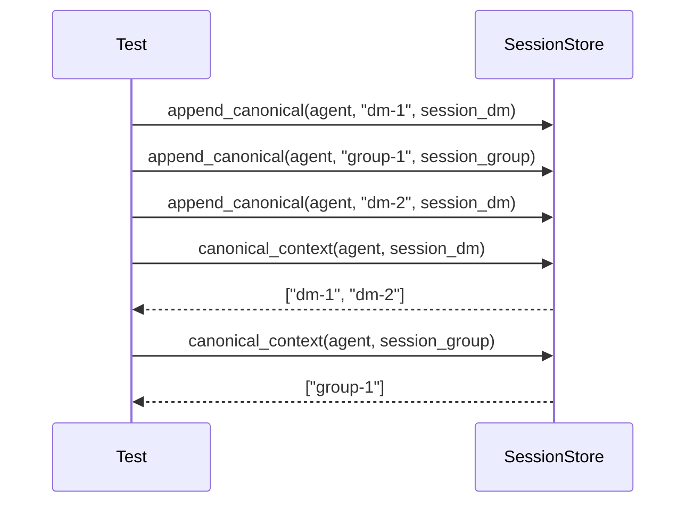

# Other — librefang-memory-tests

# librefang-memory-tests: Canonical Chat-Scoped Integration Tests

## Purpose

This module contains integration regression tests that guard a critical privacy fix in `librefang-memory`'s canonical context system. Before the fix, every WhatsApp DM and group sharing the same agent could see each other's message history injected into the LLM prompt — a private chat could leak group messages and vice versa.

The tests exercise the full **append → load → context roundtrip** via the crate's public API (`SessionStore`), which mirrors the actual call path the kernel uses when processing inbound messages.

## The Bug It Prevents

When multiple chat sessions (e.g., a WhatsApp DM and a WhatsApp group) were routed to the same `AgentId`, the canonical memory store returned all messages for that agent regardless of which chat they originated from. The fix introduces per-`SessionId` tagging on each `CanonicalEntry` at write time and filtering at read time in `session.rs`.

## Test Infrastructure

### `setup()`

Creates an in-memory SQLite-backed `SessionStore` suitable for isolated testing:

```
SqliteConnectionManager::memory() → Pool (max_size=1) → run_migrations → SessionStore::new(pool)
```

Each test gets a fresh, empty database. No state leaks between tests.

### `user_msg(text)`

Helper that constructs a `Message` with `Role::User`, text content, no pin, and no timestamp. Keeps test assertions focused on the behavior under test rather than message assembly.

## Test Cases

### `canonical_context_isolates_two_whatsapp_chats_for_same_agent`

This is the primary regression test. It verifies that two distinct chat sessions derived from the same agent produce isolated canonical contexts.

**Setup:**
- One `AgentId` (shared across both chats)
- `session_dm` — derived via `SessionId::for_channel(agent, "whatsapp:393331111111@s.whatsapp.net")`
- `session_group` — derived via `SessionId::for_channel(agent, "whatsapp:120363111111111111@g.us")`

**Flow:**


```mermaid
sequenceDiagram
    participant Test
    participant Store as SessionStore
    Test->>Store: append_canonical(agent, "dm-1", session_dm)
    Test->>Store: append_canonical(agent, "group-1", session_group)
    Test->>Store: append_canonical(agent, "dm-2", session_dm)
    Test->>Store: canonical_context(agent, session_dm)
    Store-->>Test: ["dm-1", "dm-2"]
    Test->>Store: canonical_context(agent, session_group)
    Store-->>Test: ["group-1"]
```

**Assertions:**
1. `session_dm ≠ session_group` — different channel identifiers must derive different session IDs.
2. `canonical_context(agent, Some(session_dm), None)` returns exactly `["dm-1", "dm-2"]` — never `"group-1"`.
3. `canonical_context(agent, Some(session_group), None)` returns exactly `["group-1"]` — never `"dm-1"` or `"dm-2"`.

### `canonical_context_unfiltered_returns_all_for_backward_compat`

Ensures backward compatibility: callers that haven't adopted per-session filtering still get the original cross-channel behavior.

**Flow:**
- Two sessions (`session_a` for WhatsApp, `session_b` for Telegram) each append one message to the same agent.
- `canonical_context(agent, None, None)` (no session filter) returns all messages across both sessions.

**Assertion:** The returned messages are `["a-1", "b-1"]` — everything for the agent, unfiltered.

This guarantees that existing callers passing `session_id = None` are not broken by the session-scoping change.

## Key APIs Under Test

| Method | Location | Role |
|---|---|---|
| `SessionId::for_channel` | `librefang-types/src/agent.rs` | Derives a stable session ID from an agent + channel address pair |
| `SessionStore::append_canonical` | `librefang-memory/src/session.rs` | Writes messages tagged with an optional `SessionId` |
| `SessionStore::canonical_context` | `librefang-memory/src/session.rs` | Reads recent canonical messages, optionally filtered by `SessionId` |
| `run_migrations` | `librefang-memory/src/migration.rs` | Sets up the SQLite schema including any session-tagging columns |

## How to Run

```bash
# From the workspace root
cargo test -p librefang-memory --test canonical_chat_scoped_integration
```

No external dependencies (database servers, environment variables) are required. The in-memory SQLite pool means these tests are fast and safe to run in parallel.