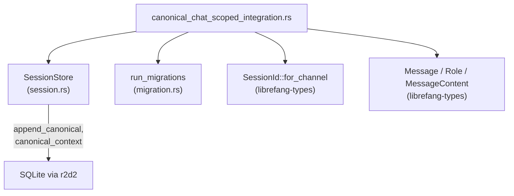

# Other — librefang-memory-tests

# librefang-memory/tests — Canonical Chat-Scoped Integration Tests

## Purpose

This module is an **integration regression test suite** that guards a critical privacy fix in `SessionStore`. The fix ensures that canonical memory entries are tagged with the originating `SessionId` and filtered at read time. Without it, any WhatsApp DM and group sharing the same agent would see each other's conversation history injected into the LLM prompt — meaning private chat content could leak into group prompts and vice versa.

The tests exercise the full `append → load → context` roundtrip via `SessionStore`'s public API, which mirrors the call path the kernel uses on every inbound message.

## Bug Context

`SessionStore.append_canonical` stores summarized conversation turns as `CanonicalEntry` rows. Before the fix, these rows had no session association. Since the same agent serves multiple chats (DMs, groups, different channels), `canonical_context` would return every entry for that agent regardless of which chat was active — a cross-channel data leak.

The fix adds an optional `session_id` parameter to `append_canonical` and `canonical_context`. When provided, reads are scoped to that session only.

## Test Infrastructure

### `setup()`

Creates a fully initialized `SessionStore` backed by an in-memory SQLite database:

- Builds an `r2d2` connection pool with `max_size(1)` against `SqliteConnectionManager::memory()`
- Runs schema migrations via `run_migrations`
- Returns a `SessionStore` ready for use

This mirrors production initialization but avoids touching the filesystem.

### `user_msg(text)`

Helper that constructs a `Message` with `Role::User`, text content, no pin, and no timestamp. Used to build the message batches passed to `append_canonical`.

## Test Cases

### `canonical_context_isolates_two_whatsapp_chats_for_same_agent`

**What it verifies:** Two chats targeting the same agent derive distinct `SessionId`s and never share canonical context.

**How it works:**

1. Creates a single `AgentId` and derives two session IDs via `SessionId::for_channel`:
   - `session_dm` — a WhatsApp DM (`...@s.whatsapp.net`)
   - `session_group` — a WhatsApp group (`...@g.us`)
2. Asserts the two sessions are not equal (validating channel derivation itself).
3. Appends three messages in interleaved order: `dm-1`, `group-1`, `dm-2`.
4. Loads canonical context scoped to `session_dm` — asserts it returns exactly `["dm-1", "dm-2"]` with no group leakage.
5. Loads canonical context scoped to `session_group` — asserts it returns exactly `["group-1"]` with no DM leakage.

**Failure implication:** A failure here means the session-tagging or filtering logic in `session.rs` is broken, and private messages are leaking across chat boundaries.

### `canonical_context_unfiltered_returns_all_for_backward_compat`

**What it verifies:** Passing `session_id = None` to `canonical_context` returns entries from all sessions, preserving the original cross-channel semantics.

**How it works:**

1. Creates an agent and two sessions on different channels (WhatsApp and Telegram).
2. Appends one message to each session.
3. Calls `canonical_context(agent, None, None)` — the unfiltered path.
4. Asserts both messages appear in the result.

**Why this matters:** Existing callers that haven't adopted per-session filtering must continue to work unchanged. This test locks in that backward-compatible behavior.

## Relationships to Other Modules


```mermaid
graph TD
    Tests["canonical_chat_scoped_integration.rs"] --> SessionStore["SessionStore<br/>(session.rs)"]
    Tests --> Migrations["run_migrations<br/>(migration.rs)"]
    Tests --> SessionId["SessionId::for_channel<br/>(librefang-types)"]
    Tests --> Message["Message / Role / MessageContent<br/>(librefang-types)"]
    SessionStore -->|"append_canonical,<br/>canonical_context"| DB["SQLite via r2d2"]
```

The test module depends on three crates:

| Crate | Usage |
|---|---|
| `librefang_memory` | `SessionStore`, `run_migrations` — the system under test |
| `librefang_types` | `AgentId`, `SessionId`, `Message`, `Role`, `MessageContent` — domain types |
| `r2d2` / `r2d2_sqlite` | Connection pooling for the in-memory SQLite backend |

## Running

```sh
# From the workspace root
cargo test -p librefang-memory --test canonical_chat_scoped_integration

# Or run all integration tests in the crate
cargo test -p librefang-memory
```

No external services or environment variables are required — everything runs in-process against an ephemeral in-memory database.