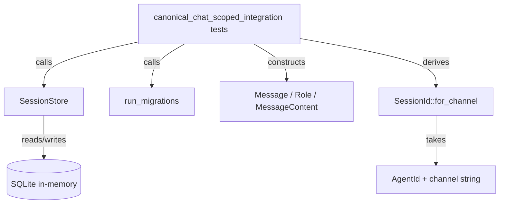

# Other — librefang-memory-tests

# librefang-memory-tests

Integration regression tests for the `librefang-memory` crate, focusing on **chat-scoped canonical context filtering**.

## Background

Each `CanonicalEntry` stored in the memory layer is tagged with the `SessionId` of the originating conversation. The `SessionStore` filters by this tag at read time so that only messages belonging to the requesting session appear in the LLM prompt context.

Before the fix these tests guard against, **all** canonical entries for a given `AgentId` were returned regardless of session. In practice this meant a WhatsApp DM and a WhatsApp group sharing the same agent would see each other's history — a private chat could leak group messages and vice versa.

## Test file

`tests/canonical_chat_scoped_integration.rs`

### Test infrastructure

| Helper | Purpose |
|---|---|
| `setup()` | Creates an in-memory SQLite pool (`SqliteConnectionManager::memory()`), runs schema migrations via `run_migrations`, and returns a fresh `SessionStore`. Pool size is 1 to keep the in-memory DB deterministic. |
| `user_msg(text)` | Builds a minimal `Message` with `Role::User` and `MessageContent::Text`. Used as the payload for `append_canonical` calls. |

Both helpers are private to the test binary; they exercise the same public API surface that the kernel runtime calls.

### Test cases

#### `canonical_context_isolates_two_whatsapp_chats_for_same_agent`

The core isolation regression test. It verifies that two sessions derived from different WhatsApp channel addresses produce distinct `SessionId` values and that `canonical_context` returns only the messages belonging to the requested session.

**Scenario:**

```
Agent
 ├── session_dm    ← "whatsapp:393331111111@s.whatsapp.net" (Jessica DM)
 │     receives: "dm-1", "dm-2"
 └── session_group ← "whatsapp:120363111111111111@g.us"     (group with Jessica)
       receives: "group-1"
```

Append order is interleaved (`dm-1`, `group-1`, `dm-2`) so that a naïve "last N entries" approach would fail. The test asserts:

- `session_dm ≠ session_group` — different channels must derive different sessions.
- Querying with `session_dm` returns exactly `["dm-1", "dm-2"]` — no group leakage.
- Querying with `session_group` returns exactly `["group-1"]` — no DM leakage.

#### `canonical_context_unfiltered_returns_all_for_backward_compat`

Verifies backward compatibility for callers that have not adopted per-session filtering. When `canonical_context` is called with `session_id = None`, it returns **all** canonical entries for the agent, preserving the original cross-channel semantics.

Entries are appended under two distinct sessions (`session_a` via WhatsApp, `session_b` via Telegram). The unfiltered query must return both `"a-1"` and `"b-1"`.

## Dependencies and integration points


```mermaid
graph TD
    A[canonical_chat_scoped_integration tests] -->|calls| B[SessionStore]
    A -->|calls| C[run_migrations]
    B -->|reads/writes| D[(SQLite in-memory)]
    A -->|constructs| E[Message / Role / MessageContent]
    A -->|derives| F[SessionId::for_channel]
    F -->|takes| G[AgentId + channel string]
```

| External crate / module | Usage |
|---|---|
| `librefang_memory::session::SessionStore` | The production type under test. Methods exercised: `new`, `append_canonical`, `canonical_context`. |
| `librefang_memory::migration::run_migrations` | Ensures the in-memory schema matches production before each test. |
| `librefang_types::agent::{AgentId, SessionId}` | `AgentId::new()` generates a fresh agent; `SessionId::for_channel(agent, channel_str)` derives a deterministic session from a channel address — mirroring how the kernel derives sessions on every inbound message. |
| `librefang_types::message::{Message, Role, MessageContent}` | Message types passed into and read back from the store. |
| `r2d2` / `r2d2_sqlite` | Connection pooling; in-memory variant avoids filesystem side-effects. |

## Running

```bash
# From the workspace root
cargo test -p librefang-memory --test canonical_chat_scoped_integration

# Or run both tests with output
cargo test -p librefang-memory --test canonical_chat_scoped_integration -- --nocapture
```

No external services or databases are required. Every test creates and tears down its own in-memory SQLite instance.