# Other — librefang-memory-wiki-tests

# librefang-memory-wiki Tests

## Overview

This module contains the integration and contract tests for the **Memory Wiki** durable knowledge vault (`librefang-memory-wiki`), implementing acceptance criteria from issue #3329. The tests validate two layers:

1. **Acceptance tests** (`wiki_acceptance.rs`) — end-to-end exercises of `WikiVault` against a real on-disk filesystem (tempdir), mirroring the seven acceptance bullets from the issue.
2. **Handle contract tests** (`wiki_handle_contract.rs`) — JSON-shape stability tests for the `WikiAccess` trait defined in `librefang-kernel-handle`, ensuring the vault's serialized output matches what every caller (tool dispatcher, HTTP routes, dashboard) is allowed to depend on.

Both test files live under `librefang-memory-wiki/tests/` because the kernel crate itself cannot build inside the sandboxed CI image (requires `libdbus`/`gdk`). The contract test here mirrors the production kernel-side adaptor verbatim, catching drift at PR time rather than at first production call.

## Architecture

```mermaid
graph TD
    subgraph "wiki_acceptance.rs"
        A1[vault_in] --> V[WikiVault::with_root]
        A2[provenance] --> PE[ProvenanceEntry]
        T1[isolated_mode_round_trip] --> A1
        T1 --> A2
        T3[provenance_is_populated_on_every_write] --> A1
        T4[external_hand_edit_is_preserved_under_force] --> A1
        T5a[obsidian_mode_emits_wiki_link_syntax] --> A1
        T5b[native_mode_emits_relative_markdown_links] --> A1
        T7[five_pages_with_links_produce...] --> A1
        T7 --> BL[vault.backlinks]
    end
    subgraph "wiki_handle_contract.rs"
        H1[vault_handle] --> V
        WH[WikiHandle] -.implements.-> WA[WikiAccess trait]
        WH --> V
        C1[wiki_write_response_shape_is_stable] --> H1
        C2[wiki_get_returns_topic_frontmatter_body] --> H1
        C3[wiki_search_returns_array_of_objects] --> H1
        C4[disabled_handle_returns_unavailable] --> WH2["WikiHandle(None)"]
    end
```



## Test Fixtures

### `provenance(agent, turn)` — `wiki_acceptance.rs`

Helper that constructs a `ProvenanceEntry` with a fixed session (`"sess_acceptance"`) and channel (`"test-harness"`). Used by every acceptance test that writes to the vault.

```rust
fn provenance(agent: &str, turn: u64) -> ProvenanceEntry
```

### `vault_in(dir, render)` — `wiki_acceptance.rs`

Creates a `WikiVault` rooted in the given tempdir with `MemoryWikiIngestFilter::Tagged`. Panics on construction failure.

```rust
fn vault_in(dir: &TempDir, render: RenderMode) -> WikiVault
```

### `vault_handle(dir)` — `wiki_handle_contract.rs`

Creates a `WikiHandle(Some(Arc<WikiVault>))` for contract tests. The `WikiHandle` struct wraps `Option<Arc<WikiVault>>` and implements `WikiAccess`, mirroring the production kernel adaptor.

```rust
fn vault_handle(dir: &TempDir) -> WikiHandle
```

### `WikiHandle` — `wiki_handle_contract.rs`

A thin adaptor that implements `librefang_kernel_handle::WikiAccess` over `Option<Arc<WikiVault>>`. When the inner option is `None`, all methods return `KernelOpError::Unavailable`. This struct is a faithful replica of the production kernel-side adaptor.

## Acceptance Tests (`wiki_acceptance.rs`)

Each test is annotated with the acceptance bullet it covers.

| Test | Bullet | What it validates |
|------|--------|-------------------|
| `default_config_is_disabled_and_construction_short_circuits` | #1 | `MemoryWikiConfig::default()` has `enabled: false`; `WikiVault::new` returns `WikiError::Disabled` |
| `isolated_mode_round_trip` | #2 | `write` → `get` → `search` round-trip; `.md` file appears on disk |
| `provenance_is_populated_on_every_write` | #3 | Multiple writes append to provenance history; order preserved; YAML frontmatter contains `agent`, `provenance`, `content_sha256` |
| `external_hand_edit_is_preserved_under_force` | #4 | External file edit detected; write without `force` returns `WikiError::HandEditConflict`; write with `force` preserves user's edit body and only appends provenance |
| `obsidian_mode_emits_wiki_link_syntax` | #5 | `RenderMode::Obsidian` preserves `[[topic]]` syntax in the `.md` file |
| `native_mode_emits_relative_markdown_links` | #5 | `RenderMode::Native` rewrites `[[topic]]` to `[topic](topic.md)` |
| `five_pages_with_links_produce_five_files_and_correct_backlinks` | #7 | Five interlinked pages produce five `.md` files plus `index.md`; `vault.backlinks()` returns correct source→target pairs; `index.md` lists all topics |
| `render_mode_conversion_round_trip` | — | `MemoryWikiRenderMode` ↔ `RenderMode` conversion is lossless |
| `reserved_modes_return_specific_error` | — | `MemoryWikiMode::Bridge` surfaces `WikiError::ModeNotImplemented("bridge")` rather than silently misbehaving |

### Hand-edit detection flow

The hand-edit test simulates a critical safety property: the vault never silently drops a human's edit.

1. Agent writes "first version" → file created on disk.
2. Simulated user appends "hand-typed important caveat" to the `.md` file directly.
3. Agent write without `force` → `WikiError::HandEditConflict`.
4. Agent write with `force=true` → vault keeps the user-edited body, ignores the supplied body string, appends provenance. `outcome.merged_with_external_edit` is `true`.

### Backlink topology test

The five-page test establishes a DAG:

```
alpha → beta, gamma
beta  → gamma, delta
gamma → delta
delta → epsilon
epsilon → (leaf)
```

The test asserts six backlink edges (sorted by target, then source), verifying that `vault.backlinks()` correctly parses `[[topic]]` references from on-disk files and builds the reverse index.

## Handle Contract Tests (`wiki_handle_contract.rs`)

These tests lock down the JSON wire shape that all consumers of `WikiAccess` depend on. They prevent accidental serialization changes.

### Error category mapping

The `WikiHandle` implementation maps `WikiError` variants to `KernelOpError` categories:

| `WikiError` | `KernelOpError` | Notes |
|---|---|---|
| *(vault absent)* | `Unavailable(method_name)` | `wiki_get`, `wiki_search`, or `wiki_write` |
| `NotFound(topic)` | `Internal("wiki topic '{topic}' not found")` | Caller should distinguish from vault-off |
| `HandEditConflict { topic }` | `Internal("wiki page '{topic}' was edited externally...")` | Message guides operator to re-read or force |
| `InvalidTopic { topic, reason }` | `InvalidInput(...)` | Bad topic name |
| `BodyTooLarge { topic, size, cap }` | `InvalidInput(...)` | Body exceeds cap |
| Deserialization failure | `InvalidInput(...)` | Malformed provenance JSON |

### Stable JSON shapes

**`wiki_write` response** — a JSON object with:
- `"topic"`: string
- `"path"`: string (filesystem path)
- `"content_sha256"`: 64-character hex string
- `"merged_with_external_edit"`: boolean

**`wiki_get` response** — a JSON object with:
- `"topic"`: string
- `"body"`: string
- `"frontmatter"`: object containing `"topic"`, `"created"`, `"updated"`, `"content_sha256"`, `"provenance"` (array of objects with `"agent"`)

**`wiki_search` response** — a JSON array of objects, each with:
- `"topic"`: string
- `"snippet"`: string
- `"score"`: float

### Disabled-vault behavior

`WikiHandle(None)` returns `KernelOpError::Unavailable` with the method name (`"wiki_get"`, `"wiki_search"`, `"wiki_write"`) for every call. This mirrors the production behavior when `MemoryWikiConfig::enabled` is `false`.

## Dependencies

| Crate | Role |
|-------|------|
| `librefang-memory-wiki` | System under test — provides `WikiVault`, `WikiError`, config types |
| `librefang-kernel-handle` | Defines `WikiAccess` trait and `KernelOpError` — contract target |
| `tempfile` | Creates isolated tempdir per test for on-disk filesystem tests |
| `chrono` | Constructs timestamps for `ProvenanceEntry` |
| `serde_json` | Validates serialized JSON shapes in contract tests |

## Running

```sh
# All tests in this module
cargo test -p librefang-memory-wiki

# Acceptance tests only
cargo test -p librefang-memory-wiki --test wiki_acceptance

# Handle contract tests only
cargo test -p librefang-memory-wiki --test wiki_handle_contract
```

No external services, databases, or environment variables are required. Each test creates its own isolated temporary directory.