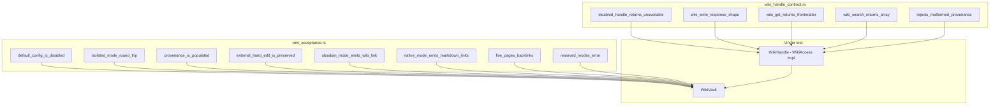

# Other — librefang-memory-wiki-tests

# librefang-memory-wiki Tests

Integration and contract tests for the memory wiki vault — a durable, file-backed knowledge store that agents read and write through `WikiVault`.

## Purpose

These tests serve two distinct roles:

1. **Acceptance tests** (`wiki_acceptance.rs`) validate the seven-bullet specification from issue #3329. They exercise `WikiVault` against a real on-disk filesystem (via `tempfile::TempDir`) and assert behaviour, file layout, frontmatter persistence, and link topology.

2. **Contract tests** (`wiki_handle_contract.rs`) lock down the JSON wire shapes that any `WikiAccess` implementation must produce. They shadow the production kernel-side adaptor so that drift between trait definition and vault output is caught at PR time rather than at first production call.

## Test Architecture



## Helpers

Both files provide thin helpers to reduce boilerplate:

### `wiki_acceptance.rs`

- **`provenance(agent, turn)`** — Constructs a `ProvenanceEntry` with a fixed session (`"sess_acceptance"`) and channel (`"test-harness"`), varying only the agent name and turn number.
- **`vault_in(dir, render)`** — Creates a `WikiVault` via `WikiVault::with_root` pointed at the temp directory, using `MemoryWikiIngestFilter::Tagged`. Panics on construction failure.

### `wiki_handle_contract.rs`

- **`WikiHandle(Option<Arc<WikiVault>>)`** — A minimal struct that implements the `WikiAccess` trait from `librefang-kernel-handle`. `None` simulates a disabled vault; `Some(Arc<...>)` delegates to the real vault. This mirrors the production kernel adaptor verbatim.
- **`vault_handle(dir)`** — Builds a `WikiVault` inside the temp directory and wraps it in `WikiHandle(Some(...))`.

## Acceptance Tests — Behaviour Coverage

### Default configuration is off

**`default_config_is_disabled_and_construction_short_circuits`** asserts that `MemoryWikiConfig::default()` has `enabled = false` and that calling `WikiVault::new` with this config returns `WikiError::Disabled`. No vault is constructed; no files are touched.

### Isolated round-trip

**`isolated_mode_round_trip`** writes a page via `vault.write`, confirms the `.md` file exists on disk, reads it back with `vault.get`, and verifies `vault.search` finds it by content. The `WriteOutcome.merged_with_external_edit` flag must be `false`.

### Provenance accumulation

**`provenance_is_populated_on_every_write`** writes to the same topic three times with different agents and turns. It asserts:
- `page.frontmatter.provenance` has length 3 with agents in order `[alpha, beta, alpha]`.
- The on-disk YAML contains `provenance:`, agent names, and `content_sha256:`.

### Hand-edit preservation

**`external_hand_edit_is_preserved_under_force`** simulates a user editing a vault `.md` file outside the system:

1. Write a page normally.
2. Manually append text to the file.
3. Attempt another write with `force = false` → must fail with `WikiError::HandEditConflict`.
4. Retry with `force = true` → the hand-typed text survives; the passed body is intentionally ignored. Provenance is appended (total 2 entries), and `outcome.merged_with_external_edit` is `true`.

### Render modes

Two counterpart tests exercise the link-rewriting behaviour:

| Test | Render Mode | `[[topic]]` becomes | Assertion |
|---|---|---|---|
| `obsidian_mode_emits_wiki_link_syntax` | `RenderMode::Obsidian` | `[[topic]]` (unchanged) | No `[topic](topic.md)` in output |
| `native_mode_emits_relative_markdown_links` | `RenderMode::Native` | `[topic](topic.md)` | No `[[topic]]` in output |

The `render_mode_conversion_round_trip` test confirms `MemoryWikiRenderMode::from` / `Into<RenderMode>` conversions are identity mappings.

### Backlink topology

**`five_pages_with_links_produce_five_files_and_correct_backlinks`** creates a chain of five pages:

```
alpha → [beta, gamma]
beta  → [gamma, delta]
gamma → [delta]
delta → [epsilon]
epsilon → (leaf)
```

It asserts:
- Six `.md` files on disk: the five topics plus `index.md`.
- `vault.backlinks()` returns exactly the six expected `BacklinkEntry` pairs.
- `index.md` mentions every topic and does not mention `_meta`.

### Reserved mode rejection

**`reserved_modes_return_specific_error`** constructs a `MemoryWikiConfig` with `mode: MemoryWikiMode::Bridge` and confirms `WikiVault::new` returns `WikiError::ModeNotImplemented("bridge")`. This ensures misconfiguration is loud rather than silently accepted.

## Contract Tests — JSON Shape Guarantees

These tests exist because `librefang-kernel-handle` defines the `WikiAccess` trait (the JSON interface) but cannot depend on a real vault, while `librefang-kernel` has the real implementation but lives behind heavy system dependencies. The tests here close that gap.

### Disabled vault

**`disabled_handle_returns_per_method_unavailable`** — When `WikiHandle(None)` calls `wiki_get`, `wiki_search`, or `wiki_write`, each must return `KernelOpError::Unavailable` with the method name as context.

### Write response shape

**`wiki_write_response_shape_is_stable`** — A successful `wiki_write` must return a JSON object with:

| Field | Type | Constraint |
|---|---|---|
| `topic` | string | matches the input topic |
| `path` | string | present and non-null |
| `content_sha256` | string | exactly 64 hex characters |
| `merged_with_external_edit` | boolean | `false` for a fresh write |

### Get response shape

**`wiki_get_returns_topic_frontmatter_body_object`** — A successful `wiki_get` must return a JSON object with:

| Field | Type | Nested requirements |
|---|---|---|
| `topic` | string | — |
| `body` | string | — |
| `frontmatter` | object | contains `topic`, `created`, `updated`, `content_sha256`, and `provenance` (array of objects with `agent`) |

### Search response shape

**`wiki_search_returns_array_of_topic_snippet_score_objects`** — A successful `wiki_search` must return a JSON array where each element is an object containing `topic` (string), `snippet` (string), and `score` (number).

### Input validation

**`wiki_write_rejects_malformed_provenance_with_invalid_input`** — Passing provenance without the required `agent` field must return `KernelOpError::InvalidInput` (not `Internal`), with a message mentioning `"provenance"`.

## Running

```sh
# All tests in this crate
cargo test -p librefang-memory-wiki

# Acceptance tests only
cargo test -p librefang-memory-wiki --test wiki_acceptance

# Contract tests only
cargo test -p librefang-memory-wiki --test wiki_handle_contract
```

No external services or system dependencies are required. Every test creates an isolated `TempDir` that is cleaned up on completion.