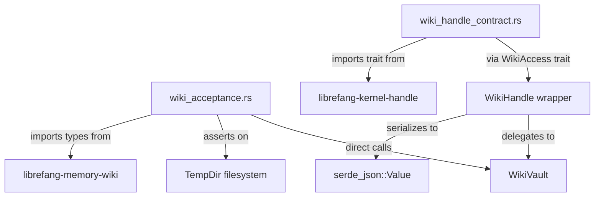

# Other — librefang-memory-wiki-tests

# librefang-memory-wiki-tests

Integration and acceptance tests for the `librefang-memory-wiki` crate, validating the `WikiVault` durable knowledge vault end-to-end against a real on-disk filesystem.

## Purpose

This module serves two distinct testing roles:

1. **Acceptance testing** (`wiki_acceptance.rs`) — Exercises the seven acceptance criteria from issue #3329. Each test creates a `WikiVault` backed by a temporary directory and asserts observable behavior: file layout, frontmatter persistence, hand-edit detection, render-mode link syntax, and backlink topology.

2. **Contract testing** (`wiki_handle_contract.rs`) — Validates that the JSON shapes produced by `wiki_get`, `wiki_search`, and `wiki_write` remain stable across the `WikiAccess` trait boundary defined in `librefang-kernel-handle`. This prevents drift between the kernel-side adaptor and what downstream consumers (tool dispatchers, HTTP routes, dashboards) rely on.

## Architecture



## Test Utilities

### `vault_in` (acceptance tests)

Constructs a `WikiVault` rooted in a temporary directory with the specified `RenderMode` and `MemoryWikiIngestFilter::Tagged`:

```rust
fn vault_in(dir: &TempDir, render: RenderMode) -> WikiVault
```

Used by every acceptance test except `default_config_is_disabled_and_construction_short_circuits`.

### `provenance` (acceptance tests)

Builds a `ProvenanceEntry` with a fixed session (`"sess_acceptance"`) and channel (`"test-harness"`), parameterized by agent name and turn number:

```rust
fn provenance(agent: &str, turn: u64) -> ProvenanceEntry
```

### `WikiHandle` (contract tests)

A thin `Option<Arc<WikiVault>>` wrapper that implements `librefang_kernel_handle::WikiAccess`. When the inner option is `None`, all methods return `KernelOpError::Unavailable`. This mirrors the production kernel-side adaptor where the vault may be disabled.

The implementation maps `WikiError` variants to `KernelOpError` variants:

| `WikiError` | `KernelOpError` |
|---|---|
| `HandEditConflict` | `Internal` (with actionable message) |
| `InvalidTopic` | `InvalidInput` |
| `BodyTooLarge` | `InvalidInput` |
| `NotFound` | `Internal` |
| All others | `Internal` |

### `vault_handle` (contract tests)

Constructs a `WikiHandle` with an active vault:

```rust
fn vault_handle(dir: &TempDir) -> WikiHandle
```

## Acceptance Tests

Each test maps to a bullet in the issue #3329 acceptance list, cited in its doc comment.

### #1: Default config is disabled

`default_config_is_disabled_and_construction_short_circuits` — Asserts `MemoryWikiConfig::default()` has `enabled: false` and that `WikiVault::new` returns `WikiError::Disabled` rather than constructing a vault.

### #2: Isolated mode round-trip

`isolated_mode_round_trip` — Writes a page via `vault.write`, verifies the `.md` file exists on disk, reads it back with `vault.get`, and confirms `vault.search` finds it by content. Also asserts `outcome.merged_with_external_edit` is `false` on a fresh write.

### #3: Provenance accumulates

`provenance_is_populated_on_every_write` — Writes to the same topic three times with different agents and turns. Verifies:
- `page.frontmatter.provenance` has exactly 3 entries in order.
- Agent names appear in the correct sequence.
- The on-disk YAML contains `provenance:`, agent names, and `content_sha256:`.

### #4: Hand-edit preservation

`external_hand_edit_is_preserved_under_force` — Tests the hand-edit detection cycle:
1. Write a page normally.
2. Append content directly to the `.md` file (simulating a user editing in their editor).
3. Assert a subsequent `write` without `force` returns `WikiError::HandEditConflict`.
4. Assert `write` with `force=true` preserves the user's hand-typed content and appends provenance. The body passed to the forced write is intentionally discarded; `merged_with_external_edit` is `true`.

### #5: Render modes

Two tests cover the two render modes:

- `obsidian_mode_emits_wiki_link_syntax` — In `RenderMode::Obsidian`, `[[topic]]` syntax is preserved verbatim in the on-disk file; no rewriting to markdown links occurs.
- `native_mode_emits_relative_markdown_links` — In `RenderMode::Native`, `[[topic]]` is rewritten to `[topic](topic.md)` plain markdown links.

### #7: Backlink topology

`five_pages_with_links_produce_five_files_and_correct_backlinks` — Creates five pages forming a link chain (alpha → beta → gamma → delta → epsilon). Verifies:
- Six `.md` files exist (five topics plus auto-generated `index.md`).
- `vault.backlinks()` returns exactly the expected `BacklinkEntry` set (6 entries, since alpha links to beta and gamma, beta links to gamma and delta, etc.).
- `index.md` lists every topic and does not contain `_meta`.

### Additional coverage

- `render_mode_conversion_round_trip` — Asserts `RenderMode::from(MemoryWikiRenderMode::*)` round-trips correctly.
- `reserved_modes_return_specific_error` — Asserts that `MemoryWikiMode::Bridge` produces `WikiError::ModeNotImplemented("bridge")`, preventing silent misconfiguration.

## Contract Tests

These tests validate the JSON wire format that any `WikiAccess` consumer can rely on. They exist because `librefang-kernel-handle` defines the trait but has no vault to test against, and `librefang-kernel` has a real impl but cannot build in the sandboxed CI environment due to system dependency constraints (libdbus, gdk).

### Disabled vault

`disabled_handle_returns_per_method_unavailable` — With `WikiHandle(None)`, all three methods (`wiki_get`, `wiki_search`, `wiki_write`) return `KernelOpError::Unavailable` with the method name as context.

### Write response shape

`wiki_write_response_shape_is_stable` — Asserts the JSON object returned by `wiki_write` contains:
- `topic`: string matching the input topic.
- `path`: string (the on-disk file path).
- `content_sha256`: 64-character hex string.
- `merged_with_external_edit`: boolean.

### Malformed provenance

`wiki_write_rejects_malformed_provenance_with_invalid_input` — Passing a JSON object without the required `agent` field surfaces as `KernelOpError::InvalidInput` (not `Internal`), with a message mentioning `"provenance"`.

### Get response shape

`wiki_get_returns_topic_frontmatter_body_object` — Asserts the JSON object has:
- `topic`: string.
- `body`: string.
- `frontmatter`: object containing `topic`, `created`, `updated`, `content_sha256`, and `provenance` (an array of objects each with an `agent` field).

### Search response shape

`wiki_search_returns_array_of_topic_snippet_score_objects` — Asserts the response is a JSON array where each hit is an object with:
- `topic`: string.
- `snippet`: string.
- `score`: number (f64).

## Running

These are standard `#[test]` functions executed via `cargo test -p librefang-memory-wiki`. All tests create temporary directories (`tempfile::TempDir`) that are automatically cleaned up on drop. No external services or system dependencies are required.