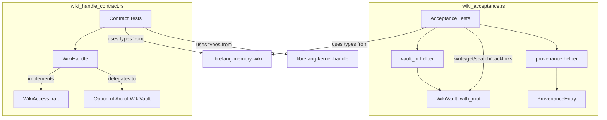

# Other — librefang-memory-wiki-tests

# librefang-memory-wiki Tests

## Purpose

This module contains the **acceptance and contract tests** for the `librefang-memory-wiki` crate — a durable, file-backed knowledge vault that agents read and write as markdown pages with YAML frontmatter. The tests validate two distinct concerns:

1. **Vault acceptance** (`wiki_acceptance.rs`) — end-to-end correctness of `WikiVault` against a real on-disk filesystem, mirroring the acceptance criteria from issue #3329.
2. **Kernel-handle contract** (`wiki_handle_contract.rs`) — JSON shape stability for the `WikiAccess` trait, ensuring the vault's serialization output matches what `librefang-kernel-handle` callers rely on.

## Architecture


```mermaid
graph TD
    subgraph "wiki_acceptance.rs"
        A[vault_in helper] --> B[WikiVault::with_root]
        C[provenance helper] --> D[ProvenanceEntry]
        E[Acceptance Tests] --> A
        E --> C
        E -->|write/get/search/backlinks| B
    end
    subgraph "wiki_handle_contract.rs"
        F[WikiHandle] -->|implements| G[WikiAccess trait]
        H[Contract Tests] --> F
        F -->|delegates to| I[Option of Arc of WikiVault]
    end
    E -->|uses types from| J[librefang-memory-wiki]
    H -->|uses types from| J
    H -->|uses types from| K[librefang-kernel-handle]
```

## Test Helpers

### `vault_in` (acceptance)

Constructs a `WikiVault` against a temporary directory with `MemoryWikiIngestFilter::Tagged`:

```rust
fn vault_in(dir: &TempDir, render: RenderMode) -> WikiVault
```

Used by every acceptance test except `default_config_is_disabled_and_construction_short_circuits`.

### `provenance` (acceptance)

Builds a `ProvenanceEntry` with fixed session (`"sess_acceptance"`) and channel (`"test-harness"`) values:

```rust
fn provenance(agent: &str, turn: u64) -> ProvenanceEntry
```

### `vault_handle` (contract)

Creates a `WikiHandle(Some(Arc<WikiVault>))` for contract tests that need an active vault:

```rust
fn vault_handle(dir: &TempDir) -> WikiHandle
```

### `WikiHandle` struct (contract)

A thin `Option<Arc<WikiVault>>` wrapper that implements `WikiAccess`. This mirrors the production kernel-side adaptor. When the inner option is `None`, every method returns `KernelOpError::Unavailable` — matching the behavior when the wiki feature is disabled.

## Acceptance Tests (`wiki_acceptance.rs`)

Each test maps to a specific acceptance bullet from issue #3329.

| Test | Acceptance Bullet | What it verifies |
|------|-------------------|------------------|
| `default_config_is_disabled_and_construction_short_circuits` | #1 | `MemoryWikiConfig::default().enabled == false`; `WikiVault::new` returns `WikiError::Disabled` |
| `isolated_mode_round_trip` | #2 | `write` creates `*.md` on disk; `get` returns the page; `search` finds it by content |
| `provenance_is_populated_on_every_write` | #3 | Each write appends to the provenance array; order and agents are preserved; YAML frontmatter round-trips |
| `external_hand_edit_is_preserved_under_force` | #4 | External file edits cause `HandEditConflict` without `force`; with `force`, the user's edit survives and only provenance is appended |
| `obsidian_mode_emits_wiki_link_syntax` | #5 | `RenderMode::Obsidian` preserves `[[topic]]` syntax without rewriting |
| `native_mode_emits_relative_markdown_links` | #5 (counterpart) | `RenderMode::Native` rewrites `[[topic]]` to `[topic](topic.md)` |
| `five_pages_with_links_produce_five_files_and_correct_backlinks` | #7 | Five linked pages produce five `.md` files, a correct backlink graph, and an `index.md` listing all topics |
| `render_mode_conversion_round_trip` | — | `MemoryWikiRenderMode` ↔ `RenderMode` conversion is identity-preserving |
| `reserved_modes_return_specific_error` | — | `MemoryWikiMode::Bridge` surfaces `WikiError::ModeNotImplemented("bridge")` rather than silently behaving incorrectly |

### Hand-edit conflict flow

The hand-edit detection test (`external_hand_edit_is_preserved_under_force`) is the most complex acceptance test. Its flow:

1. Write initial page → file lands on disk with a `content_sha256` in frontmatter.
2. Manually append text to the `.md` file (simulating a user edit).
3. Attempt another `write` with `force=false` → `WikiError::HandEditConflict` is returned because the on-disk SHA no longer matches.
4. Retry with `force=true` → the vault discards the supplied body, preserves the user's edit, and only appends provenance. The `merged_with_external_edit` flag on the outcome is `true`.

## Contract Tests (`wiki_handle_contract.rs`)

These tests ensure the JSON shapes produced by `WikiVault` serialization remain stable across changes. They exist because `librefang-kernel-handle` defines the `WikiAccess` trait but cannot test against a real vault (its dependencies cannot build in the sandboxed CI image).

### JSON shape guarantees

**`wiki_write` response shape:**

```json
{
  "topic": "string",
  "path": "string",
  "content_sha256": "64-char hex string",
  "merged_with_external_edit": false
}
```

Verified by `wiki_write_response_shape_is_stable`.

**`wiki_get` response shape:**

```json
{
  "topic": "string",
  "body": "string",
  "frontmatter": {
    "topic": "string",
    "created": "timestamp",
    "updated": "timestamp",
    "content_sha256": "string",
    "provenance": [
      { "agent": "string", ... }
    ]
  }
}
```

Verified by `wiki_get_returns_topic_frontmatter_body_object`.

**`wiki_search` response shape:**

```json
[
  {
    "topic": "string",
    "snippet": "string",
    "score": 0.95
  }
]
```

Verified by `wiki_search_returns_array_of_topic_snippet_score_objects`.

### Error categorization

The `WikiHandle` implementation maps vault errors to `KernelOpError` variants following a specific contract:

| Vault error | Kernel error | Test |
|---|---|---|
| No vault (`None`) | `KernelOpError::Unavailable(method_name)` | `disabled_handle_returns_per_method_unavailable` |
| Malformed provenance JSON | `KernelOpError::InvalidInput(…)` | `wiki_write_rejects_malformed_provenance_with_invalid_input` |
| `WikiError::HandEditConflict` | `KernelOpError::Internal(…)` | embedded in `wiki_write` impl |
| `WikiError::InvalidTopic` | `KernelOpError::InvalidInput(…)` | embedded in `wiki_write` impl |
| `WikiError::BodyTooLarge` | `KernelOpError::InvalidInput(…)` | embedded in `wiki_write` impl |

## Dependencies

- **`librefang-memory-wiki`** — the crate under test; provides `WikiVault`, `ProvenanceEntry`, `BacklinkEntry`, `MemoryWikiConfig`, `RenderMode`, and error types.
- **`librefang-kernel-handle`** — provides the `WikiAccess` trait and `KernelOpError` (contract tests only).
- **`tempfile`** — ephemeral on-disk directories for filesystem isolation.
- **`chrono`** — timestamps for `ProvenanceEntry.at`.
- **`serde_json`** — JSON shape assertions (contract tests only).

## Running the tests

```sh
# All tests in this module
cargo test -p librefang-memory-wiki

# Acceptance tests only
cargo test -p librefang-memory-wiki --test wiki_acceptance

# Contract tests only
cargo test -p librefang-memory-wiki --test wiki_handle_contract
```

No external services or environment variables are required. Every test creates its own `TempDir` and cleans up on exit.