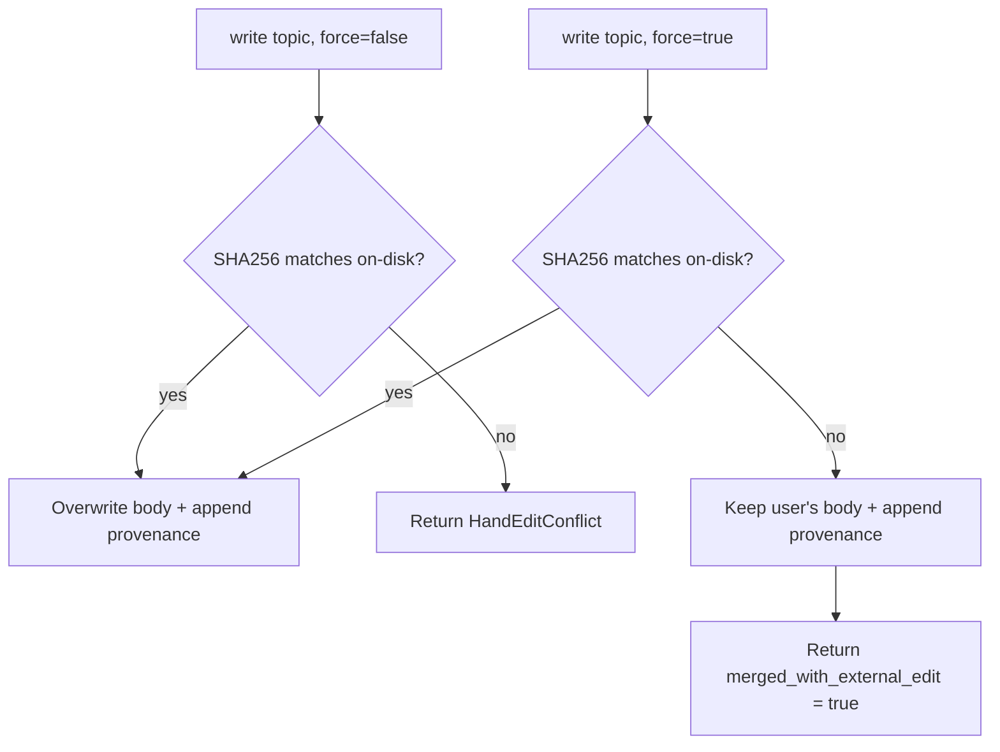

# Other — librefang-memory-wiki-tests

# librefang-memory-wiki Tests

Acceptance and contract tests for the **Memory Wiki** durable knowledge vault (issue #3329). These tests exercise the public `WikiVault` API end-to-end against a real on-disk filesystem and verify the JSON contract that kernel-side consumers rely on.

## Test Files

| File | Scope |
|---|---|
| `wiki_acceptance.rs` | Seven acceptance criteria from the issue — vault construction, round-trip I/O, provenance, hand-edit detection, render modes, backlink topology |
| `wiki_handle_contract.rs` | JSON shape stability for `WikiAccess` trait methods (`wiki_get`, `wiki_search`, `wiki_write`) — prevents drift between the kernel adaptor and its callers |

## Acceptance Tests (`wiki_acceptance.rs`)

Each test maps to a specific bullet in the issue's acceptance list, cited in the function-level doc comment.

### Helpers

- **`provenance(agent, turn)`** — constructs a `ProvenanceEntry` with a fixed session/channel and the given agent name and turn number.
- **`vault_in(dir, render)`** — creates a `WikiVault` rooted in the temp directory using `WikiVault::with_root` with `MemoryWikiIngestFilter::Tagged`.

### Test Coverage

| Test | Acceptance Bullet | What it verifies |
|---|---|---|
| `default_config_is_disabled_and_construction_short_circuits` | #1 | `MemoryWikiConfig::default()` has `enabled = false`; `WikiVault::new` returns `WikiError::Disabled` rather than constructing a vault. |
| `isolated_mode_round_trip` | #2 | `write` → `get` → `search` round-trip: file lands on disk, content is retrievable, and search finds it by body text. |
| `provenance_is_populated_on_every_write` | #3 | Three successive writes to the same topic accumulate three `ProvenanceEntry` records in the YAML frontmatter (never dropped). Frontmatter survives serialization to disk. |
| `external_hand_edit_is_preserved_under_force` | #4 | After an out-of-process file edit, a non-forced write returns `WikiError::HandEditConflict`. With `force = true`, the user's edit is preserved, only provenance is appended, and `merged_with_external_edit` is `true`. |
| `obsidian_mode_emits_wiki_link_syntax` | #5 | `RenderMode::Obsidian` keeps `[[wiki-link]]` syntax intact in the on-disk file. |
| `native_mode_emits_relative_markdown_links` | #5 (counterpart) | `RenderMode::Native` rewrites `[[topic]]` to `[topic](topic.md)` so files render in any markdown viewer. |
| `five_pages_with_links_produce_five_files_and_correct_backlinks` | #7 | Five interlinked pages produce five `.md` files plus `index.md`. `backlinks()` returns the complete directed edge set. `index.md` lists every topic. |
| `render_mode_conversion_round_trip` | — | `MemoryWikiRenderMode` ↔ `RenderMode` conversion is lossless. |
| `reserved_modes_return_specific_error` | — | `MemoryWikiMode::Bridge` (and other unimplemented modes) surface `WikiError::ModeNotImplemented` rather than silently degrading. |

### Hand-Edit Detection Flow


```mermaid
flowchart TD
    A[write topic, force=false] --> B{SHA256 matches on-disk?}
    B -- yes --> C[Overwrite body + append provenance]
    B -- no --> D[Return HandEditConflict]
    E[write topic, force=true] --> F{SHA256 matches on-disk?}
    F -- yes --> C
    F -- no --> G[Keep user's body + append provenance]
    G --> H[Return merged_with_external_edit = true]
```

## Contract Tests (`wiki_handle_contract.rs`)

The production kernel implements `WikiAccess` (from `librefang-kernel-handle`) by wrapping an `Option<Arc<WikiVault>>`. This crate cannot depend on the full kernel (heavy system deps), so the test file defines a **shadow adaptor** (`WikiHandle`) that mirrors the kernel-side implementation verbatim and asserts the JSON shapes that all callers — tool dispatcher, HTTP routes, dashboard — are allowed to rely on.

### Shadow Adaptor: `WikiHandle`

Wraps `Option<Arc<WikiVault>>` and implements `WikiAccess`:

- **`wiki_get`** — returns a JSON object with keys `topic`, `body`, `frontmatter`. The `frontmatter` object contains `topic`, `created`, `updated`, `content_sha256`, and `provenance` (an array). Maps `WikiError::NotFound` to `KernelOpError::Internal`.
- **`wiki_search`** — returns a JSON array of objects, each with `topic`, `snippet`, and `score`.
- **`wiki_write`** — deserializes the `provenance` parameter from a JSON value into `ProvenanceEntry`; returns a JSON object with `topic`, `path`, `content_sha256` (64-char hex), and `merged_with_external_edit` (bool). Maps specific `WikiError` variants to the appropriate `KernelOpError` variant:
  - `HandEditConflict` → `KernelOpError::Internal` (with guidance message)
  - `InvalidTopic` → `KernelOpError::InvalidInput`
  - `BodyTooLarge` → `KernelOpError::InvalidInput`
- When the inner vault is `None`, all three methods return `KernelOpError::Unavailable` with the method name as context.

### Contract Test Coverage

| Test | Verifies |
|---|---|
| `disabled_handle_returns_per_method_unavailable` | All three methods on `WikiHandle(None)` return `Unavailable`. |
| `wiki_write_response_shape_is_stable` | Response object has `topic` (string), `path` (string), `content_sha256` (64-char hex), `merged_with_external_edit` (bool). |
| `wiki_write_rejects_malformed_provenance_with_invalid_input` | Missing `agent` field surfaces as `InvalidInput`, not `Internal`. |
| `wiki_get_returns_topic_frontmatter_body_object` | Response has `topic`, `body`, and `frontmatter` with `created`, `updated`, `content_sha256`, and `provenance` array. |
| `wiki_search_returns_array_of_topic_snippet_score_objects` | Response is an array of objects with `topic`, `snippet`, `score`. |

## Running

```sh
cargo test -p librefang-memory-wiki
```

All tests use `tempfile::TempDir` for filesystem isolation — no global state, no cleanup required.

## Dependencies

- **`librefang-memory-wiki`** — the crate under test; provides `WikiVault`, `WikiError`, `ProvenanceEntry`, `BacklinkEntry`, config types, and `RenderMode`.
- **`librefang-kernel-handle`** — defines the `WikiAccess` trait and `KernelOpError` (used by contract tests only).
- **`tempfile`** — ephemeral on-disk directories.
- **`chrono`** — timestamp construction for `ProvenanceEntry::at`.
- **`serde_json`** — contract-test assertions on response shapes.