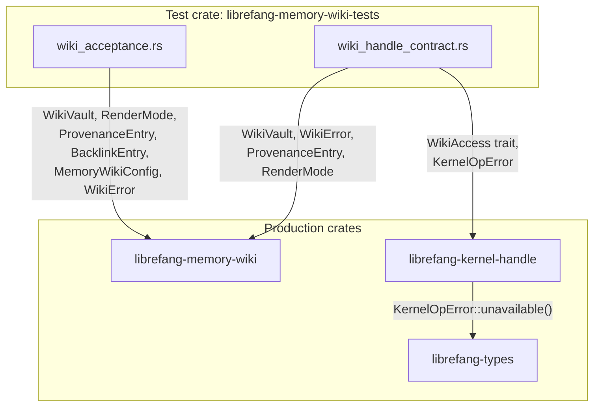

# Other — librefang-memory-wiki-tests

# librefang-memory-wiki-tests

Integration and contract tests for the `librefang-memory-wiki` crate, exercising the `WikiVault` public API against a real on-disk filesystem and verifying the JSON shape contract that `librefang-kernel-handle` callers rely on.

## Purpose

These tests serve two distinct roles:

1. **Acceptance validation** (`wiki_acceptance.rs`) — End-to-end proof that the seven acceptance criteria from issue #3329 are satisfied. Each test is a self-contained scenario that creates a temporary directory, constructs a `WikiVault`, and asserts observable behaviour on disk.

2. **Kernel-handle contract guard** (`wiki_handle_contract.rs`) — Bridges a gap in the test matrix: `librefang-kernel-handle` defines the `WikiAccess` trait and its expected JSON shapes but has no vault to test against, while `librefang-kernel` has a real implementation but cannot compile in the sandboxed Docker image. This test file implements a shadow adaptor (`WikiHandle`) and asserts the JSON shapes every caller is allowed to depend on.

## Test Files

### `wiki_acceptance.rs`

Tests `WikiVault` directly. Uses helper functions to reduce boilerplate:

- **`provenance(agent, turn)`** — Constructs a `ProvenanceEntry` with a fixed session (`"sess_acceptance"`) and channel (`"test-harness"`).
- **`vault_in(dir, render)`** — Calls `WikiVault::with_root` with `MemoryWikiIngestFilter::Tagged`.

| Test | Acceptance bullet | What it verifies |
|------|-------------------|------------------|
| `default_config_is_disabled_and_construction_short_circuits` | #1 | `MemoryWikiConfig::default()` has `enabled = false`; `WikiVault::new` returns `WikiError::Disabled`. |
| `isolated_mode_round_trip` | #2 | `write` creates `<topic>.md` on disk, `get` retrieves it with correct topic and body, `search` finds it by content. Write outcome reports `merged_with_external_edit == false`. |
| `provenance_is_populated_on_every_write` | #3 | Three sequential writes to the same topic accumulate three `ProvenanceEntry` records in frontmatter. On-disk YAML contains `provenance:`, agent names, and `content_sha256:`. |
| `external_hand_edit_is_preserved_under_force` | #4 | After a simulated external edit (direct `fs::write`), a non-force write returns `WikiError::HandEditConflict`. A force write preserves the user's body text and only appends provenance; the new body argument is intentionally discarded. |
| `obsidian_mode_emits_wiki_link_syntax` | #5 | `RenderMode::Obsidian` keeps `[[topic]]` syntax intact in the on-disk file. |
| `native_mode_emits_relative_markdown_links` | #5 | `RenderMode::Native` rewrites `[[topic]]` into `[topic](topic.md)` markdown links. |
| `five_pages_with_links_produce_five_files_and_correct_backlinks` | #7 | Five inter-linked pages produce five `.md` files plus `index.md`. `backlinks()` returns the complete set of `BacklinkEntry` records. `index.md` lists every topic. |
| `render_mode_conversion_round_trip` | (supporting) | `MemoryWikiRenderMode::Native` ↔ `RenderMode::Native` and `MemoryWikiRenderMode::Obsidian` ↔ `RenderMode::Obsidian` conversions are identity. |
| `reserved_modes_return_specific_error` | (supporting) | `MemoryWikiMode::Bridge` produces `WikiError::ModeNotImplemented("bridge")` rather than silently degrading. |

### `wiki_handle_contract.rs`

Implements `WikiAccess` from `librefang-kernel-handle` on a thin `WikiHandle(Option<Arc<WikiVault>>)` wrapper, mirroring the production kernel-side adaptor. This ensures the JSON shapes that tool dispatchers, HTTP routes, and dashboards depend on remain stable.

**`WikiHandle` implementation details:**

- **`wiki_get`** — Serializes the `WikiPage` from `vault.get()` as JSON. Maps `WikiError::NotFound` to `KernelOpError::Internal`.
- **`wiki_search`** — Serializes the search results array from `vault.search()`.
- **`wiki_write`** — Deserializes the `provenance` JSON value into `ProvenanceEntry`, then calls `vault.write()`. Maps domain errors:
  - `WikiError::HandEditConflict` → `KernelOpError::Internal` (with guidance to re-read or pass `force=true`)
  - `WikiError::InvalidTopic` → `KernelOpError::InvalidInput`
  - `WikiError::BodyTooLarge` → `KernelOpError::InvalidInput`
- When the inner `Option` is `None` (wiki disabled), all methods return `KernelOpError::Unavailable` with the method name as context.

| Test | What it verifies |
|------|------------------|
| `disabled_handle_returns_per_method_unavailable` | `WikiHandle(None)` returns `Unavailable` for `wiki_get`, `wiki_search`, and `wiki_write`. |
| `wiki_write_response_shape_is_stable` | Write returns a JSON object with keys `topic` (string), `path` (string), `content_sha256` (64-char hex), and `merged_with_external_edit` (boolean). |
| `wiki_write_rejects_malformed_provenance_with_invalid_input` | Missing required fields in provenance produce `InvalidInput`, not `Internal`. |
| `wiki_get_returns_topic_frontmatter_body_object` | Get returns an object with `topic`, `body`, and `frontmatter`. Frontmatter contains `topic`, `created`, `updated`, `content_sha256`, and `provenance` (array with at least one entry having `agent`). |
| `wiki_search_returns_array_of_topic_snippet_score_objects` | Search returns a JSON array; each element has `topic`, `snippet`, and `score` (float). |

## Architecture and Dependencies

```mermaid
graph TD
    subgraph "Test crate: librefang-memory-wiki-tests"
        WA[wiki_acceptance.rs]
        WH[wiki_handle_contract.rs]
    end

    subgraph "Production crates"
        LMW[librefang-memory-wiki]
        LKH[librefang-kernel-handle]
        LT[librefang-types]
    end

    WA -->|"WikiVault, RenderMode,<br/>ProvenanceEntry, BacklinkEntry,<br/>MemoryWikiConfig, WikiError"| LMW
    WH -->|"WikiAccess trait,<br/>KernelOpError"| LKH
    WH -->|"WikiVault, WikiError,<br/>ProvenanceEntry, RenderMode"| LMW
    LKH -->|"KernelOpError::unavailable()"| LT
```

## Conventions for Contributors

- **TempDir per test.** Every test creates its own `tempfile::TempDir`. The directory is cleaned up automatically on drop. Never share a directory between tests.
- **No mocks.** All tests hit the real filesystem and the real `WikiVault` implementation. This is intentional — the tests exist to catch regressions in on-disk format and YAML round-tripping.
- **Doc comments cite acceptance bullets.** Each test function in `wiki_acceptance.rs` has a `///` comment referencing which bullet of issue #3329 it covers. Keep these accurate when adding or splitting tests.
- **Shadow adaptor must match production.** The `WikiHandle` struct in `wiki_handle_contract.rs` is a verbatim mirror of the kernel's adaptor. If the kernel changes its error mapping or JSON shape, both places must be updated in the same PR. CI will catch drift via the shape assertions here.