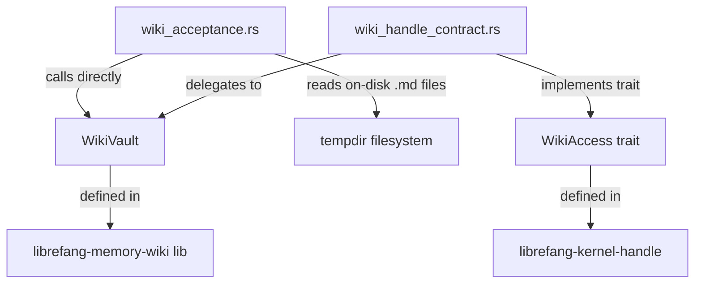

# Other — librefang-memory-wiki-tests

# librefang-memory-wiki Tests

End-to-end acceptance and contract tests for the memory wiki durable knowledge vault (issue #3329). These tests exercise the public `WikiVault` surface against a real on-disk filesystem and verify the JSON shape contract that `WikiAccess` implementors must satisfy.

## Purpose

This test crate serves two distinct roles that cannot be collapsed into the library's own unit tests or into `librefang-kernel`'s integration suite:

1. **Acceptance validation** — each test maps to a specific bullet in the issue #3329 acceptance list, proving the vault behaves correctly on a real filesystem (tempdir), not an in-memory mock.
2. **Kernel contract enforcement** — `librefang-kernel-handle` defines the `WikiAccess` trait and its expected JSON shapes, but has no vault to test against. `librefang-kernel` has a real implementation but depends on system libraries (libdbus, gdk) unavailable in the sandboxed CI image. This crate bridges the gap by implementing a shadow adaptor and asserting the JSON shape at PR time.

## Test Files

### `wiki_acceptance.rs`

Exercises `WikiVault` directly. Every test constructs a vault inside a `tempfile::TempDir`, writes/reads pages, and inspects both the in-memory results and the on-disk files.

**Helper functions:**

| Function | Purpose |
|---|---|
| `provenance(agent, turn)` | Builds a `ProvenanceEntry` with a fixed session/channel and the given agent name and turn number |
| `vault_in(dir, render)` | Constructs a `WikiVault` via `WikiVault::with_root` using `MemoryWikiIngestFilter::Tagged` |

**Tests and acceptance criteria:**

| Test | Acceptance bullet | What it proves |
|---|---|---|
| `default_config_is_disabled_and_construction_short_circuits` | #1 | `MemoryWikiConfig::default()` has `enabled = false`; `WikiVault::new` returns `WikiError::Disabled` rather than touching the filesystem |
| `isolated_mode_round_trip` | #2 | `write` → `get` → `search` round-trip: a page lands as `<topic>.md` on disk, is retrievable, and is discoverable by search |
| `provenance_is_populated_on_every_write` | #3 | Multiple writes to the same topic accumulate `ProvenanceEntry` records in frontmatter; the history is never dropped and survives YAML serialization on disk |
| `external_hand_edit_is_preserved_under_force` | #4 | A write to a page that was externally edited fails with `WikiError::HandEditConflict` unless `force = true`; force-write preserves the external edit body and only appends provenance |
| `obsidian_mode_emits_wiki_link_syntax` | #5 | `RenderMode::Obsidian` keeps `[[topic]]` syntax intact in the on-disk file |
| `native_mode_emits_relative_markdown_links` | #5 | `RenderMode::Native` rewrites `[[topic]]` to `[topic](topic.md)` for standard markdown viewers |
| `five_pages_with_links_produce_five_files_and_correct_backlinks` | #7 | A five-page directed graph produces the correct five `.md` files plus `index.md`, accurate `BacklinkEntry` records via `vault.backlinks()`, and an index page listing all topics |
| `render_mode_conversion_round_trip` | — | `MemoryWikiRenderMode` → `RenderMode` conversion is identity-preserving for both variants |
| `reserved_modes_return_specific_error` | — | `MemoryWikiMode::Bridge` surfaces `WikiError::ModeNotImplemented("bridge")` rather than silently failing |

### `wiki_handle_contract.rs`

Validates the JSON wire shape that every `WikiAccess` implementor must produce. Implements the trait on `WikiHandle(Option<Arc<WikiVault>>)` — mirroring the production kernel adaptor — and asserts the serialized output structure.

**Key type:**

```rust
struct WikiHandle(Option<Arc<WikiVault>>);
```

`None` represents a disabled wiki (returns `KernelOpError::Unavailable` for every method). `Some(vault)` delegates to the real vault.

**`WikiAccess` implementation details:**

- **`wiki_get`** — Returns the serialized `WikiPage` object. `WikiError::NotFound` maps to `KernelOpError::Internal` with a descriptive message.
- **`wiki_search`** — Returns a JSON array of `{topic, snippet, score}` hit objects.
- **`wiki_write`** — Deserializes the `provenance` `Value` into `ProvenanceEntry`, then delegates to `vault.write`. Maps `HandEditConflict` → `Internal`, `InvalidTopic` → `InvalidInput`, `BodyTooLarge` → `InvalidInput`.

**Tests:**

| Test | What it proves |
|---|---|
| `disabled_handle_returns_per_method_unavailable` | All three methods return `Unavailable("wiki_{method}")` when the inner vault is `None` |
| `wiki_write_response_shape_is_stable` | Write returns `{topic, path, content_sha256, merged_with_external_edit}`; `content_sha256` is 64 hex characters |
| `wiki_write_rejects_malformed_provenance_with_invalid_input` | Missing `agent` field in provenance produces `InvalidInput` (not `Internal`) with a message mentioning "provenance" |
| `wiki_get_returns_topic_frontmatter_body_object` | Get returns `{topic, body, frontmatter: {topic, created, updated, content_sha256, provenance: [{agent, ...}]}}` |
| `wiki_search_returns_array_of_topic_snippet_score_objects` | Search returns `[{topic, snippet, score}]` |

## Architecture


```mermaid
graph TD
    A[wiki_acceptance.rs] -->|calls directly| V[WikiVault]
    A -->|reads on-disk .md files| FS[tempdir filesystem]
    H[wiki_handle_contract.rs] -->|implements trait| T[WikiAccess trait]
    H -->|delegates to| V
    T -->|defined in| K[librefang-kernel-handle]
    V -->|defined in| L[librefang-memory-wiki lib]
```

## Relationships to Other Crates

| Crate | Relationship |
|---|---|
| `librefang-memory-wiki` | The library under test; provides `WikiVault`, `WikiError`, `ProvenanceEntry`, `BacklinkEntry`, `RenderMode`, `MemoryWikiConfig`, and all config types |
| `librefang-kernel-handle` | Defines the `WikiAccess` trait and `KernelOpError` type used in the contract tests |
| `librefang-kernel` | Contains the production `WikiAccess` implementation that these contract tests shadow; the JSON shapes asserted here must match that impl |

## Running the Tests

```sh
# All acceptance + contract tests
cargo test -p librefang-memory-wiki --test wiki_acceptance --test wiki_handle_contract

# Single acceptance test
cargo test -p librefang-memory-wiki --test wiki_acceptance isolated_mode_round_trip

# Contract tests only
cargo test -p librefang-memory-wiki --test wiki_handle_contract
```

No external services or system dependencies are required. Each test creates and tears down its own temporary directory.

## Adding New Tests

When adding a test for a new acceptance bullet or a new `WikiAccess` method:

1. **Acceptance tests** go in `wiki_acceptance.rs`. Use `vault_in` and `provenance` helpers. Cite the acceptance bullet in the function-level doc comment. Verify both the returned value and the on-disk artifact when the behavior being tested touches serialization.
2. **Contract tests** go in `wiki_handle_contract.rs`. Assert the JSON shape — field names, types, and presence — not just "it serialized." This is what catches drift between the kernel impl and the trait definition.