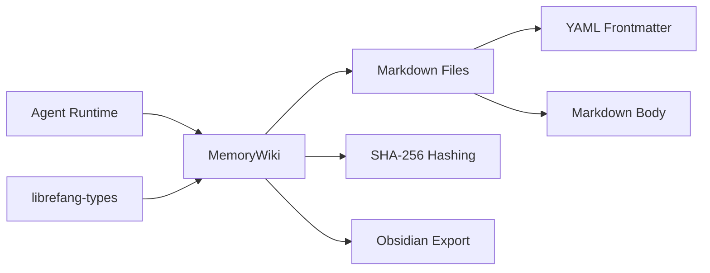

# Other — librefang-memory-wiki

# librefang-memory-wiki

Durable markdown knowledge vault for the LibreFang Agent OS. Persists agent knowledge as markdown files with provenance frontmatter and supports Obsidian-friendly export.

## Purpose

This module provides the long-term memory layer for LibreFang agents. Knowledge is stored as plain markdown files with YAML frontmatter encoding provenance metadata — creation timestamps, content hashes, source information — making the vault both human-readable and machine-verifiable. The output format is designed to be directly usable in [Obsidian](https://obsidian.md) or any markdown-aware tooling.

## Architecture

The wiki wraps a filesystem-backed store. Each entry is a single markdown file containing a YAML frontmatter block with provenance metadata and a markdown body with the actual content. Content integrity is verified via SHA-256 hashes stored in the frontmatter.

## Key Dependencies

| Dependency | Role |
|---|---|
| `librefang-types` | Shared type definitions used across the LibreFang ecosystem |
| `serde` / `serde_json` / `serde_yaml` | Serialization of frontmatter and structured content |
| `chrono` | Timestamp generation for provenance metadata |
| `sha2` | SHA-256 hashing for content integrity verification |
| `thiserror` | Ergonomic error types for vault operations |
| `tracing` | Structured logging of vault operations |

## Core Concepts

### Provenance Frontmatter

Every wiki entry carries a YAML frontmatter block. This metadata enables auditability and tamper detection. Typical fields include:

- **`created_at`** — ISO 8601 timestamp of when the entry was written.
- **`updated_at`** — Timestamp of the most recent modification.
- **`content_hash`** — SHA-256 digest of the markdown body, used to detect corruption or unauthorized edits.
- **`source`** — Origin of the knowledge (e.g., agent ID, user input, derived reasoning).

### Obsidian-Compatible Export

The vault produces markdown files compatible with Obsidian's conventions. This means:

- Standard YAML frontmatter delimited by `---`.
- Wikilink-style cross-references between entries where applicable.
- Flat or hierarchically organized directory structure that Obsidian can open as a vault.

## Error Handling

All fallible operations return errors derived from `thiserror`. Expected error categories include:

- **I/O errors** — Filesystem permission issues, missing files, disk full.
- **Serialization errors** — Malformed frontmatter that cannot be parsed.
- **Integrity errors** — Content hash mismatches indicating corruption or tampering.

Consumers should handle these gracefully, particularly in long-running agent sessions where the vault is accessed frequently.

## Testing

The test suite uses `tempfile` to create isolated temporary directories, ensuring tests do not interfere with a real vault. `librefang-kernel-handle` is included as a dev-dependency for integration scenarios that require a kernel context.

## Integration Points

This module depends on `librefang-types` for shared data structures. It does not make outgoing calls to other LibreFang modules, keeping it self-contained and easy to test in isolation. Other modules consume the wiki by reading from or writing to the vault directory.

When integrating:

1. **Initialize the vault** with a root directory path at agent startup.
2. **Write entries** through the wiki API, which handles frontmatter generation and hashing automatically.
3. **Read entries** by ID or through search/filter operations.
4. **Export** the vault directory directly to Obsidian or sync it to external storage.