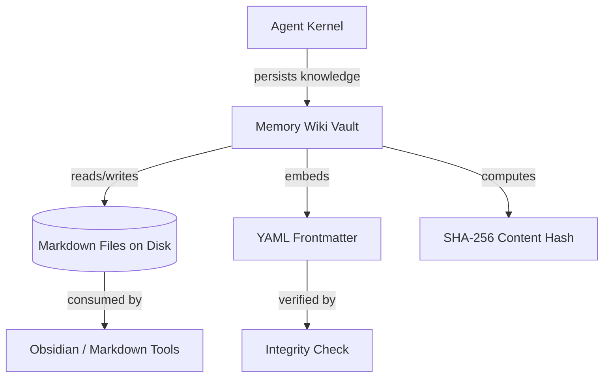

# Other — librefang-memory-wiki

# librefang-memory-wiki

A durable markdown knowledge vault for the LibreFang Agent OS. This module provides long-term, file-based storage of agent knowledge as Markdown documents enriched with provenance frontmatter and structured for Obsidian-compatible navigation.

## Purpose

Agents accumulate insight over time — tool outputs, reasoning chains, environmental observations, and synthesized conclusions. `librefang-memory-wiki` persists that knowledge to disk as a structured, human-readable Markdown vault. Each entry carries cryptographic provenance metadata in its YAML frontmatter, making the vault both auditable and portable.

The vault is designed to be:
- **Obsidian-friendly** — bi-directional links, tag conventions, and folder structure compatible with Obsidian out of the box.
- **Tamper-evident** — content hashes stored in frontmatter allow integrity checks across the vault.
- **Agent-writable, human-readable** — the same files an agent produces can be browsed, searched, and edited by a human in any Markdown tool.

## Dependencies and What They Enable

| Dependency | Role in this module |
|---|---|
| `librefang-types` | Shared domain types (memory entries, agent identifiers, etc.) |
| `serde` / `serde_json` / `serde_yaml` | Serialization of frontmatter (YAML) and optional structured payloads (JSON) |
| `chrono` | Timestamps for provenance — creation, modification, and query windows |
| `sha2` | SHA-256 content hashing for integrity verification of vault entries |
| `thiserror` | Typed error enumeration for vault I/O, serialization, and integrity failures |
| `tracing` | Instrumentation for vault operations (writes, reads, integrity checks) |

The dev-dependency on `librefang-kernel-handle` indicates that integration tests simulate vault operations through the kernel's handle abstraction, confirming that this module is typically invoked via the agent kernel rather than directly.

## Architecture

## Frontmatter Provenance

Every vault entry includes a YAML frontmatter block containing at minimum:

- **Timestamps** — creation and last-modified times via `chrono`.
- **Content hash** — SHA-256 digest of the document body, computed via `sha2`, enabling detection of corruption or unauthorized edits.
- **Agent provenance** — identifiers tracing which agent or subsystem authored the entry.

This provenance model allows downstream consumers to verify that a vault entry has not been altered since it was written by the agent.

## Error Handling

All fallible operations produce errors through `thiserror`-derived error types. Expected failure categories include:

- **I/O errors** — file not found, permission denied, disk full.
- **Serialization errors** — malformed frontmatter, invalid YAML/JSON.
- **Integrity errors** — content hash mismatch during verification.

These errors are propagated with enough context for the calling kernel to decide whether to retry, log, or surface the issue.

## Integration with LibreFang

This module sits in the `librefang-memory-wiki` crate and is positioned as a persistence backend for the agent's long-term memory subsystem. It does not initiate calls to other modules (as confirmed by the absence of outgoing edges in the call graph). Instead, it is called into by higher-level components — primarily `librefang-kernel-handle` — which manage the agent's lifecycle and decide when to persist or recall knowledge.

The zero outgoing-call footprint is intentional: the wiki module is a pure storage layer with no side effects beyond filesystem I/O, making it straightforward to test in isolation using the `tempfile` dev-dependency for ephemeral vault directories.