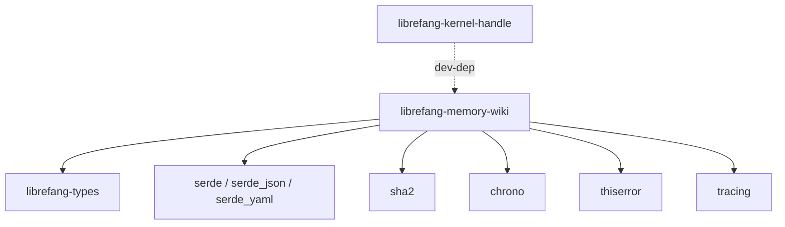

# Other — librefang-memory-wiki

# librefang-memory-wiki

Durable markdown knowledge vault for the LibreFang Agent OS, providing provenance-tracked frontmatter and Obsidian-friendly export.

## Purpose

This module implements a persistent knowledge store where LibreFang agents can read and write markdown documents with structured metadata. Every document carries provenance frontmatter — tracking who created it, when, and its content hash — so the system can detect tampering, resolve conflicts, and maintain an auditable record of agent knowledge.

The vault format is designed to be directly usable in [Obsidian](https://obsidian.md), meaning human operators can browse, search, and edit the same files agents interact with.

## Architecture

### Dependency Rationale

| Dependency | Role |
|---|---|
| `librefang-types` | Shared type definitions used across the LibreFang ecosystem |
| `serde` / `serde_json` / `serde_yaml` | Serialization of frontmatter (YAML) and structured data (JSON) |
| `chrono` | Timestamp generation for provenance metadata |
| `sha2` | Content hashing to detect changes and verify integrity |
| `thiserror` | Ergonomic error type definitions |
| `tracing` | Structured logging of vault operations |

`librefang-kernel-handle` is a dev-only dependency, used in integration tests to verify wiki operations through the kernel's handle abstraction.

## Core Concepts

### Provenance Frontmatter

Every markdown document in the vault is prefixed with a YAML frontmatter block containing provenance information. This typically includes:

- **Creator**: The agent or user that authored the document
- **Timestamp**: When the document was created or last modified
- **Content hash**: A SHA-256 digest of the document body, enabling integrity checks
- **Version or revision**: Tracking information for conflict detection

Frontmatter is serialized via `serde_yaml`, keeping it human-readable and compatible with Obsidian's built-in YAML parsing.

### Obsidian-Compatible Export

The vault's file structure and frontmatter format follow Obsidian conventions so that the wiki directory can be opened directly as an Obsidian vault. This enables:

- Operators to inspect agent knowledge without special tooling
- Manual edits that agents can later read back
- Graph view and backlink navigation in Obsidian for exploring relationships between documents

### Durable Storage

"Memory" in this context refers to durable, file-backed storage — not in-process memory. Documents persist across agent restarts and system reboots, forming a long-term knowledge base.

## Integration with LibreFang

This module sits alongside other LibreFang components as a standalone library:

- **`librefang-types`** provides the shared data structures that wiki documents reference or embed.
- **`librefang-kernel-handle`** is used in tests to simulate the kernel environment; production consumers would access the wiki through their own kernel handle.
- The module has no detected incoming or outgoing runtime call edges, indicating it is a pure library consumed by higher-level agent orchestration code rather than calling into other services itself.

## Error Handling

Errors are defined using `thiserror` and cover scenarios such as:

- File I/O failures (missing files, permission errors)
- Frontmatter parsing errors (malformed YAML, missing required fields)
- Content integrity failures (hash mismatches)
- Serialization or deserialization errors

All operations instrument themselves with `tracing` spans for observability.

## Testing

Tests use `tempfile` to create isolated temporary directories, ensuring wiki operations are verified against a clean filesystem each time. The dev-dependency on `librefang-kernel-handle` allows integration tests that exercise wiki behavior through the same handle interface production code uses.