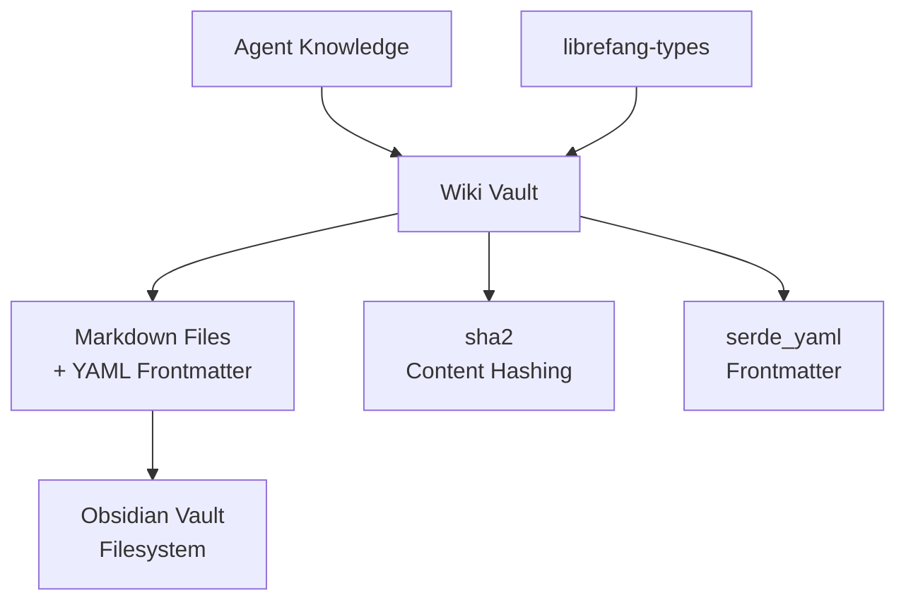

# Other — librefang-memory-wiki

# librefang-memory-wiki

A durable markdown knowledge vault for the LibreFang Agent OS. Persists agent knowledge as markdown files with provenance-tracking YAML frontmatter and exports in an Obsidian-friendly format.

## Purpose

Agents in LibreFang accumulate knowledge during execution — facts, observations, decisions, and learned patterns. This module provides a structured, human-readable persistence layer for that knowledge. Each entry is stored as a markdown file with rich YAML frontmatter capturing provenance metadata (who created it, when, from what source, content hash). The output format is deliberately compatible with Obsidian, allowing operators to browse, search, and link agent knowledge alongside their own notes.

This module corresponds to issue #3329.

## Architecture

```mermaid
graph TD
    A[Agent Knowledge] --> B[Wiki Vault]
    B --> C[Markdown Files<br/>+ YAML Frontmatter]
    C --> D[Obsidian Vault<br/>Filesystem]
    E[librefang-types] --> B
    B --> F[sha2<br/>Content Hashing]
    B --> G[serde_yaml<br/>Frontmatter]
```

## Key Concepts

### Provenance Frontmatter

Every wiki entry carries a YAML frontmatter block that records where the knowledge came from. This is critical for trusting and auditing agent-generated content. The frontmatter typically includes:

- **Timestamps** — creation and modification times via `chrono`
- **Source attribution** — which agent, session, or subsystem produced the entry
- **Content hash** — a SHA-256 digest of the entry body, enabling integrity checks and deduplication via `sha2`

### Obsidian-Friendly Export

The vault writes standard markdown files with YAML frontmatter, using conventions that Obsidian understands natively:

- Wikilink-style cross-references between entries
- Tag support in frontmatter for categorization
- Flat or hierarchically organized `.md` files that Obsidian can index as a vault

### Durable Storage

The vault is designed for filesystem-backed durability. Unlike in-memory caches, entries survive across sessions and process restarts. This makes the wiki suitable for long-lived agent knowledge that accumulates over time.

## Dependencies

| Dependency | Role |
|---|---|
| `librefang-types` | Shared type definitions used across the LibreFang ecosystem |
| `serde` / `serde_json` / `serde_yaml` | Serialization of frontmatter metadata and structured content |
| `chrono` | Timestamp generation for provenance records |
| `thiserror` | Ergonomic error types for vault operations |
| `sha2` | SHA-256 content hashing for integrity and deduplication |
| `tracing` | Structured logging of vault operations |

### Dev Dependencies

| Dependency | Role |
|---|---|
| `tempfile` | Temporary directories for isolated vault tests |
| `librefang-kernel-handle` | Kernel handle mocking for integration tests |

## Integration

This module sits in the `librefang` workspace and depends on `librefang-types` for shared domain types. It does not directly call into other workspace crates at runtime (no incoming or outgoing call edges), making it a leaf-level utility module. Other components that need to persist or retrieve knowledge instantiate the vault and read/write entries through its API.

The `librefang-kernel-handle` dev dependency suggests that vault operations may be tested in contexts where a kernel handle is present, but the vault itself is kernel-agnostic — it deals in files and markdown, not in kernel primitives.