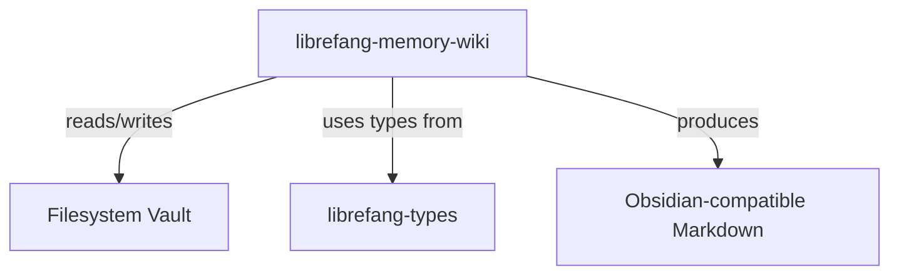

# Other — librefang-memory-wiki

# librefang-memory-wiki

Durable markdown knowledge vault for the LibreFang Agent OS. Persists agent knowledge as Markdown files with provenance-tracking YAML frontmatter, exportable to Obsidian-compatible vaults.

## Purpose

This module provides a file-backed knowledge store that agents can read from and write to across sessions. Each knowledge entry is a Markdown document with structured YAML frontmatter capturing provenance metadata—who created it, when, from what source, and with what content hash. The output format targets Obsidian, enabling human operators to browse, search, and link agent-generated knowledge alongside their own notes.

## Dependencies

| Dependency | Role |
|---|---|
| `librefang-types` | Shared type definitions across the LibreFang ecosystem |
| `serde`, `serde_json`, `serde_yaml` | Serialization of frontmatter and document structures |
| `chrono` | Timestamp generation for provenance metadata |
| `sha2` | Content hashing for integrity verification and deduplication |
| `thiserror` | Typed error definitions |
| `tracing` | Structured logging of vault operations |

**Dev dependencies:** `tempfile` for isolated filesystem tests, `librefang-kernel-handle` for integration scenarios.

## Architecture

The module is a self-contained library with no outgoing call edges to other LibreFang modules at runtime. It depends on `librefang-types` for shared data structures but operates independently on the filesystem.

```mermaid
graph TD
    A[librefang-memory-wiki] -->|reads/writes| FS[Filesystem Vault]
    A -->|uses types from| LT[librefang-types]
    A -->|produces| OBS[Obsidian-compatible Markdown]
```

## Knowledge Document Format

Each document consists of two parts:

1. **YAML frontmatter** — provenance and metadata enclosed in `---` delimiters. This includes creation timestamp, authorship, content hash (SHA-256), and any source references.
2. **Markdown body** — the actual knowledge content, written in standard Markdown with Obsidian-compatible wikilink syntax where applicable.

## Error Handling

Errors are defined via `thiserror` and cover likely failure modes: file I/O errors, YAML parsing failures, hash mismatches, and vault integrity violations. Consumers should expect structured error variants rather than raw I/O errors.

## Testing

Tests use `tempfile` to create isolated directory trees, ensuring vault operations (creation, reading, listing, integrity checks) are verified without touching the real filesystem. Integration tests may pull in `librefang-kernel-handle` to validate end-to-end scenarios where the kernel interacts with the wiki store.