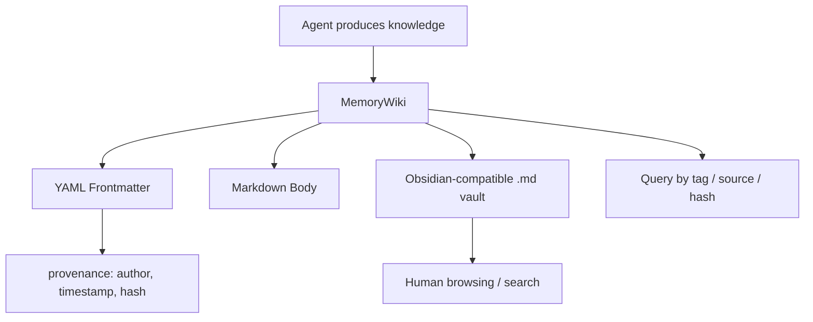

# Other — librefang-memory-wiki

# librefang-memory-wiki

Durable markdown knowledge vault for the LibreFang Agent OS. Provides persistent, queryable storage for agent knowledge as Markdown documents with provenance-tracking YAML frontmatter and Obsidian-compatible export.

## Purpose

Agents accumulate knowledge during execution — facts, procedures, observations, and decisions. This crate provides a structured, durable store for that knowledge using plain Markdown files augmented with machine-readable frontmatter. The format is designed to be:

- **Human-readable**: Open any entry in a standard Markdown editor or Obsidian.
- **Machine-queryable**: YAML frontmatter carries structured provenance and metadata.
- **Content-addressed**: SHA-256 hashing ensures integrity and enables deduplication.
- **Durable**: File-based storage that survives process restarts and crashes.

## Architecture


```mermaid
graph TD
    A[Agent produces knowledge] --> B[MemoryWiki]
    B --> C[YAML Frontmatter]
    B --> D[Markdown Body]
    C --> E[provenance: author, timestamp, hash]
    B --> F["Obsidian-compatible .md vault"]
    F --> G[Human browsing / search]
    B --> H[Query by tag / source / hash]
```

## Key Dependencies

| Dependency | Role |
|---|---|
| `librefang-types` | Shared domain types (agent IDs, session handles, etc.) |
| `serde` / `serde_json` / `serde_yaml` | Serialization of frontmatter and structured metadata |
| `chrono` | Timestamp generation for provenance records |
| `sha2` | SHA-256 content hashing for integrity and deduplication |
| `thiserror` | Typed error definitions |
| `tracing` | Instrumentation for debug/diagnostic logging |

## Document Structure

Each wiki entry is a single Markdown file with two sections:

1. **YAML frontmatter** (delimited by `---`): Contains provenance metadata — who wrote it, when, the content hash, tags, source module, and any cross-references. This is the machine-readable envelope.

2. **Markdown body**: The actual knowledge content. Written in standard Markdown with support for Obsidian wiki-links (`[[other-entry]]`) to create a navigable knowledge graph.

Example:

```yaml
---
id: a1b2c3d4
author: agent::planner
created_at: "2025-06-12T14:30:00Z"
content_hash: sha256:e3b0c44298fc1c149afbf4c8996fb924...
tags: [networking, tls, incident-4421]
source: session::planner-0092
---

# TLS Handshake Failure — Incident 4421

## Summary
During the planning phase, repeated TLS handshake failures were
observed when connecting to `api.example.com:443`.

## Root Cause
The server's certificate chain was incomplete...

## Resolution
Adding the intermediate CA to the trust store resolved the issue.
See [[tls-trust-configuration]] for the general procedure.
```

## Provenance Model

Provenance frontmatter tracks the origin and history of each knowledge entry:

- **`author`**: The agent or module that created the entry.
- **`source`**: The originating session, task, or execution context.
- **`created_at` / `updated_at`**: Timestamps for creation and modification.
- **`content_hash`**: SHA-256 digest of the Markdown body, used to detect corruption or unauthorized changes.
- **`tags`**: Freeform labels for categorization and querying.

This provenance chain is critical for auditing agent behavior — you can trace any piece of stored knowledge back to the specific agent run and decision that produced it.

## Obsidian Compatibility

The vault directory produced by this module can be opened directly in Obsidian. Key compatibility features:

- Standard Markdown files with YAML frontmatter (Obsidian's native property format).
- Wiki-link syntax (`[[entry-name]]`) for inter-document references.
- Tag-based organization compatible with Obsidian's tag pane.
- Folder structure maps to logical namespaces within the agent's knowledge base.

## Integration Points

- **`librefang-types`**: Consumes shared types for agent identifiers, session tokens, and domain-specific enums. Any type that appears in frontmatter must derive `Serialize` / `Deserialize`.
- **`librefang-kernel-handle`**: Used in dev-dependencies for integration testing. Tests spin up a kernel handle to verify that wiki operations behave correctly within the full agent lifecycle.

## Error Handling

All fallible operations return typed errors via `thiserror`. Expected error categories include:

- **I/O errors**: Filesystem operations on the vault directory.
- **Serialization errors**: Malformed frontmatter during read or write.
- **Integrity errors**: Content hash mismatches indicating corruption or tampering.
- **Validation errors**: Missing required frontmatter fields or invalid values.

## Testing

Tests use `tempfile` to create isolated vault directories. This ensures tests are repeatable and don't pollute the filesystem. Integration tests exercise the full write → read → query cycle, including frontmatter round-tripping and hash verification.

```rust
// Typical test pattern
let dir = tempfile::tempdir().unwrap();
let wiki = MemoryWiki::open(dir.path()).unwrap();

wiki.write_entry(/* ... */).unwrap();
let entry = wiki.read_entry("some-id").unwrap();
assert_eq!(entry.frontmatter.content_hash, computed_hash);
```