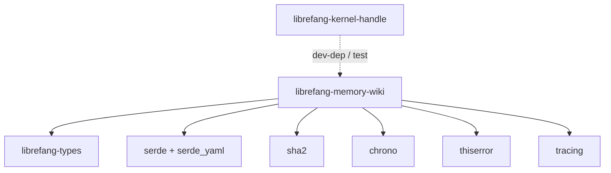

# Other — librefang-memory-wiki

# librefang-memory-wiki

Durable markdown knowledge vault for the LibreFang Agent OS. This module provides persistent, human-readable storage of agent knowledge as markdown files with provenance frontmatter and Obsidian-compatible export.

## Purpose

The wiki module serves as the Agent OS's long-term knowledge store. Rather than relying on opaque binary formats or databases, it persists agent knowledge as plain markdown files that are:

- **Self-describing** — YAML frontmatter carries provenance metadata (source, timestamp, integrity hash).
- **Human-navigable** — compatible with Obsidian and other markdown tools for direct inspection.
- **Tamper-evident** — SHA-2 hashing provides content integrity verification.

This addresses issue #3329: the need for a durable, inspectable knowledge layer that outlives individual agent sessions.

## Architecture


```mermaid
graph TD
    A[librefang-memory-wiki] --> B[librefang-types]
    A --> C[serde + serde_yaml]
    A --> D[sha2]
    A --> E[chrono]
    A --> F[thiserror]
    A --> G[tracing]
    H[librefang-kernel-handle] -.->|dev-dep / test| A
```

The module has no runtime call edges to other crates — it is a leaf dependency that produces files on disk. Other components consume its output by reading the generated markdown vault directory.

## Key Concepts

### Provenance Frontmatter

Every generated markdown file includes a YAML frontmatter block with metadata about its origin:

- **Timestamps** — creation and last-modification times via `chrono`.
- **Source identity** — which agent, skill, or subsystem produced the document.
- **Content hash** — a SHA-2 digest of the body for integrity verification.

Serialization of frontmatter relies on `serde` and `serde_yaml` to ensure consistent, round-trippable output.

### Obsidian-Friendly Export

The vault structure follows Obsidian conventions so that exported directories can be opened directly as Obsidian vaults. This enables operators and developers to browse agent knowledge using standard markdown tooling — links, tags, graph views, and search all work without conversion.

### Durable Storage

The module writes files to a vault directory on disk. It is designed for append-mostly workloads: knowledge entries are written and occasionally updated, but the vault is not a high-throughput data store. Durability comes from the filesystem, not from an embedded database.

## Dependencies

| Dependency | Role |
|---|---|
| `librefang-types` | Shared type definitions used across the Agent OS |
| `serde` / `serde_json` / `serde_yaml` | Serialization of frontmatter and structured content |
| `chrono` | Timestamp generation for provenance metadata |
| `sha2` | SHA-2 content hashing for integrity verification |
| `thiserror` | Ergonomic error type definitions |
| `tracing` | Structured logging and instrumentation |

### Dev Dependencies

| Dependency | Role |
|---|---|
| `tempfile` | Temporary directories for vault tests |
| `librefang-kernel-handle` | Kernel integration context needed for end-to-end tests |

## Error Handling

All fallible operations return errors defined via `thiserror`. Errors cover:

- I/O failures (disk full, permission denied, missing vault directory).
- Serialization failures (invalid frontmatter, malformed YAML).
- Integrity check failures (hash mismatch on verification).

## Integration

`librefang-memory-wiki` is a standalone library crate. Other Agent OS components add it as a dependency and call into it to write or query the knowledge vault. It does not depend on the runtime kernel at production compile time — the `librefang-kernel-handle` dependency is test-only.

To use this crate from another workspace member:

```toml
[dependencies]
librefang-memory-wiki = { path = "../librefang-memory-wiki" }
```

## Testing

Tests use `tempfile` to create isolated vault directories, avoiding side effects on the host filesystem. Where kernel interaction is required, `librefang-kernel-handle` provides the necessary test harness.

Run tests with:

```bash
cargo test -p librefang-memory-wiki
```