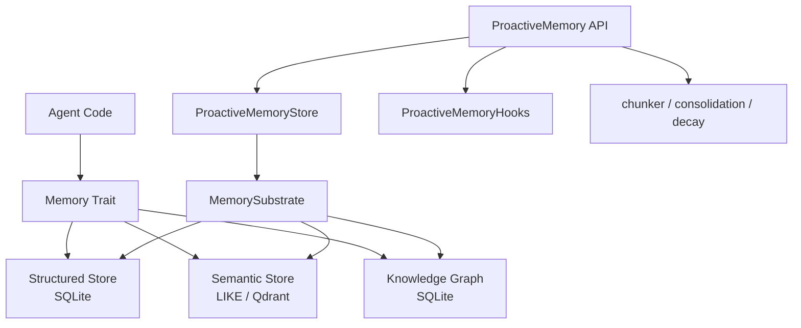

# Other — librefang-memory

# librefang-memory

Memory substrate for the LibreFang Agent OS. Provides durable, queryable memory across three storage paradigms—structured key/value, semantic text search, and knowledge graph—behind a single `Memory` trait that agents call without knowing the underlying backend.

## Architecture

Agents call the unified `Memory` trait. The `ProactiveMemory` layer sits on top of `MemorySubstrate`, adding mem0-style auto-memorization and retrieval with chunking, consolidation, and decay.

## Three Storage Backends

### Structured Store (`structured`)

SQLite-backed storage for:

- **Key/value pairs** — arbitrary agent state serialized as JSON or MessagePack (`rmp-serde`)
- **Sessions** — conversation and interaction state scoped to a session ID
- **Agent state** — persistent agent configuration and runtime state
- **Audit trail** — append-only log of agent actions and decisions

This is the primary store for anything that needs exact retrieval by key or range queries over time-ordered records. Uses `r2d2` / `r2d2_sqlite` for connection pooling.

### Semantic Store (`semantic`, `http_vector_store`)

Text search over stored content:

- **Current path** — LIKE-based pattern matching in SQLite, suitable for development and small deployments
- **Vector path** — designed for Qdrant-backed similarity search via the `http_vector_store` module (uses `reqwest` for HTTP transport)

Agents store natural-language fragments and retrieve them by similarity or keyword match. The semantic store is what powers contextual recall during conversations.

### Knowledge Graph (`knowledge`)

SQLite-backed entity-relation store:

- **Entities** — nodes representing concepts, agents, users, or any addressable thing
- **Relations** — typed, directed edges between entities

Enables agents to build and query an understanding of how concepts relate to each other across sessions and interactions.

## Proactive Memory (mem0-style)

The `proactive` module implements a mem0-inspired memory layer that automatically decides what to memorize, when to consolidate, and what to forget.

### Core Types

| Type | Purpose |
|---|---|
| `ProactiveMemory` | Unified API exposing `search`, `add`, `get`, `list` |
| `ProactiveMemoryHooks` | Auto-memorize and auto-retrieve hooks that intercept agent I/O |
| `ProactiveMemoryStore` | Concrete implementation backed by `MemorySubstrate` |

### Supporting Modules

| Module | Responsibility |
|---|---|
| `chunker` | Splits incoming text into memorizable segments |
| `consolidation` | Merges redundant or overlapping memories over time |
| `decay` | Applies time-based relevance decay to stored memories |
| `migration` | Schema migrations for the proactive memory tables |
| `namespace_acl` | Access control scoped to memory namespaces |
| `prompt` | Prompt templates for memory-related LLM calls |
| `provider` | Abstraction over LLM providers used for memory extraction |
| `roster_store` | Tracks which agents have access to which memory scopes |
| `session` | Session-scoped memory context |

### Typical Flow

1. Agent receives user input.
2. `ProactiveMemoryHooks` intercept the input, calling `ProactiveMemory::search` to retrieve relevant context.
3. Injected context is included in the agent's prompt.
4. After the agent responds, the hooks call `ProactiveMemory::add` to store new facts extracted from the exchange.
5. Background processes run `consolidation` and `decay` to keep the store healthy.

## Key Dependencies

| Dependency | Role in this crate |
|---|---|
| `librefang-types` | Shared domain types (memory keys, entity IDs, relation types) |
| `rusqlite` + `r2d2` / `r2d2_sqlite` | SQLite storage with connection pooling; FTS5 enabled for full-text search |
| `serde` / `serde_json` / `rmp-serde` | Serialization of stored values (JSON for inspection, MessagePack for compactness) |
| `tokio` + `async-trait` | Async `Memory` trait definition |
| `reqwest` | HTTP client for `http_vector_store` (Qdrant communication) |
| `sha2` | Content hashing for deduplication and integrity |
| `chrono` / `uuid` | Timestamps and unique identifiers |
| `tracing` / `metrics` | Observability |
| `thiserror` | Error type definitions |

## Integration with LibreFang

`librefang-memory` sits below the agent runtime and above the persistence layer:

- **Upstream consumers** — agent implementations import the `Memory` trait and `ProactiveMemory` API. They never interact with SQLite or Qdrant directly.
- **Downstream dependencies** — only `librefang-types` (shared type definitions). The crate is otherwise self-contained, managing its own schema and connections.
- **Schema ownership** — the `migration` module owns all database schema changes. No other crate should write to the same SQLite files.

When adding a new storage backend or modifying an existing one, ensure the `Memory` trait remains the single entry point for agent code. The trait abstraction is what allows swapping LIKE-based search for Qdrant without changing any agent logic.