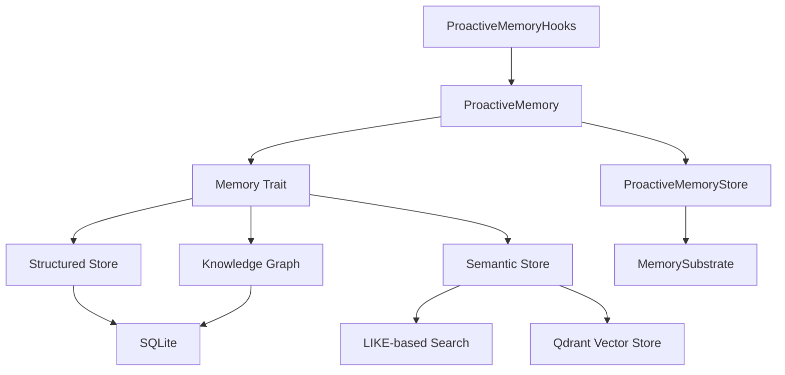

# Other — librefang-memory

# librefang-memory

Memory substrate for the LibreFang Agent OS. Agents need persistent, queryable memory that spans structured state, semantic text search, and relational knowledge. This crate provides all three through a unified `Memory` trait, backed by SQLite for local persistence and optionally Qdrant for vector search.

## Architecture

Agents interact with the `Memory` trait rather than individual backends. The trait routes operations to the appropriate storage layer — structured key/value queries go to SQLite, text similarity queries go to the semantic store, and entity/relation lookups go to the knowledge graph. The `ProactiveMemory` layer adds mem0-style automatic memorization and retrieval on top of this substrate.

## Storage Backends

### Structured Store (`structured`)

SQLite-backed storage for data with a predictable shape. Handles:

- **Key/value pairs** — arbitrary agent state, configuration, flags.
- **Sessions** — conversation or task sessions tied to an agent lifecycle.
- **Agent state** — checkpointed progress, current goals, context windows.
- **Audit trail** — append-only log of actions and decisions for accountability.

This is the default persistence mechanism and requires no external services beyond SQLite.

### Semantic Store (`semantic`, `http_vector_store`)

Full-text search over unstructured or semi-structured text. Two modes:

- **LIKE-based search** (`semantic`) — simple substring matching against stored text. Sufficient for small-scale deployments or development.
- **Qdrant-backed vector search** (`http_vector_store`) — embeddings stored in Qdrant for similarity search via `reqwest`. Used when semantic recall quality matters.

### Knowledge Graph (`knowledge`)

SQLite-backed graph storage for entities and the relations between them. Agents build and query a world model — people, systems, concepts, and their connections — through this backend.

## The Memory Trait

The central abstraction. All three backends implement this trait, and consumers never reference a specific store directly. This allows swapping backends (for example, upgrading from LIKE-based to vector search) without changing agent code.

## Proactive Memory

Inspired by mem0. The `proactive` module gives agents the ability to automatically memorize important information and retrieve relevant memories without explicit prompts.

### Core Types

| Type | Role |
|------|------|
| `ProactiveMemory` | Unified API exposing `search`, `add`, `get`, and `list` operations. |
| `ProactiveMemoryStore` | Concrete implementation built on top of `MemorySubstrate`. |
| `ProactiveMemoryHooks` | Auto-memorize and auto-retrieve hooks that intercept agent interactions and manage memory transparently. |

### Supporting Modules

These modules handle the infrastructure that makes proactive memory work:

- **`chunker`** — Splits large inputs into memory-sized chunks before storage. Prevents oversized entries and improves retrieval granularity.
- **`consolidation`** — Merges overlapping or redundant memories over time. Keeps the memory store clean as information accumulates.
- **`decay`** — Applies time-based relevance decay to memories. Older, unreferenced memories lose priority so recent and frequently accessed ones surface first.
- **`migration`** — Schema evolution for memory storage. Handles database migrations when the memory schema changes between versions.
- **`namespace_acl`** — Access control for memory namespaces. Ensures agents can only read and write memory they are authorized for.
- **`prompt`** — Prompt templates and construction for memory-related LLM calls (e.g., deciding what to memorize).
- **`provider`** — Abstraction over memory storage providers. Decouples proactive memory logic from the underlying backend.
- **`roster_store`** — Tracks which agents exist and their capabilities. Used for coordination in multi-agent setups.
- **`session`** — Session management for proactive memory operations. Groups related memory activity together.

## Key Dependencies

| Dependency | Purpose |
|------------|---------|
| `librefang-types` | Shared types across the LibreFang workspace — memory entries, agent identifiers, errors. |
| `rusqlite` | SQLite bindings with FTS5 support. Core storage engine for structured, knowledge, and local semantic backends. |
| `serde` / `serde_json` / `rmp-serde` | Serialization. JSON for human-readable storage and interop; MessagePack (`rmp-serde`) for compact binary encoding. |
| `tokio` | Async runtime. All memory operations are non-blocking. |
| `async-trait` | Enables the `Memory` trait to be async. |
| `sha2` | Content hashing for deduplication and integrity checks on stored memories. |
| `reqwest` | HTTP client for communicating with Qdrant in the vector store backend. |
| `chrono` | Timestamps for audit trails, decay calculations, and session tracking. |
| `uuid` | Unique identifiers for memory entries, sessions, and entities. |
| `tracing` | Structured logging and instrumentation throughout the memory stack. |
| `thiserror` | Ergonomic error types for memory-specific failures. |

## Integration with the Workspace

`librefang-memory` sits between `librefang-types` (which defines the data structures) and the agent runtime (which consumes the `Memory` trait). Agents receive a configured memory instance at startup and use it throughout their lifecycle. The module does not depend on any LLM provider directly — proactive memory hooks that need LLM calls receive a provider through the `provider` abstraction.

For development, `tempfile` is used in tests to create ephemeral SQLite databases, ensuring tests are isolated and repeatable.

## Error Handling

Errors are defined using `thiserror` and cover storage failures (SQLite errors, connection issues), serialization problems, namespace violations, and vector store unavailability. All fall under the crate's error type hierarchy so callers can handle memory failures specifically or generically.

## Testing

Tests use `tempfile` to create temporary directories for SQLite databases. Each test gets a fresh, isolated database instance. No external services (Qdrant, etc.) are required for the default test suite — the LIKE-based semantic backend is used in place of vector search.