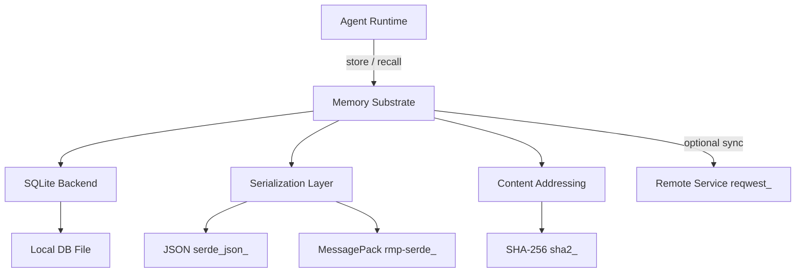

# Other — librefang-memory

# librefang-memory

Memory substrate for the LibreFang Agent OS. This crate provides persistent storage, retrieval, and management of agent memory — including conversation history, task context, and long-term knowledge — backed by SQLite.

## Purpose

Agents in LibreFang need to persist and recall information across sessions and tasks. `librefang-memory` provides the storage layer that makes this possible. It handles:

- **Short-term memory**: Recent conversation turns and active task context
- **Long-term memory**: Durable knowledge that persists across agent restarts
- **Content-addressed storage**: Memories are hashed for integrity and deduplication
- **Structured and serialized storage**: Memories are serialized (JSON and MessagePack) for flexible retrieval

The crate is intentionally database-agnostic at the API level, though the reference implementation uses SQLite via `rusqlite`.

## Dependencies and Why They Matter

| Dependency | Role in This Crate |
|---|---|
| `rusqlite` | Primary embedded database for persistent memory storage |
| `serde` / `serde_json` | Serialization of memory entries and metadata |
| `rmp-serde` | MessagePack encoding for compact binary storage of memory payloads |
| `sha2` | Content hashing for deduplication and integrity verification of stored memories |
| `tokio` | Async runtime — memory operations that may involve I/O are async |
| `async-trait` | Defines async trait interfaces for memory backends |
| `uuid` | Unique identifiers for individual memory entries |
| `chrono` | Timestamps for memory creation, access, and expiration |
| `librefang-types` | Shared domain types (agent IDs, session identifiers, memory-related types) |
| `tracing` | Structured logging of memory operations for observability |
| `reqwest` | HTTP client — used when memory operations involve remote memory services or syncing |
| `thiserror` | Ergonomic error type definitions |

## Architecture

The memory substrate sits between the agent runtime and the underlying storage. All memory operations flow through a common interface, allowing the runtime to store and retrieve context without coupling to a specific backend.

## Key Concepts

### Memory Entries

Each memory entry is a discrete unit of information the agent has persisted. An entry typically contains:

- A **UUID** identifying the memory
- A **timestamp** (via `chrono`) recording when it was created
- A **payload** — the actual content, serialized as JSON or MessagePack
- An optional **content hash** (SHA-256) for deduplication and integrity

### Content Addressing

Using `sha2`, the crate hashes memory payloads. This enables:

- **Deduplication**: Identical memories aren't stored twice
- **Integrity checks**: Corrupted entries can be detected on retrieval
- **Content-based lookup**: Retrieve memories by their content hash rather than by ID

### Serialization Formats

Two formats are supported for memory payloads:

- **JSON** (`serde_json`): Human-readable, useful for debugging and interoperability
- **MessagePack** (`rmp-serde`): Compact binary format, used when storage efficiency matters

The choice of format may be configurable per memory entry or per backend.

### Async Interface

Memory operations are defined using `async-trait`, making them compatible with the Tokio runtime used throughout LibreFang. This ensures that database I/O never blocks the agent's primary event loop.

## Error Handling

Errors are defined using `thiserror` and cover scenarios such as:

- Database connection or query failures
- Serialization and deserialization errors
- Content hash mismatches (integrity violations)
- Remote sync failures (when applicable)

Consumers of this crate should expect `Result<T, MemoryError>` (or equivalent) return types and handle errors appropriately — particularly in agent logic where a failed memory recall should degrade gracefully rather than crash the agent.

## Testing

The `tempfile` dev-dependency is used to create temporary directories for SQLite databases during tests. This keeps tests isolated and repeatable — each test gets a fresh, ephemeral database that is cleaned up automatically.

## Relationship to Other Crates

- **`librefang-types`**: This crate depends on shared types from `librefang-types`. Any `MemoryId`, `AgentId`, `SessionId`, or memory-related structs are defined there, not here. This crate implements storage and retrieval logic using those types.
- **Agent crates**: Agent runtime crates consume this library's public API to persist and recall context. This crate does not depend on agent-specific logic — it is a general-purpose memory layer.

## When to Use This Crate

Use `librefang-memory` directly when:

- You are building or extending an agent runtime that needs persistent memory
- You need to implement custom memory retrieval strategies (e.g., recency-weighted, relevance-ranked)
- You are testing agent behavior that depends on memory state

Do **not** use this crate when:

- You only need to define memory-related types — use `librefang-types` instead
- You need ephemeral, in-memory-only storage with no persistence guarantees