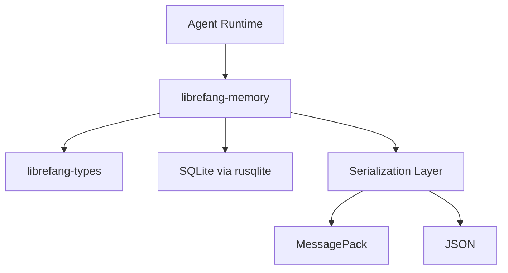

# Other — librefang-memory

# librefang-memory

Memory substrate for the LibreFang Agent OS.

## Purpose

`librefang-memory` provides the persistence and state-management layer for LibreFang agents. It abstracts how agent memories are stored, retrieved, serialized, and addressed, offering a substrate that other LibreFang components build on top of rather than accessing raw storage directly.

The crate is positioned as a foundational library — it defines the traits and data structures that describe memory operations, while concrete implementations handle the actual storage mechanics.

## Role in the Architecture

Other LibreFang crates depend on `librefang-memory` when they need to persist or recall agent state, conversation history, or intermediate computation results. In return, `librefang-memory` depends on `librefang-types` for shared domain types that flow across module boundaries.

## Key Dependencies and What They Signal

| Dependency | Role |
|---|---|
| `rusqlite` | Embedded SQLite for durable, queryable local storage |
| `rmp-serde` | MessagePack serialization — compact binary encoding for memory entries |
| `serde` / `serde_json` | Generic serialization with JSON support for interoperability |
| `sha2` | Cryptographic hashing, likely for content-addressed memory lookups |
| `async-trait` | Async trait definitions enabling pluggable memory backends |
| `uuid` | Unique identifiers for memory entries and sessions |
| `chrono` | Timestamps for memory entry creation, expiry, and ordering |
| `reqwest` | HTTP client — suggests optional remote memory or sync capabilities |
| `tracing` | Structured logging throughout memory operations |
| `thiserror` | Ergonomic error types for memory-specific failures |

## Design Expectations

Based on the dependency set and crate description, the module is built around these patterns:

**Pluggable backends.** The `async-trait` dependency indicates that memory operations are defined as traits, allowing different storage backends (SQLite, in-memory, remote) to be swapped without changing consumer code.

**Dual serialization.** Both `rmp-serde` and `serde_json` are present, suggesting that memory entries can be serialized to compact MessagePack for local storage or JSON for external exchange and debugging.

**Content addressing.** The `sha2` dependency points to hash-based identification of memory content, enabling deduplication and integrity verification.

**Durable local storage.** `rusqlite` provides an embedded SQL database, meaning agents can maintain persistent memory across restarts without requiring an external database service.

## Error Handling

Errors are defined using `thiserror`, producing typed error variants that callers can pattern-match on. This ensures that failures in storage, serialization, or retrieval are distinguishable and handleable at the appropriate layer.

## Testing

The dev-dependencies include `tokio-test` for async test helpers and `tempfile` for creating ephemeral directories. Tests likely spin up temporary SQLite databases to verify memory operations in isolation without polluting the host filesystem.